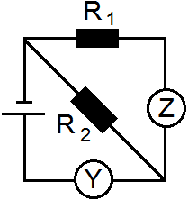

Задача 1. Трите части на задачата са независими!

Част 1. Принцесата и граховото зърно
Ако принцеса легне непосредствено върху грахови зърна, тя ще ги
усети заради натиска, който те оказват, поради силно изпъкналата
си повърхност. Нека принцесата лежи върху водно легло, под което
се намират остри грахови зърна - Фиг. 1. Ще усети ли принцесата
граховите зърна? Обяснете накратко защо. Водното легло
представлява голям балон, изцяло напълнен с вода. (3 точки) 

Фиг. 1

Част 2. Скок върху влака
Финиъс и Изабела се намират в двата края на движещ се
вагон - Фиг. 2. Финиъс решил да скочи вертикално
нагоре. Той преценил, че докато е във въздуха, вагонът
ще измине известно разстояние и така той ще се 
приземи по-близо до Изабела. Прав ли е Финиъс?
Обяснете защо. Съпротивлението на въздуха се
 пренебрегва. (3 точки)

Фиг. 2

 Част 3. Магдебургската полусфера
 На Фиг. 3 е показана играчка - висящо слонче, което се закрепва за гладък таван с
 помощта на вакуумна закачалка-смукало. Обяснете накратко как работи вакуумната
 закачалка-смукало. Каква трябва да е площта на смукало създаващо идеален
 вакуум, така че да издържи тежестта на истинско слонче? Атмосферното налягане е
 p = 100 kPa, а теглото на слончето е G = 1200 N. (4 точки)

 Фиг. 3

Задача 2. Ламята Спаска вари компот от златни ябълки. Двете части на задачата са независими!
Част 1. Да измериш маса с часовник
Ламята Спаска трябва да определи колко вода се събира в
тенджерата ѝ. Тя знае, че на електрическата ѝ печка 1 kg
вода завира след 2 минути. Спаска измерила, че една
тенджера вода завира след 18 минути. Като използвате
връзката между масата на водата и количеството топлина,
което е необходимо за завирането ѝ- Фиг. 4, определете
колко вода ще се събере в тенджерата на ламята. Печката
има постоянна мощност и цялото отделено от нея
количество топлина отива за нагряване на водата. (5 точки)

 Фиг. 4
 
Част 2. Компот от златни ябълки
За да стане компотът хубав, температурата му не трябва да е по-
ниска от 80 oC и по-висока от 120 oC (която той може да достигне
заради разтворената в него захар). Спаска трябва сама да сглоби
електрическия котлон, на който да свари компота. Тя разполага с
един нагревател със съпротивление R1 = 80 $\Omega$ и един с R2 = 50 $\Omega$.
Нагревателите може да се свържат заедно или да се използват
поотделно. Намерете при кои свързвания ще се получи хубав
компот. Връзката между мощността на котлона и крайната
температура, която компотът достига (вследствие на топлообмена
с околната среда), е показана на Фиг. 5. Използва се източник на
напрежение от 220 V. (5 точки) 

Фиг. 5

Задача 3. Съпротивление на квадрат
Във всяка от показаните електрически вериги са включени неизвестни измервателни уреди X, Y, Z и
S. Всеки един от тях е или амперметър, или волтметър. Всички уреди са идеални и са включени
правилно. Двете части на задачата са независими!

Част 1. Един от резисторите от веригата на Фиг. 6 има съпротивление R2 = 2 $\Omega$.
Показанието на уреда Y e 4 пъти по-голямо от показанието на уреда Z.
Определете вида на неизвестните уреди и намерете съпротивлението R1 на
другия резистор. Колко пъти показанието на уреда Y ще е по-голямо от
показанието на Z, ако разменим местата на резисторите R1 и R2? (5 точки)

 Фиг. 6

Част 2. Показанието на уредите от Фиг. 7 е 500 за X и 0,002 за S. Източникът
на напрежение е U = 4,5 V. Определете вида на неизвестните уреди X и S,
както и в какви мерни единици са показанията им. Какво ще бъде
показанието на уреда X, ако разменим местата на X и S ? (5 точки)

 Фиг. 7