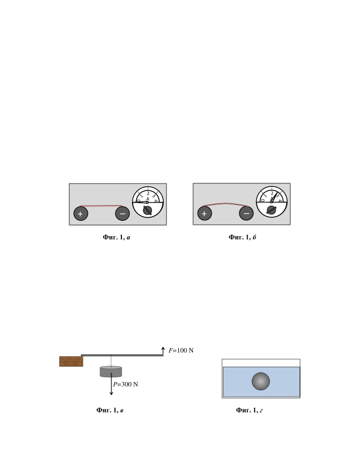
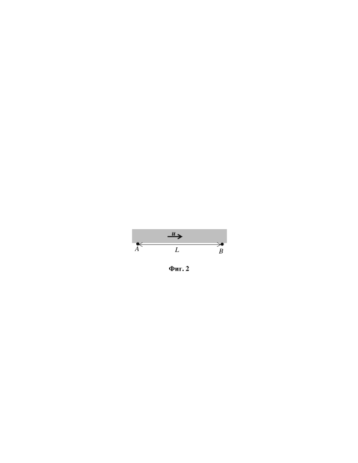
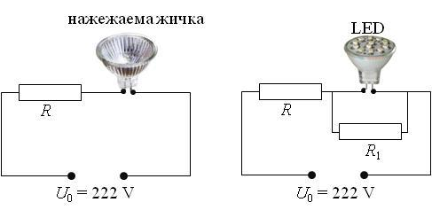

[[Състезания/proletno/7/2021|◂ 2021]] | [[Състезания/proletno/7r/2022|решения]] | [[Състезания/proletno/7/2023| 2023 ▸]]

**Задача 1. Физика за съобразителни**

Задачата се състои от четири независими части. На всяка част дайте кратък, но обоснован отговор.

а) Тънка медна жичка е опъната между полюсите на източник на електричен ток, чиято големина може плавно да се регулира (фиг. 1, а). При увеличаване на тока през жичката, тя започва видимо да се изкривява, както е илюстрирано на фиг. 1, б. Обяснете каква е причината за изкривяването на жичката, когато по нея тече ток. \[2 точки\]

 

б) След като бил пометен подът на работилница, се образувала купчина от смесени дървени, алуминиеви и железни стружки. Предложете "технология", чрез която отпадъчните материали може да бъдат рециклирани, т.е. да бъдат разделени стружките от различен материал. \[3 точки\]

в) На фиг. 1, в е илюстрирано повдигане на товар с тегло P = 300 N посредством
едностранен лост, опрян в ръба на масата. Оказало се, че за целта е достатъчно към дългото рамо на лоста да бъде приложена сила F = 100 N, действаща нагоре. Откъде "се вземат" недостигащите 200 N, нужни за уравновесяване на теглото на товара? Направете чертеж, на който да изобразите посоката и приложната точка на тази сила. \[2 точки\]

г) В съд с вода при температура е потопено пластмасово топче. Топчето се намира в равновесие под водната повърхност, без да потъва и без да изплава (фиг. 1, г). Какво ще се случи с топчето - ще изплава, ще потъне или ще остане в равновесие, ако темературата на водата се понижи? \[3 точки\]

Задача 2. Напред-назад по реката

Дърводобивно предприятие (т. А на фиг. 2) се намира на брега на река, която тече със скорост . Дървеният материал се транспортира до пристанището В, намиращо се на разстояние от т. А по посока на течението. За целта на всеки 10 min от т. А в реката се пуска дървен ствол, който плава по течението до т. В.

От пристанището (т. В) срещу течението тръгва катер, който достига т. А, след което се връща обратно в т. В. Скоростта на катера в спокойна вода е . Катерът тръгва от т. В в момент между пристигането на два последователни ствола и тръгва от т. А в момент между пускането на два последователни ствола.

а) С колко дървени ствола се разминава катерът, докато се движи срещу течението? \[5 точки\]

б) Колко дървени ствола задминава катерът по пътя си обратно? \[5 точки\]

 

Задача 3. Икономично осветление

а) За осветление на работното си място ученик използвал нощна лампа с нажежаема жичка с мощност P0 = 36 W, включена непосредствено към електрическата мрежа с напрежение U0 = 222 V. Ученикът използвал лампата по пет часа дневно в продължение на един месец (30 дена). Колко струва осветлението на работното място за един месец, ако приемете, че цената на електроенергията е 0,20 лв./kWh? \[2 точки\]

б) Лампата изгоряла и ученикът решил да я замени с нова. В магазина обаче имало само лампи със същата мощност P0, но предназначени за работа при по-ниско напрежение U1 = 12 V. За да може да използва такава лампа, ученикът конструирал електрическата верига, показана на фиг. 3, а, чрез която лампата да бъде включена към електрическата мрежа.

Колко трябва да бъде съпротивлението R на резистора, така че лампата да работи нормално? Колко лева струва осветлението на работното място за един месец при този вид свързване? \[4 точки\]

в) Осветлението по начина, описан в подточка б), се оказало твърде скъпо. Затова ученикът решил да замени лампата от схемата на фигура 3, а с енергоспестяваща LED лампа, която работи при същото напрежение U1 = 12 V, но консумира по-малка мощност P1 = 6 W. Оказало се обаче, че за да работи нормално LED лампата, успоредно към нея трябва да бъде свързан резистор, както е показано на фиг. 3, б.

 Колко трябва да бъде съпротивлението R1 на допълнителния резистор, така че LED лампата да свети нормално? \[2 точки\]

Ще спести ли ученикът електроенергия при този вид осветление в сравнение със свързването, описано в точка б)? Обосновете вашия отговор. \[2 точки\]

 