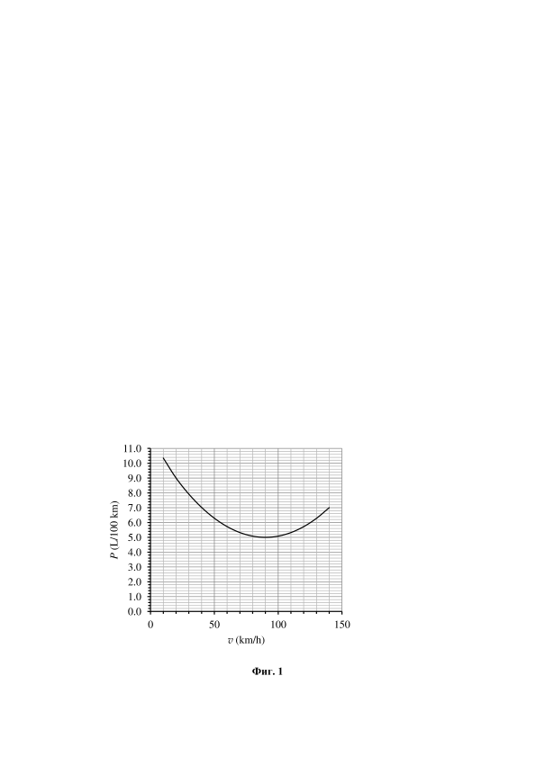

[[Състезания/proletno/7/2022|◂ 2022]] | [[Състезания/proletno/7r/2023|решения]] | [[Състезания/proletno/7/2024| 2024 ▸]]

**Задача 1. Разход на гориво**

Разходът на гориво, който в тази задача ще означаваме с P, е важна характеристика на всеки автомобил. Обикновено Р се изразява с единицата $\frac{L}{100\ \mathrm{km}}$, т.е.
литри изразходвано гориво на сто километра, изминати от автомобила. Разходът на гориво обаче зависи от скоростта, с която се движи автомобилът. На фиг. 1 е дадена графика на зависимостта на P от скоростта v за малък градски автомобил.

а) При движение в задръстване автомобилът изминал разстояние 15 km за 45 min. Колко гориво е изразходвал автомобилът за това време? Минимум колко човека (включително шофьорът) трябва да се возят в автомобила, за да бъде пътуването им по-евтино, отколкото с автобус на градския транспорт? Приемете, че цената на горивото е 3 лв./литър, а цената на автобусния билет е 2 лв. \[4,0 т\]

б) Автомобилът пътува от София до Варна, като тръгва от София с резервоар, пълен с 28 L гориво. Разстоянието между двата града е 508 km, от които 193 km са по магистрала, където максималната разрешена скорост е 140 km/h, а останалото разстояние е по път с разрешена максимална скорост 90 km/h. За какво най-малко време автомобилът може да стигне от София до Варна, без да спира за зареждане на допълнително гориво и без да нарушава правилата за движение? \[6,0 т\]

 

**Задача 2. Лодка от пластилин**

Добре известно е, че топка пластилин потъва във вода. Ако от пластилина обаче бъде направена лодка с достатъчно тънки стени, тя плава. След много експерименти ученик установил, че ако от парче пластилин оформи лодка с формата на куб със страна $a = 2,5\ \mathrm{cm}$ и с дебелина на дъното и стените $d = 5\ \mathrm{mm}$, лодката плава, потопена до горния си ръб във водата.

а) Колко бил обемът V на парчето пластилин? \[3,0 т\]

б) Като използвате данните от условието, определете плътността $\rho_\text{п}$ на пластилина.
Известно е, че плътността на водата е $\rho_\text{в} = 1\ \mathrm{g/cm^3}$. \[3,0 т\]

в) Лодката била потопена в съд с площ на напречното сечение $S = 9\ \mathrm{cm^2}$. Поради
невнимание, ученикът натиснал леко лодката надолу. Тя се напълнила с вода и
потънала. Увеличило ли се е или е намаляло, и с колко милиметра, при това нивото на течността в съда? \[2,5 т\]

г) Ученикът експериментирал, като изрязал горната половина от лодката, т.е. новата лодка имала квадратна основа със страна a и височина h = a/2. Ще плава ли или ще потъне новата лодка? Обосновете отговора си. \[1,5 т\]

**Задача 3. Заплетена верига**

 

Три еднакви резистора, номерирани от 1 до 3, са свързани по начина, показан на фиг. 3. Към металните клеми A, B, C и D може да бъдат включени източник на неизвестно напрежение, волтметър или амперметър. Към дадени две клеми не може да бъдат включени едновременно два уреда.

а) Източникът е включен към клемите A и B. Тогава, ако към клемите C и D бъде включен волтметър, той отчита напрежение $U = 12\ \mathrm{V}$. Ако волтметърът бъде заменен с амперметър, показанието на уреда е $I = 50\ \mathrm{mA}$. Намерете напрежението на източника и съпротивлението на резисторите. \[4,5 т\]

б) Пречертайте таблица 1 в работните си листа и попълнете в Фиг. 3 празните клетки показанията съответно на волтметъра и на амперметъра за всяко от посочените свързвания. \[5,5 т\]

Важно! В тази подточка се оценява, както вярно попълнената таблица, така и
обосновка за нанесените стойности чрез подходящи схеми или изчисления.

Таблица 1. Под "измерителен уред" се разбира или волтметър, или амперметър,
включен към посочените клеми.

| № свързване | Източник, свързан към | Измервателен уред, свързан към | Показание на волтметъра (V) | Показание на амперметъра (A) |
| ----------- | --------------------- | ------------------------------ | --------------------------- | ---------------------------- |
| 1           | B и C                 | A и D                          |                             |                              |
| 2           | A и C                 | B и D                          |                             |                              |
| 3           | B и D                 | A и C                          |                             |                              |
