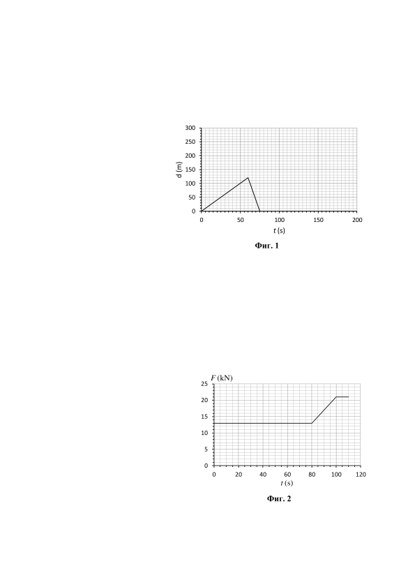
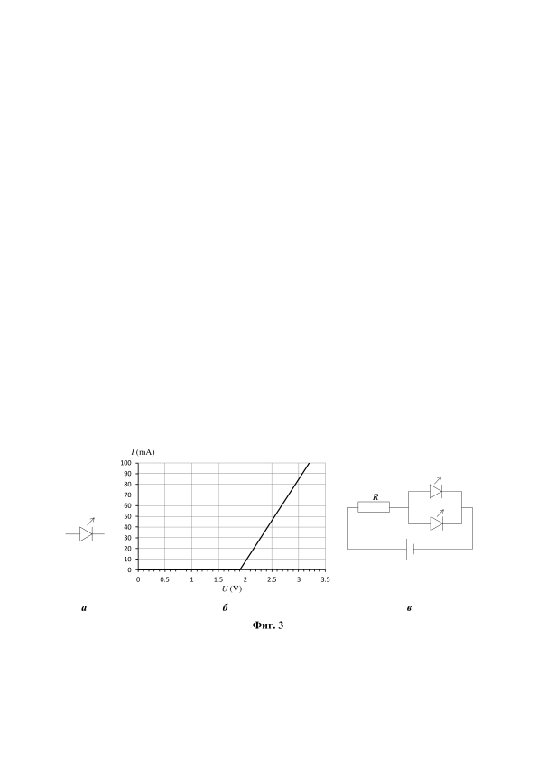

**Задача 1. Спортни нормативи**

 В час по физическо възпитание двама ученици покриват нормативи за бягане. Те стартират едновременно от единия край на алея в парка. Когато достигнат другия край на алеята, бягат в обратната посока и финишират там, откъдето са тръгнали. На фиг. 1 е дадена графика на зависимостта на разстоянието d между учениците от времето t за t първите 75 s секунди след старта.

а) Намерете скоростите, с които бягат двамата ученици. Означете с v1 скоростта на по-бързия ученик, а с v2 - на по-бавния. (5 точки)

б) Колко е разстоянието L, което трябва да пробягат учениците? (2 точки)

в) Графиката от фиг. 1 е дадена и на работния лист на стр. 3. Допълнете я от момента 75 s до момента, в който финишира по-бързият ученик. Предайте работния лист заедно с останалите листа от решението на задачата.
Важно! За да получите пълен брой точки на подусловие в), освен да представите вярна графика, е нужно да обосновете с пресмятания как сте я построили. (3 точки)

**Задача 2. Археологическа експедиция**

При археологическа експедиция по морското крайбрежие, гмуркачи открили цилиндрична мраморна колона с диаметър , която стояла изправена вертикално на морското дъно. От подемния кран на намиращия се отгоре кораб, спуснали въже, което закрепили за върха на колоната и започнали да я издигат с постоянна скорост . На фиг. 2 е показана зависимостта на силата F, с която кранът издърпва въжето, от t (s) времето t.\*

а) Обяснете накратко (с две-три изречения) защо силата F се променя по време на издърпването на колоната. (2 точки)

б) Колко е височината на колоната? (2 точки)

в) Колко е дълбочината H на морето на мястото, където е открита колоната? (2 точки)

г) По данните от фигурата, пресметнете плътността на мрамора, от който е направена колоната. (4 точки)
Приемете, че .
* Обърнете внимание, че на графиката стойностите на силата са дадени в килонютони
(kN): 1 kN = 1000 N.

**Задача 3. LED осветление**

Светодиодът (т.нар. LED) е източник на светлина, който е няколко пъти по-икономичен от лампите с нажежаема жичка. Затова светодиодите се използват като светлинни индикатори в много устройства, както и за осветление в бита. На фиг. 3, а е показано схемното означение за светодиод, а на фиг. 3, б е показана зависимостта на тока , който тече през даден модел светодиод, от приложеното върху него напрежение . До определено напрежение през светодиода не тече ток и той не свети. При светодиодът "светва" и токът през него бързо се увеличава с повишаване на напрежението. При ток , светодиодът изгаря и отново престава да пропуска ток.

а) Колко е напрежението , при което светодиодът започва да свети? (1 точка)
На клас ученици била поставена домашна работа да конструират електрическа верига по техен избор, в която са свързани светодиоди от описания модел. Веригата трабва да се захранва от източник с напрежение .

б) Петър решил да направи светещ гирлянд за елха, като използва последователно свързани диоди. Колко светодиода са нужни, така че гирляндът да свети, без някой от светодиодите да изгори? (5 точки)

в) Гергана конструирала електрическа верига с два светодиода, свързани по начина, показан на фиг. 3, в. Колко най-малко трябва да бъде съпротивлението на резистора така, че диодите да светят, без да изгорят? (4 точки)

