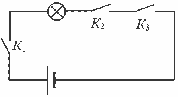
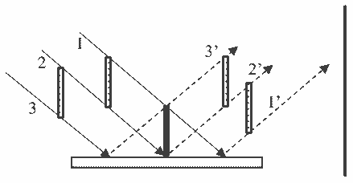

**Зад. 1.**

**Част 1. Мокри дърва**

Нека с $V$ отбележим обема на едно кубче.
Тогава обемът на цялата пирамида е $14V$. **(0,5 т)**
При намокряне се увеличава само плътността на дървените кубчета. **(0,5 т)**
Нека отбележим с $\rho_{мд}$ – плътността на мокрите дърва.
Следователно:
$1,02 \cdot (9\rho_3V + 4\rho_1V + \rho_2V) = 9\rho_{мд} \cdot V + 4\rho_1V + \rho_2V$ **(1 т)**
$\rho_{мд} = 0,618 \text{ g/cm}^3$ **(0,5 т)**
Отношението на плътностите на мокрите дърва към сухите е: $\rho_{мд}/\rho_3 = 1,211$. **(0,5 т)**
Следователно плътността на мокрите дърва е по-голяма от тази на сухите с
$(\rho_{мд} – \rho_3)/\rho_3 = 21,1 \%$. **(1 т)**

**Част 2. Смесване етанол и вода**

**А)** $\frac{m_2}{m_1+m_2} = 0,441$ **(0,5 т)**
$m_2 = 0,789 \cdot m_1$ **(0,5 т)**
Записваме условието на „свиване“:
$(V_1 + V_2) \cdot \frac{(100-\gamma)}{100} = V$ **(0,5 т)** следователно: $\frac{m_1}{\rho_1} + \frac{m_2}{\rho_2} = 1,064 \cdot V$ **(0,5 т)**
След като използваме получените уравнения, получаваме обема и масата на водата:
$m_1 = \frac{1,064 \cdot V \cdot \rho_1 \rho_2}{0,789 \cdot \rho_1 + \rho_2}$ **(1 т)**
Следователно:
$V_1 = \frac{1,064 \cdot V \rho_2}{0,789 \cdot \rho_1 + \rho_2} = 532 \text{ cm}^3$ **(1 т)**
Аналогично за обемът на етанола:
$V_2 = 532 \text{ cm}^3$ **(1 т)**

**Б)** Плътността на течността е
$\rho = \frac{m_1+m_2}{V} = 952 \text{ kg/m}^3$ **(1 т)**

**Зад. 2.**

**Част 1**

**А)** използвайки формулата за мощност $P = U^2/R$, то следва:
$P_{11} = 100 \text{ W}$ **(0,5 т)**; $P_{12} = 150 \text{ W}$ **(0,5 т)**

**Б)** При успоредно свързване и двата нагревателя са под напрежение $U$.
$P_{усп} = P_1 + P_2$ **(0,5 т)**
$P_{усп} = 1000 \text{ W}$ **(0,5 т)**

**В)** Използваме, че съпротивлението е постоянно и при последователно свързване общото съпротивление е:
$R = R_1 + R_2$ и връзката $P = U^2/R$ **(0,5 т)**
$\frac{U^2}{P_{посл}} = \frac{U^2}{P_1} + \frac{U^2}{P_2}$ **(0,5 т)**
$P_{посл} = \frac{P_1 P_2}{P_1 + P_2} = 240 \text{ W}$ **(0,5 т)**

**Част 2.**
Необходими са минимум 3 ключа **(0,5 т)**, свързани с лампата последователно към източника.
$K_1$ – ключ, който затваря веригата при включване на двигателя на автомобила **(0,5 т)**
$K_2$ – ключ, поставен под седалката на автомобила, затворен при седнал шофьор **(0,5 т)**
$K_3$ – ключ към колана, отворен при поставен колан **(0,5 т)**

За правилно начертана схема **(0,5 т)**.

| Стъпка | Позиция на $K_1$ | Позиция на $K_2$ | Позиция на $K_3$ | За всеки верен ред |
| :--- | :--- | :--- | :--- | :--- |
| 1 | Отворен | Отворен | Затворен | **(1 т)** |
| 2 | Затворен | Отворен | Затворен | **(1 т)** |
| 3 | Затворен | Затворен | Затворен | **(1 т)** |
| 4 | Затворен | Затворен | Отворен | **(1 т)** |

**Зад. 3.**

**Част 1.**

**А)** Товарът се издига нагоре. Съобразяваме дължината на нишката. Скъсява се отляво и отдясно на макарата.
$v_1 = \frac{v}{2}$ **(0,5 т)**

**Б)** Товарът се издига нагоре. Скоростта на товара е равна на скоростта, с която се дърпат нишките:
$v_2 = v$ **(0,5 т)**

**В)** Нека в началния момент макарите заемат положение, както е показано на чертежа. Разглеждаме движение на макарите за интервал от време $\Delta t$. Тогава трите подвижни макари, които дърпат, се преместват на разстояние съответно:
$v\Delta t$ (наляво) **(0,5 т)**, $2v\Delta t$ **(0,5 т)** (наляво) и $3v\Delta t$ (нагоре) **(0,5 т)**.
Това означава, че нишката от дясната страна трябва да се съкращава с $2v\Delta t$ **(0,5 т)**
От лявата страна да се удължава $4v\Delta t$ **(0,5 т)**
нагоре да се удължава с $6v\Delta t$ **(0,5 т)**.
Поради това е необходимо „излишна“ нишка с дължина:
$6v\Delta t + 4v\Delta t - 2v\Delta t = 8v\Delta t$ **(1 т)**
Тази дължина може да бъде взета само от нишката, свързваща макарата с товара. Това означава, че макарата с товара трябва да се **издига нагоре (0,5 т)** на разстояние $4v\Delta t$ **(0,5 т)**, следователно товарът ще се издига нагоре със скорост $4v$ **(0,5 т)**.

**Част 2.**

**А)** Кибритената клечка образува сянка както от падащата върху нея светлина, така и от сянката на отражението си върху огледалото. Падащият сноп, е ограничен от 1 и 2, а отразеният от 2' и 3' **(0,5 т)**. Понеже ъгъла на падане е равен на ъгъла на отражение то размерите на падащите и отразените снопове са равни **(0,5 т)**.
Следователно размерът на сянката на кибритената клечка върху стената е двойно по-голям от клечката, т.е.
$x = 2l = 9 \text{ cm}$ **(1 т)**

**Б)** Размерът на сянката няма да зависи от ъгъла на падане **(0,5 т)**

**В)** При $\alpha = 90^\circ$ сянката ще бъде равна на размерът на клечката **(0,5 т)**, т.е. $x_2 = 4,5 \text{ cm}$. **(0,5 т)**