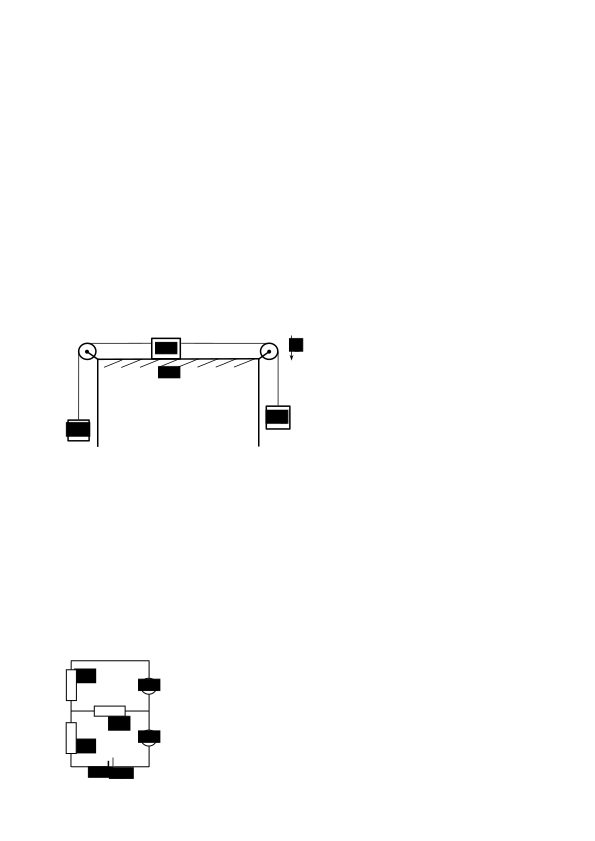

Задача 1. Кинематика
Камион тръгва да се движи с ускорение a = 1 m/s2 от дадена позиция по прав път. След време t0 = 8 s през същата позиция минава автомобил със скорост v0 = 10 m/s в същата посока, като се движи равноускорително със същото ускорение като камиона.
а) Намерете времето tизп (от момента, в който камионът започва да се движи), което е необходимо на автомобила, за да изпревари камиона. \[4 т.\]
б) На колко е равен изминатият от камиона път sизп до мястото на изпреварване? \[1 т.\]
в) Определете скоростите vк и vа на двете превозни средства в момента, когато автомобилът изпреварва камиона. \[2 т.\]
г) Намерете преднината $\Delta$s на автомобила пред камиона в момента, когато скоростта на автомобила е с 5% по-голяма от тази на камиона. \[3 т.\]

Задача 2. Трупчета и макари

Трупче с маса M = 1 kg и други две трупчета с неизвестни маси mл и mд са свързани с безмасови неразтегливи нишки, както е показано на фигурата вляво. Двете  крайни трупчета висят, окачени на  безмасови макари. Разстоянието между макарите е d = 2 m. В началото, преди системата да започне да се движи, трупчето  с маса M се намира в левия край на хоризонталната повърхност (допира се до лявата макара). Трупчетата са оставени да се движат с ускорение a = 1 m/s2 до момента, когато централното трупче се намира по средата между двете макари. Тогава дясната нишка е прерязана, след което лявото и централното трупче продължават да се движат с ускорение a' = 1,5 m/s2 . Дадено е също така, че коефициентът на триене между трупчето с маса M и повърхността е k = 0,05. Може да използвате, че земното ускорение е g = 10 m/s2. Съпротивлението на въздуха да се пренебрегне.
а) Определете масите mл и mд на двете крайни трупчета. \[5 т.\]
б) На колко са равни големините на силите на опън Tл и Tд на нишките преди прерязването на дясната нишка? \[1 т.\]

в) Определете с каква скорост vкр трупчето с маса M се връща при лявата макара. \[3 т.\]

г) Намерете работата Aтр на силата на триене по време на движението на системата. \[1 т.\]

Задача 3. Електрическа верига

Батерия с неизвестно напрежение U е свързана с два амперметъра и три резистора със съпротивления R1 = 0,8 k$\Omega$, R2 = 2 k$\Omega$ и R3 = 3 k$\Omega$, както е показано на фигурата вляво. Токът през долния амперметър е Iд = 3 mA.

а) Определете стойността на напрежението U на батерията. \[4 т.\]

б) Какъв ток Iг измерва горният амперметър? \[3 т.\]

в) Намерете мощността P2 , която се отделя в резистора със съпро тивление R2 . \[3 т.\]