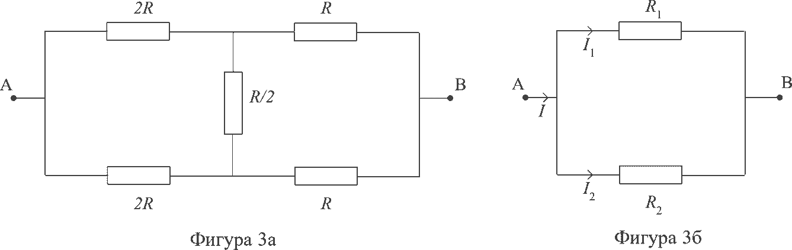

[[Състезания/proletno/8/2019|◂ 2019]] | [[Състезания/proletno/8r/2021|решения]] | [[Състезания/proletno/8/2022| 2022 ▸]]

Задача 1. Кинематика 1

А и В решават да плуват заедно в басейн. А плува fA = 40 дължини за час, а В плува fB = 25 дължини за 1 час. Басейнът е с дължина L = 50 м. Плувците се гмурват едновременно от една и съща страна на басейна и плуват с постоянна скорост.

а) Намерете скоростите VA и VB , с които плуват А и В. \[1т\]

б) Представете графично разстоянието на А и В от началото на басейна в една координатна система. Ограничете се до 6 дължини за А. \[1т\]

в) Намерете минималния брой дължини NA и NB , които трябва да изплуват А и В, така че едновременно да достигнат до един и същи край на басейна. Колко време Т отнема това? \[4т\]

г) Колко пъти се срещат плувците за времето T? Гмурването не се брои за среща. \[2т\]

д) Какъв е интервалът от време $\Delta$T между две насрещни разминавания? \[2т\]

Задача 2. Кинематика 2

Част 1

А и В участват в автомобилно състезание. Първоначално (t = 0) колите се намират в покой на стартовата линия. А и В започват равноускорително движение с ускорения съответно aA = 5 m/s2 и aB = 3 m/s2. След като достигат скорости съответно VA = 30 m/s и VВ = 42 m/s, А и В започват да се движат равномерно. Намерете:

а) моментите от време tA и tB , когато колите започват равномерно движение; \[2т\]

б) какво разстояние са достигнали колите в тези моменти, измервано от стартовата линия;
\[2т\]

в) в кой момент от време В настига А. \[2т\]

Част 2

г) Интервалът от време, който дели две пълнолуния, е T = 29.53 дни. Този интервал е различен от времето, за което Луната прави пълна обиколка около Земята, TM , поради въртенето на Земята около Слънцето, което отнема време TЕ = 365.25 дни. Намерете TM .
Орбиталното въртене на Земята и Луната е в една и съща посока. \[4т\]

Задача 3: Електрически схеми

а) Пет консуматора са свързани, както е показано на фигура 3а, където съпротивлението R = 1$\Omega$. Между точки А и В е приложено напрежение U = 1V. Намерете тока през консуматора със съпротивление R / 2, както и мощността, която се отделя в него \[4т\];

 
б) Два консуматора със съпротивления R1 = 2 $\Omega$ и R2 = 2/3 $\Omega$ са свързани успоредно, както е показано на фигура 3б. От точка А във веригата влиза ток I = 1А. Да се намери токът, който протича през консуматорите R1 и през R2 \[3т\];

в) Да се намерят мощностите (топлината за единица време), които се отделят от всеки от консуматорите във фигура 3б \[3т\].