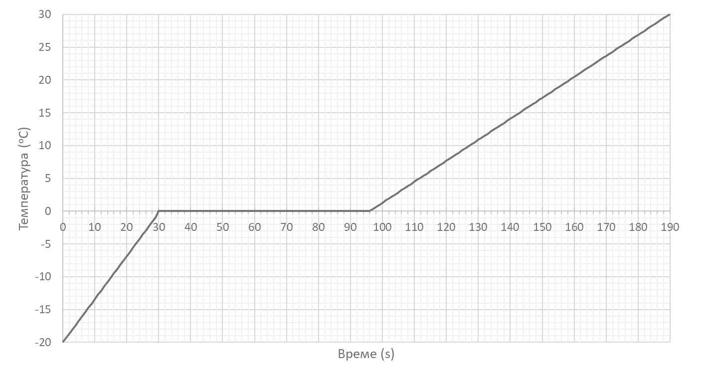
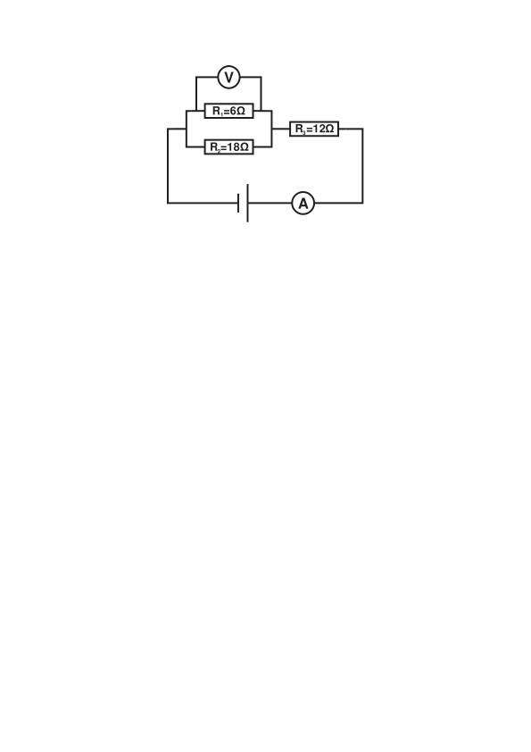

[[Състезания/proletno/8/2021|◂ 2021]] | [[Състезания/proletno/8r/2022|решения]] | [[Състезания/proletno/8/2023| 2023 ▸]]

Задача 1:

Лед с маса m = 800 g е поставен в калориметър, изолиран от околната среда. В него е включен нагревател с мощност P1 = 1100 W. Когато се достигне температура t = 0 $^\circ$C, се включва и допълнителен нагревател с мощност P2 = 2900 W. След като ледът се разтопи, вторият нагревател се изключва. Определете от графиката:

 A. Специфичният топлинен капацитет на леда. \[3 точки\]
 
 B. Специфичната топлина на топене на леда \[4 точки\]
 
 C. Специфичният топлинен капацитет на водата. \[3 точки\]

Задача 2:

Електрическа схема е свързана, както е показано на фигурата. Първоначално показанието на на волтметъра е UV = 9 V. Намерете тока I2 , който протича през съпротивлението R2 \[2 точки\],
напрежението U3 върху съпротивлението R3 \[2 точки\] и напрежението на батерията U0 \[3 точки\]. Един от успоредно свързаните резистори изгаря и показанието на амперметъра се променя на I' = 1,1 A. Определете кое съпротивление е изгоряло. \[3 точки\]

 
Задача 3:

Куршум с маса m = 20 g е изстрелян право нагоре с първоначална скорост v = 300 m/s. Той достига максимална височина от h = 3700 m. Намерете работата, извършена от силата на триене на въздуха до достигане на максималната височина. \[3 точки\] Определете крайната скорост на куршума \[3 точки\], когато той се върне в първоначалната точка на изстрелване.
Известно е, че работата, извършена при свободното падане, е 10% от първоначалната енергия на изстрелване. Определете средната сила на триене, която действа на куршума, за цялото време на неговото движение. \[4 точки\] (g = 9,8 m/s2)
