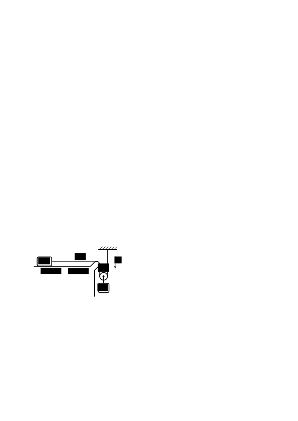

[[Състезания/proletno/8/2023|◂ 2023]] | [[Състезания/proletno/8r/2024|решения]] | [[Състезания/proletno/8/2025| 2025 ▸]]

Задача 1. Кинематика (две независими части)

Част I Мотоциклет и камион се движат с еднаква постоянна скорост v0 = 30 m/s в една и съща посока по прав път. Мотоциклетистът кара на d0 = 12 m зад камиона. В даден момент шофьорът на камиона внезапно бие спирачки, след което камионът започва да се движи равнозакъснително с ускорение aк = 2 m/s2 . След време $\Delta$t = 2 s водачът на мотоциклета също бие спирачки и успява да се размине на косъм от катастрофа (двете превозни средства се допират с нулева относителна скорост), движейки се равнозакъснително.

а) Намерете ускорението aм на мотоциклета. \[3,5 т.\]

б) Колко време t изминава от момента, когато шофьорът на камиона бие спирачки, до момента, когато двете превозни средства са на косъм от катастрофа? \[1 т.\]

в) Намерете скоростите vм и vк на мотоциклета и камиона, когато разстоянието между тях е отново d0 . \[2 т.\]

Част II Топка е пусната да пада свободно от височина h = 5 m над повърхността на плувен басейн. Дадено е, че след като топката се удари във водната повърхност, тя потъва равномерно със същата скорост, с която е паднала във водата. Топката достига дъното на басейна за време tд = 1,3 s (от момента, когато е пусната да пада). Приемете, че земното ускорение е g = 10 m/s 2 . Съпротивлението на въздуха да се пренебрегне.

а) Колко е скоростта v, с която топката потъва в басейна? \[1,5 т.\]

б) Намерете дълбочината d на басейна. \[1 т.\]

в) Определете средната скорост vср на пълното движение на топката. \[1 т.\]

Задача 2. Теглилки на триеща се нишка

 Две теглилки с неизвестни маси mл и mд са свързани с безмасова неразтеглива нишка, както е показано на фигурата вляво. Теглилките са оставени да се движат свободно, като нишката е прекарана през заоблен ръб и k>0 k=0 подвижна безмасова макара. Поради триенето на нишката в заобления ръб силата на опън Tл на нишката mд отляво на ръба е винаги два пъти по-малка от силата на опън Tд на нишката отдясно на ръба. Преди системата да започне да се движи, лявата теглилка се намира върху област от хоризонтална повърхност, където коефициентът на триене между теглилката и повърхността е k = 0,25.
Може да използвате, че земното ускорение е g = 10 m/s2 . Съпротивлението на въздуха да се пренебрегне.

а) На колко е равно минималното отношение на масите (mд /mл )min , така че системата да започне да се движи? \[3 т.\]

б) Дадено е, че първоначалното ускорение на лявата теглилка е aл = 2 m/s2 . Намерете отношението mд /mл на масите на теглилките. \[4 т.\]

в) В даден момент лявата теглилка достига област, където коефициентът на триене става равен на нула. Силата на опън Tл' на нишката отляво на ръба е отново два пъти по-малка от силата на опън Tд' отдясно на ръба. Определете новото ускорение aл' на лявата теглилка. \[3 т.\]

Задача 3. Статика на флуиди (две независими части)

Част I В U-образна тръба е налята вода с плътност $\rho$в = 1 g/cm3 . След това в дясното коляно на тръбата е налято олио с плътност $\rho$о = 0,9 g/cm3 така, че височината на стълба олио е hо = 20 cm (вж. фигурата вляво). Площта на напречното сечение на лявото коляно на тръбата е Sл = 3 cm, а на дясното е Sд = 6 cm .

а) Намерете разликата $\Delta$h между равнищата на издигане на течностите от двете страни на тръбата. \[2 т.\]

б) В лявото коляно на тръбата е пробита малка дупка, която се намира на
разстояние dд = 1 cm под нивото на водата отляво. Намерете обема Vизт на изтеклата вода от дупката. \[2 т.\]

Част II Камък е окачен на безмасова неразтеглива нишка. Първоначално силата на опън на нишката е T1 . След това камъкът е напълно потопен във вода с плътност $\rho$в , при което силата на опън става T2 . Накрая камъкът е изцяло потопен в течност с неизвестна плътност $\rho$x и пренебрежим вискозитет, при което силата на опън на нишката е T3 . Земното ускорение е g.

а) Определете обема Vк на камъка и плътността $\rho$x на течността. \[4 т.\]

б) Докато камъкът е в неизвестната течност, нишката е прерязана. Намерете ускорението aк на потъващия камък. Съпротивлението от страна на течността да се пренебрегне. \[2 т.\]
