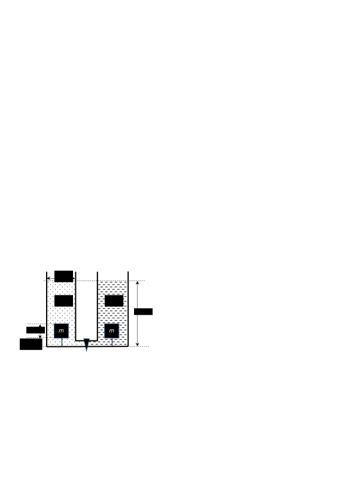

[[Състезания/proletno/8/2024|◂ 2024]] | [[Състезания/proletno/8r/2025|решения]]

**Задача 1. Насам - натам**

Към системата, показана на чертежа (вж Фиг. 1), са приложени две сили F1 и F2. Масата на трупчето е m = 1 kg, коефициентът на триене между трупчето и хоризонталната равнина е k = 0,4. Ускорението на свободно падане е g = 10 m/s2. Нишките са неразтегливи, безтегловни и достатъчно дълги.

А) Изразете чрез параметрите F1, F2, k, m ускорението a на трупчето, в случай, че то се движи надясно. Приемете, че силите са хоризонтални и постоянни с времето. (2 т)

Силите F1 и F2 се изменят с времето, както е показано на Фиг. 1 а и Фиг. 1 б,
съответно.

Б) Определете в кой момент t0 трупчето ще започне да се движи. Определете в кои интервали от време трупчето ще се движи и намерете ускоренията в тези интервали. (3 т)

В) Нека с F отбележим равнодействащата сила, с която нишките действат върху
трупчето. Начертайте графика на зависимостта на силата F от времето t. (2 т)

Г) Начертайте графика на зависимостта на скоростта v на трупчето от времето t. (2 т)

Д) На какво разстояние S ще се премести трупчето след 10 s от началото на действието на силите, ако първоначално е било в покой? (1 т)

 **Зад. 2. Powerbank - ремарке с батерия за електромобил**

Електромобил е оборудван с ремарке, в което е поставена помощна батерия. Електромобилът и ремаркето имат обща маса m = 2000 kg и се движат равномерно по хоризонтален път. В един момент ремаркето, с маса m1 = 200 kg, се откъсва от електромобила. Силата на триене е пропорционална на движещата се маса. Земното ускорение да се приеме за g = 10 m/s2. Коефициентът на триене k = 0,4. Силата на триене има същите свойства като тази при хлъзгане.

А) Сравнете пътищата, които ще изминат до пълно спиране електромобилът и
 ремаркето при условие, че двигателят спре веднага след откъсването? (1,5 т)

В следващите подусловия двигателят се изключва, след като електромобилът измине разстояние от S = 200 m. Теглителната сила на електромобила при работа на двигателя е постоянна.

Б) Изразете равнодействащата сила F на електромобила, след като ремаркето се е откъснало, чрез k, m1 и g и изчислете стойността ѝ. (2 т)

В) На какво разстояние Sx един от друг се намират ремаркето от електромобила след като напълно спрат? (6,5 т)

**Зад. 3. Скачени съдове**

Два еднакви отворени съда с квадратно сечение със страна 2а и вертикални стени са свързани с тънка хоризонтална тръбичка. На тръбичката е монтиран кран. В началото кранът е затворен, левият съд е запълнен до ниво 6а с течност с неизвестна плътност $\rho_1$, а десният - с течност с неизвестна плътност $\rho_2$. Към дъното на всеки съд са прикрепени с леки нишки с дължина 0,5а еднакви кубчета с дължина на реброто а, като силата на опън на лявата нишка е 3Т, а на дясната - Т.

Кранът се отваря и системата преминава в равновесие. При това течностите не се смесват и не преливат от съдовете. В състояние на равновесие силата на опън на дясната нишка е равна на 2Т. Обемът на свързващата тръбичка да се пренебрегне.

А) Определете коя течност е с по-голяма плътност. (2 т)

Б) Когато кранът се отвори, част от едната течност ще премине в другия съд. Каква част k от обема на кубчето в другия съд ще бъде потопена в по-леката течност? (3,5 т)

В) Определете плътностите на течностите $\rho_1$, $\rho_2$ и масата на кубчетата m като ги
 изразите чрез дадените параметри а, T и земното ускорение g. (4,5 т)
