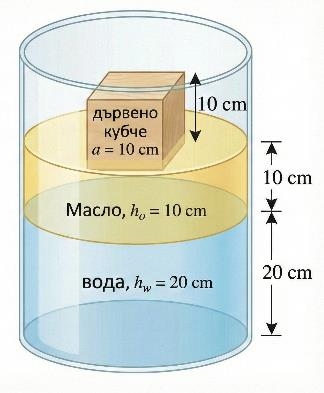
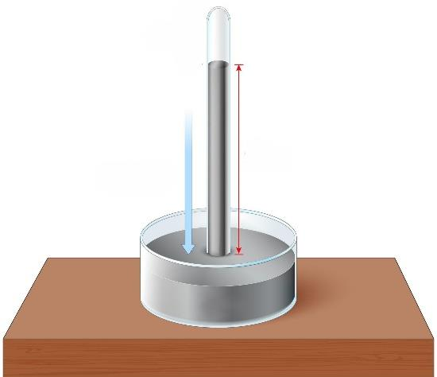

**ЗАДАЧА 1. Потапяне**

В цилиндричен съд с лице на дъното $S = 1700\text{ cm}^2$ са налети вода с плътност $\rho_w = 1000\text{ kg/m}^3$ и масло с плътност $\rho_o = 800\text{ kg/m}^3$. Дебелината на водния слой е $h_w = 20\text{ cm}$, а на масления слой е $h_o = 10\text{ cm}$. Маслото и водата не се смесват. В съда се пуска дървено кубче с дължина на страната $a = 10\text{ cm}$ и плътност $\rho_d = 900\text{ kg/m}^3$. Кубчето плава така, че част от него е във водата, а другата част е в маслото, без да допира дъното, като две от стените му са хоризонтални, а другите 4 са вертикални. Приемете земното ускорение $g = 10\text{ m/s}^2$.

а) Определете хидростатичното налягане, което течностите упражняват върху дъното на съда, преди пускането на кубчето. \[1 т.\]

б) Запишете условието за равновесие на кубчето. \[1 т.\]

в) Определете каква част от височината на кубчето е потопена във водата и каква в маслото. Определете дали кубчето е изцяло потопено в течностите или част от него остава над повърхността на маслото. \[2 т.\]

г) С колко сантиметра ще се повиши общото ниво на течността в съда (спрямо дъното) след потапянето на кубчето? \[1 т.\]

Върху центъра на горната стена на кубчето се поставя малка метална сачма с маса $m$. Обемът на сачмата е пренебрежим. Кубчето потъва, докато горната му стена съвпадне с границата между водата и маслото (кубчето се намира изцяло във водата).
д) Намерете масата $m$. \[2 т.\]

След това сачмата се маха. Вместо нея към кубчето се връзва метално цилиндърче с обем $V_c = 10\text{ cm}^3$ и плътност $\rho_c = 7800\text{ kg/m}^3$. Цилиндърчето е свързано с кубчето чрез лека, неразтеглива и опъната нишка. То виси под кубчето, изцяло потопено във водата, и не допира дъното.

е) Определете новото положение на кубчето. Колко сантиметра от него са потопени във водата и колко – в маслото. \[2 т.\]

ж) При това положение определете с колко сантиметра се изменя височината на границата вода–масло спрямо първоначалното положение (преди пускането на кубчето). \[1 т.\]

**ЗАДАЧА 2. Разминаване и изпреварване**

По два успоредни съседни железопътни коловоза се движат пътнически влак ("Експрес") и товарен влак. Експресът има дължина $L_e = 120\text{ m}$ и се движи с постоянна скорост $v_{e0} = 90\text{ km/h}$. Товарният влак има дължина $L_t = 280\text{ m}$. В момента $t_0 = 0\text{ s}$, когато двата влака се намират в позиция за начало на разминаване или изпреварване, и двата влака са в положение „нос до нос “, тоест най-предните части на двата локомотива лежат на една права, перпендикулярна на коловоза. Товарният влак има скорост $v_{t0} = 36\text{ km/h}$ и започва да ускорява с постоянно положително ускорение $a_{t0} = 0,2\text{ m/s}^2$. Разгледайте два независими случая за движението на влаковете:

Случай А (Еднопосочно): влаковете се движат еднопосочно и експресът изпреварва товарния влак.

Случай Б (Разнопосочно): влаковете се движат един срещу друг и се разминават.

а) Превърнете скоростите в m/s. Запишете как относителната скорост (скоростта един спрямо друг) $v_{rel}$ между двата влака зависи от времето за Случай А и за Случай Б. \[1,5 т.\]

б) В Случай А, намерете колко време $t_A$ е необходимо на Експреса, за да извърши пълно изпреварване на товарния влак. (Забележка: Пълно изпреварване е когато последният вагон на дадения влак подмине локомотива на другия влак). \[2 т.\]

в) В Случай Б, намерете колко време $t_B$ ще отнеме пълното разминаване на двата влака (от срещата на локомотивите до раздалечаването на последните вагони). \[2 т.\]

г) Пътник, седящ до прозореца и намиращ се точно в средата на Експреса, решава да засече с хронометър колко време вижда товарния влак през стъклото си. Пресметнете това време $\tau$ и за двата случая А и Б. \[4,5 т.\]

**ЗАДАЧА 3. Барометър.**

През 1643 г. италианският учен Еванджелиста Торичели провежда исторически експеримент, с който доказва съществуването на атмосферното налягане. Той напълва стъклена тръба, запоена в единия край, с живак, обръща я и потапя отворения ѝ край в съд, също пълен с живак. Част от живака изтича, но в тръбата остава стълб с определена височина. Над него се образува пространство, което практически е вакуум. Атмосферното налягане действа върху свободната повърхност на живака в съда и уравновесява хидростатичното налягане на живачния стълб в тръбата. В следващата задача ще изследвате как различни условия влияят върху показанията на този уред.

Дадено: Плътност на живака $\rho_{Hg} = 13600\text{ kg/m}^3$, плътност на водата $\rho_w = 1000\text{ kg/m}^3$, плътност на маслото $\rho_o = 800\text{ kg/m}^3$, земно ускорение $g = 10\text{ m/s}^2$, атмосферно налягане на морското равнище $p_0 = 102000\text{ Pa}$. Пренебрегваме изпарението на живака и температурните изменения.

а) Определете вертикалната височина $h_0$ на живачния стълб при атмосферно налягане $p_0$, когато тръбата е вертикална. \[1 т.\]

б) Тръбата се накланя така, че сключва ъгъл $30^\circ$ с хоризонталата. Вертикалната проекция на живачния стълб остава равна на $h_0$. Определете дължината $L$ на живачния стълб, измерена по оста на тръбата. \[1 т.\]

в) Метален съд с отворено дъно (подобен на водолазна камбана) се спуска във вода. В него има въздух. При спускането водата навлиза частично в съда и въздухът се компресира. В даден момент границата между въздуха и водата вътре в съда се намира на дълбочина $H = 10,2\text{ m}$ под повърхността на езерото. Да се приеме, че налягането на въздуха вътре в съда е равно на налягането на водата на същата дълбочина. Определете налягането $p_1$ на въздуха в съда. \[1 т.\]

г) Барометърът се намира вътре в съда от подусловие в). Определете вертикалната височина $h_1$ на живачния стълб. Приемете, че тръбата е достатъчно дълга. (1 т.)

д) След връщане на повърхността в пространството над живака в тръбата е проникнал въздух. Измерената височина на живачния стълб е $h_r = 60\text{ cm}$. Запишете уравнението за равновесие на наляганията в този случай. \[1 т.\]

е) Определете налягането $p_v$ на въздуха над живака в тръбата. \[1 т.\]

ж) Използва се нов, изправен барометър (без въздух в тръбата). Върху повърхността на живака във ваната се налива слой масло с височина $h_M = 68\text{ cm}$. Отвореният край на тръбата остава потопен достатъчно дълбоко в живака под маслото. Определете налягането върху повърхността на живака под масления слой. \[1 т.\]

з) Определете с колко сантиметра $\Delta h$ ще се измени височината на живачния стълб в тръбата спрямо първоначалната височина $h_0$. \[1 т.\]

и) След разклащане на уреда част от маслото навлиза в тръбата и образува слой с височина $h_B = 17\text{ cm}$ над живака вътре в нея. Външният слой масло във ваната остава с височина 68 cm. Над течностите в тръбата има вакуум. Да се намери новата вертикална височина $h_H$ на живачния стълб в тръбата. \[2 т.\]