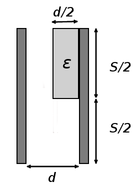
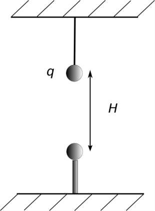

Полезни физични константи
Заряд на електрона: e =- 1,6.10-19 C
Константа на Кулон: k = 9. 109 Nm2 C-2

Задача 1. Електростатика (10 точки)
 Част 1. Елена се пързаля върху килима на пода и се наелектризира. Малко преди да
достигне вратата, тя има заряд q = 2,4 mC.
 а) Колко електрона е отдала Елена на килима? (1 точка)
 б) Тя докосва металната врата и усеща лек токов удар. Обяснете явлението. (1 точка)
 в) Определете тока, който протича за t = 0,25 s като приемете, че той е постоянен. (1 точка)

 Част 2. Кондензатор с капацитет C = 0,14 pF се зарежда и се отделя от електрическата
мрежа. Измереното напрежение е U1 = 360 V. Към кондензатора се включва успоредно втори
кондензатор. Измереното ново напрежение е U2 = 210 V. Определете капацитета C' на втория
кондензатор. (2 точки)
 Част 3. Във въздушен кондензатор с капацитет C = 0,6 pF е
 внесена диелектрична пластина с диелектрична
 проницаемост $\varepsilon$ = 2. Пластината е разположена, както е
 показано на фиг. 1. Размерите на електродите на
 кондензатора са значително по-големи от разстоянието
 между тях. Определете капацитета на кондензатора C0 след
 внасяне на пластината. (5 точки)

 Фиг. 1

 Фиг. 1

Задача 2. Заряди в гравитационно поле (10 точки)
 Метално топче със заряд q = +0,1 $\mu$C и маса m = 1 g е
 окачено на безтегловна, неразтеглива нишка, направена от
 изолаторен материал. Земното ускорение е g = 9,81 m/s 2 .
 а) Определете силата на опъване на нишката. (1 точка)
 Директно под топчето на диелектрична пръчица е закрепено
 неподвижно второ топче със същия по големина заряд и същата
 маса, както е показано на фиг. 2. Силата на опъване на нишката
 е 0.
 б) Какъв е по знак зарядът на топчето? (1 точка)
 в) Определете разстоянието H между двете топчета. (2 точки)

 Фиг. 2

 Долното топче се отделя от диелектричната пръчица и се
 прикача към горното топче на изолираща, безтегловна и
 неразтеглива нишка с дължина h. Зарядите на двете топчета се
 запазват. Под него на диелектрична пръчица е закрепено
 неподвижно трето топче с неизвестен заряд Q, както е показано
 на фиг. 3.
 г) Намерете големината и знака на Q, ако при разстояние 2h
 между долните две топчета силите на опъване на двете нишки
 стават равни на нула. (6 точки)

 Фиг. 3

Задача 3. Свободно падане и земно ускорение (10 точки)
 Част 1. За да се определи дълбочината на кладенец, в него се пуска камък без начална
скорост. След t = 3 s се чува как той достига дъното. Определете дълбочината на кладенеца
h, ако скоростта на звука е vS = 330 m/s. Земното ускорение е g = 9,81 m/s2 . (3 точки)

 Част 2. В близост до земната повърхност земното ускорение може да се приеме за
 C
постоянно. На големи разстояния обаче то намалява според закона gЕ (r) = rE2 , където CE е
константна величина, зависеща от масата на Земята, а r е разстоянието до центъра на Земята.
 а) Определете константата CE, взимайки предвид, че радиусът на Земята е 6400 km, а
ускорението на нивото на земната повърхност е gЕ (RЕ ) = 9,81 m/s2 . (1 точка)
 б) Лунното ускорение зависи от разстоянието до центъра на Луната по същия начин както
 C
земното gМ (r) = rМ2 , но с различна константа CМ. Приемайки, че радиусът на Луната е
1700 km, а ускорението на повърхността й е 17% от gE (RE ), пресметнете константата CМ.
(1 точка)
 в) Приемайки, че CE и CM зависят правопропорционално съответно от масата на Земята
 m
mE и масата на Луната mM , намерете съотношението m E . (1 точка)
 M
 г) Разстоянието Земя-Луна е R = 384000 km. На какво разстояние R' от Земята се намира
обект, върху който силите на тежестта между Луната и Земята се уравновесяват? Направете
чертеж. (4 точки)
 CE
 Упътване: Формулата gЕ (r) = r 2 важи единствено от земната повърхност нагоре, т.е. не и
във вътрешността на Земята.

 Успешно представяне!
