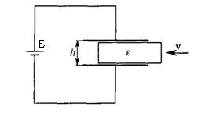

Задача 1. Движение в течности

В цилиндричен съд са налети две несмесващи се течности с плътности $\rho_1$ и $\rho$ 2
съответно, като $\rho_1$ < $\rho_2$ . Дебелината на слоя от първата течност е h1 , а от втората - h2 .
От разделителната повърхност въздух-течност в съда се пуска без начална скорост
топче, което достига дъното със скорост равна на нула. Земното ускорение е g .
Триенето се пренебрегва. Определете:
 а) плътността $\rho$ на материала, от който е направено топчето \[6 т.\]
 б) ускорението a1 и a2 на топчето във всяка от течностите \[2 т.\]
 в) времето t на движение на топчето в течностите. \[2 т.\]

Задача 2. Цикличен процес

На фиг. 1 е показан процесът 1-2-3-1, извършен с един mol хелий, разглеждан като
идеален газ. В участъка 1-2 (изохорен процес) газът отдава на околната среда
количество топлина Q = 1660 J и температурата му намалява 4 пъти. Температурите в
състояния 2 и 3 са равни. Вътрешната енергия на хелия се дава с израза U = (3 / 2) BT .
 J
Газовата константа за един mol газ е B = 8,3 .
 K
 а) Определете температурата T1 на газа в състояние 1. \[1,3 т.\]
 б) Намерете количеството топлина Q' , което газът обменя с околната среда при
своето разширяване. \[5,2 т.\]
 в) Дайте геометричнo тълкуване на работата W , извършена от газа в процеса
1-2-3-1. \[1,5 т.\]
 г) Намерете работата W . \[2 т.\]

 Фи г. 1

Указание. При решаване на задачата използвайте следните означения: минимален
обем V1 , максимален обем V2 , минимално налягане p 2 , максимално налягане p1 ,
налягане в състояние 3 - p ' .
Задача 3. Електричен ток

ЧАСТ А. (Козел 2.4.8, Сивухин 3.45.4) В електрическата схема на фиг. 2 съпротивлението R1 = 10 $\Omega$, a R2 / R3 = 4 , като
токът през галванометъра G (амперметър, който измерва много слаби токове), е равен
на нула. Електродвижещите напрежения на източниците са E1 = 60 V и E3 = 9 V ,
докато напрежението E 2 е неизвестно. Вътрешните съпротивления на източниците са
пренебрежими.
 а) Намерете електродвижещото напрежение E 2 . \[2 т.\]
 б) Определете тока I през източника E1 \[2 т.\]

 Фиг. 2.

ЧАСТ Б. (Козел 2.4.14) Плосък кондензатор, чиито електроди са квадратни метални пластини, всяка с
площ S и разстояние между тях h , е свързан към източник с електродвижещо
напрежение E и пренебрежимо вътрешно съпротивление. В пространството между
пластините навлиза с постоянна скорост v и без триене диелектрична пластина с
проницаемост $\varepsilon$ , която постепенно запълва цялото пространство между електродите на
кондензатора (фиг. 3).

 Фиг. 3.

а) Определете тока I във веригата, докато диелектричната пластина се движи. \[4 т.\]
б) Намерете работата на източника за единица време, т.е. мощността P , която е
необходима, за поддържане на механичното движение на диелектрика. \[2 т.\]
