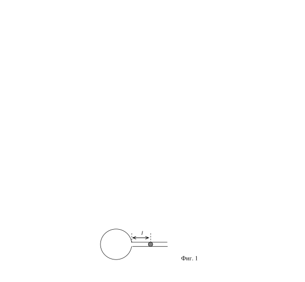
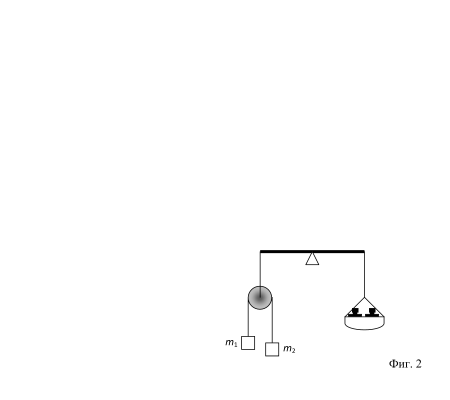

[[Състезания/proletno/9/2021|◂ 2021]] | [[Състезания/proletno/9r/2022|решения]] | [[Състезания/proletno/9/2023| 2023 ▸]]

**Задача 1. Свързване на източници в електрическа верига**

В електрична верига са свързани консуматор със съпротивление R и източник с ЕДН $\varepsilon$ и вътрешно съпротивление r . Към източника във веригата се свързва друг, еднакъв на него източник, един път последователно, а след това успоредно.

а) Начертайте схемите на двете вериги. \[2 т.\]

б) Намерете на колко трябва да са равни ЕДН $\varepsilon$ ' и вътрешното съпротивление r ' на източник, който може да замени двата последователно свързани източници във веригата без да настъпят изменения? На колко трябва да са равни ЕДН $\varepsilon$ '' и вътрешното съпротивление r '' на източник, който може да замени двата успоредно свързани източници без да настъпят изменения във веригата? \[3,5 т.\]

в) Как трябва да бъдат свързани двата еднакви източника на ЕДН, така че
мощността на консуматора да бъде възможно най-голяма? \[4,5 т.\]

**Задача 2. Газов термометър**

Газов термометър се състои от стъклен балон и запоена към него хоризонтална дълга стъклена тръбичка с напречно сечение S = 0,1 cm2 и дължина L = 100 cm (фиг. 1). Капка живак в тръбичката отделя въздуха в стъкления балон от външното пространство. При температура T1 = 273 K капката живак се намира на разстояние l1 = 30 cm от повърхността на балона, а при температура T2 = 278 K на разстояние l2 = 50 cm.
Намерете:

а) обема V на стъкления балон \[5 т.\]

б) зависимостта на температурата T на газа от разстоянието l на капката живак в
тръбичката \[3 т.\]

в) постройте графиката на температурата Т на газа от разстоянието l за цялата
дължина на тръбичката и определете интервала от температури, които могат да бъдат измерени с този термометър. \[2 т.\]

Задача 3. Каква маса отчитат везните?

Две тела съответно с маси m1 = 150 g и m2 = 100 g са свързани с лека неразтеглива нишка, както е показано на фиг. 2. Нишката действа на всяко от телата с една и съща сила на опън T .

а) Намерете ускорението на всяко от телата и силата на опън T на нишката,
когато везната е в равновесие. \[6 т.\]

б) При каква маса m на теглилките в блюдото везната (равнораменен лост) е в
равновесие? \[4 т.\]

Макарата и блюдото имат равни маси, много по-малки от масите m1 и m2, поради което могат да бъдат пренебрегнати. За земното ускорение използвайте стойността g $\approx$ 10 m/s2 .