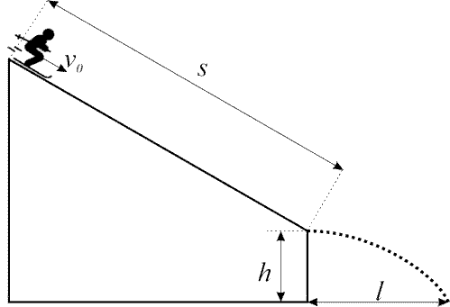

**Задача 1: Провален експеримент**

Лора извършва лабораторно упражнение по физика, което проверява закона за запазване на енергията при топене на лед. Експерименталната установка представлява калориметър (затворен съд, изолиран от околната среда), пълен с лед с маса mл и температура tл = -30 $^\circ$C. Към него се долива вода с обем V = 50 ml и температура tв = 50 $^\circ$C. Крайната температура в калориметъра трябва експериментално да потвърди теоретичната стойност от tкр = 3 $^\circ$C.
Докато долива водата в калориметъра, в него от джоба ѝ пада монета с маса mм = 10 g и температура tм = 40 $^\circ$C. Това води до получаване на различна крайна температура от tкр2 = 3,5 $^\circ$C. Определете:

А) Първоначалната маса на леда mл . \[5,5 т\]

Б) Специфичния топлинен капацитет на монетата cм .

Специфичният топлинен капацитет на леда е $c_\text{л} = 2100\ \mathrm{J/(kg.^\circ C)}$, на водата $c_\text{в} = 4200\ \mathrm{J/(kg.^\circ C)}$,специфичната топлина на топене на леда е $\lambda$ = 335 kJ/kg , а плътността на водата е $\rho$ = 1000 kg/m3. \[4,5 т\]

**Задача 2: Ски скок**

Скиор е на състезание по ски скок. Когато се намира на разстояние s = 40 m от мястото на излитане, неговата скорост е v0 = 10 m/s . От края на пистата излита хоризонтално със скорост vи = 20 m/s от височина h = 8,8 m.

А) Определете ускорението на скиора по време на спускането и времето за спускане по пистата. \[5 т\]

Б) Определете крайната скорост vпад на падане на скиора. \[5 т\]

Гравитационното ускорение е g = 10 m/s 2.

Съпротивлението на въздуха се пренебрегва.

**Задача 3: Реостат**

Реостатът представлява навит проводник с много голяма дължина и три изхода - два от тях в краищата на проводника (1 и 2) и един регулируем (3), който променя точката си на контакт върху проводника, както е показано на фиг. 1.

При свързване на реостат в схемата, показана на фиг. 2, при подадено напрежение U = 36 V, ако отношението на:
- дължината на проводника $\frac{l_1}{l_2} = \frac{1}{2}$, показанието на амперметъра е Iа1 = 0,6 A
- дължината на проводника $\frac{l_1}{l_2} = \frac{2}{1}$, показанието на амперметъра е Iа2 = 0,45 A
Определете цялото съпротивление на реостата R и съпротивлението на резистора R3 . \[10 т\]