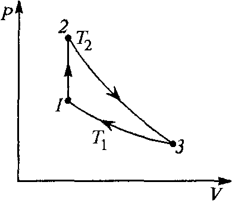
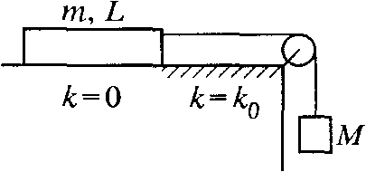

**Задача 1. Топлинни явления**

**А.** Цилиндрична пипета с дължина $l$ е вертикално потопена наполовина в живак. Тя бива затисната с палец и извадена от живака. Част от живака изтича. Определете дължината $x$ на стълбчето живак, останал в пипетата. Атмосферното налягане е равно на хидростатичното налягане на стълб живак с дължина $H$. \[6 т.\]

**Б.** (Заикин 3.8) Топлинна машина с работно вещество идеален газ работи по кръгов процес, показан на фиг. 1. При адиабатния процес 2–3 газът извършва работа $A'$, докато за един цикъл той отделя в околната среда количество топлина $Q > 0$. Процесът 3–1 е изотермен. 

Определете:

а) работата $A$, извършена от работното вещество за един цикъл \[2 т.\]

б) полученото количество топлина $Q_1$ за един цикъл \[1,5 т.\]

в) коефициента на полезно действие (КПД) на топлинната машина \[0,5 т.\]

**Задача 2. Механична система** (Заикин 4.46)

Тяло с маса $M$ е свързано чрез неразтеглива нишка с пренебрежима маса с еднородна дъска с маса $m$ и дължина $L$, която лежи върху хоризонтален плот (фиг. 2). В началния момент дъската лежи върху гладката част на плота (коефициент на триене $k = 0$), като от началото на движението тя попада върху грапава повърхност (коефициент на триене $k = k_0$). Приемете $M > m k_0$, $k_0 < 1$. Земното ускорение е $g$. Определете:

а) силата на опън $T(x)$, с която нишката действа на дъската, когато част от дъската с дължина $x$ се намира върху грапавата повърхност. \[5,5 т.\]

б) ускорението $a(x)$ при същото положение на дъската, както в а). Намерете минималната и максималната стойност на ускорението, докато дъската се окаже изцяло върху грапавата повърхност. \[1,5 т.\]

в) Начертайте графиката на ускорението $a(x)$ от началото на движението на дъската до момента, в който тя се оказва изцяло върху грапавата повърхност. Намерете площта под графиката и абсцисата. Намерете физичната величина, свързана с тази площ. Определете нейната стойност. \[3 т.\]

**Задача 3. Електрически вериги**

Когато към акумулатор се свърже консуматор 1, токът през него е $I_1 = 4\text{ A}$, а мощността му – $P_1 = 10\text{ W}$. При свързване към същия акумулатор на друг консуматор 2 токът през него е $I_2 = 7\text{ A}$, а мощността му – $P_2 = 15\text{ W}$.

а) Определете еквивалентното (общото) съпротивление на консуматорите, получени чрез последователно и успоредно свързване на консуматорите 1 и 2. \[4 т.\]

б) Намерете ЕДН $\varepsilon$ и вътрешното съпротивление $r$ на акумулатора. \[6 т.\]