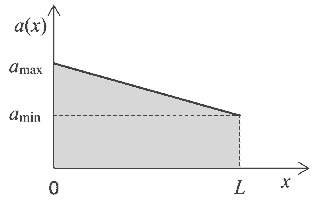

**Задача 1.**

А. При затискането на пипетата в горната й половина се намира въздух с налягане, равно на атмосферното $P_a$ \[0,25 т.\]. При изваждането й от живака външното налягане $P_a < P$ – налягането, което оказват стълбчето живак с височина $(1/2)l$ и въздухът в пипетата. \[0,5 т.\] Живак ще изтича от пипетата докато двете налягания се изравнят, т.е. когато се достигне равенството $P_a = P_1$ \[0,5 т.\]. Като отчетем, че $P_a = \rho gH$ \[0,5 т.\] и $P_1 = \rho gx + P_2$ \[0,5 т.\], получаваме
(1) $\rho gH = \rho gx + P_2$. \[0,5 т.\]

Налягането $P_2$ е крайното налягане на въздуха в пипетата, което той достига след изотермно разширение:
$P_2(l - x)s = P_a(1/2)ls$ , \[0,5 т.\]
т.е. определяме
$P_2 = \frac{\rho g}{2} \frac{Hl}{(l - x)}$ . \[0,5 т.\]

След като заместим в (1), намираме уравнението, което трябва да удовлетворява $x$:
$2x^2 - 2(H + l)x + Hl = 0$. \[0,5 т.\]

Неговите решения са
$x_{1,2} = \frac{1}{2} \left[ (H + l) \pm \sqrt{H^2 + l^2} \right]$ , \[0,5 т.\]
като и двете са положителни. От друга страна трябва да бъде изпълнено условието
$x_{1,2} < \frac{1}{2}l$ , \[0,5 т.\]
което води до неравенството
$H \pm \sqrt{H^2 + l^2} < 0$. \[0,25 т.\]

Тогава дължината на стълбчето живак, останало в пипетата, е
$x = \frac{1}{2} \left[ (H + l) - \sqrt{H^2 + l^2} \right]$ . \[0,5 т.\]

Б. а) Газът върши работа при адиабатния и изотермния процес. Тогава имаме
$A = A' + A_T$ . \[0,5 т.\]

Тъй като вътрешната енергия на идеалния газ зависи само от температурата \[0,5 т.\], при изотермния процес тя не се променя, т.е. в сила е равенството
$\Delta U = U_1 - U_3 = 0 = -Q - A_T$ . \[0,5 т.\]

Следователно намираме $A = A' - Q$ . \[0,5 т.\]

б) Тъй като $A = Q_1 - Q_2$ \[0,5 т.\], където $Q_1$ е полученото количество топлина за един цикъл от газа, а $Q_2$ – отдаденото от газа количество топлина, т.е. $Q_2 = Q$ \[0,5 т.\].
Тогава намираме $Q_1 = A'$ . \[0,5 т.\]

в) По определение КПД се дава с израза
$\eta = \frac{A}{Q_1} = 1 - \frac{Q}{A'}$ . \[0,5 т.\]

**Задача 2.** а) Разглеждаме дъската като две тела съответно с маси
$m(x) = \rho Sx = \rho SL \frac{x}{L} = m \frac{x}{L}$ , \[0,5 т.\]
$m_1(x) = m - m(x) = m \left( 1 - \frac{x}{L} \right)$ , \[0,5 т.\]

където $m(x)$ е масата на частта от дъската върху грапавата повърхност, а $m_1(x)$ – масата от дъската върху гладката повърхност. Ще означим с $T(x)$ силата, с която нишката дърпа дъската, а с $a(x)$ – ускорението на дъската. Тогава можем да запишем уравненията на движение на двете части на дъската:
$m(x)a(x) = T(x) - f(x) - T_0$ , \[1 т.\]
$m_1(x)a(x) = T_0$ . \[0,5 т.\]

В тези уравнения силата на триене е
$f(x) = k_0 m(x)g$ \[0,5 т.\],
а $T_0$ – силата на взаимодействие между двете части на дъската. Като изключим $T_0$ получаваме уравнението
$ma(x) = T(x) - k_0 mg \frac{x}{L}$ . \[1 т.\]

От друга страна уравнението на движение на тялото с маса $M$ е
$Ma(x) = Mg - T(x)$ . \[0,5 т.\]

От двете уравнения намираме
$T(x) = \frac{mM}{m + M} g \left( 1 + k_0 \frac{x}{L} \right)$ . \[1 т.\]

б) Като заместим $T(x)$ в първото уравнение на движение, намираме ускорението
$a(x) = g \frac{M}{m + M} \left( 1 - \frac{k_0 m}{ML} x \right)$ . \[1 т.\]

Ускорението на дъската намалява с навлизане над грапавата повърхност. Следователно имаме
$a_{max} = a(0) = \frac{M}{m + M} g$ , \[0,25 т.\]
$a_{min} = a(L) = \frac{M - k_0 m}{m + M} g$ . \[0,25 т.\]

в) Графиката на ускорението $a(x)$ до навлизането на дъската изцяло на грапавата повърхност е показана на фиг. 1. \[1 т.\] Площта под графиката на функцията и оста х е площ на трапец
$S_{\text{трапец}} = \frac{a_{max} + a_{min}}{2} L = \frac{2M - k_0 m}{2(m + M)} gL$ . \[0,5 т.\]

От друга страна можем да запишем $S_{\text{трапец}} = a_{cp.}L$, т.е. движението на дъската до пълното й излизане върху грапавата повърхност може да се разглежда като движение с постоянно ускорение $a_{cp.}$ \[0,5 т.\]. Тогава крайната скорост на дъската е
$v = \sqrt{2 a_{cp.} L} = \sqrt{2 S_{\text{трапец}}}$ \[0,5 т.\]
$v = \sqrt{\frac{2M - k_0 m}{(m + M)} gL}$ \[0,5 т.\]

*

**Задача 3.**

а) При последователно свързване еквивалентното съпротивление е
$R' = R_1 + R_2$ . \[0,5 т.\]

Като отчетем, че
$R_1 = \frac{P_1}{I_1^2}$ , \[0,5 т.\]
$R_2 = \frac{P_2}{I_2^2}$ , \[0,5 т.\]
намираме
$R' = \frac{P_1 I_2^2 + P_2 I_1^2}{I_1^2 I_2^2} \approx 0,93 \, \Omega$ . \[1 т.\]

При успоредно свързване еквивалентното съпротивление е
$R'' = \frac{R_1 R_2}{R_1 + R_2} = \frac{P_1 P_2}{P_1 I_2^2 + P_2 I_1^2} \approx 0,21 \, \Omega$ . \[1,5 т.\]

б) От закона на Ом за цялата верига следва
$\varepsilon = I_1(R_1 + r)$ , \[0,5 т.\]
$\varepsilon = I_2(R_2 + r)$ , \[0,5 т.\]

откъдето намираме
$\varepsilon = \frac{I_1 I_2(R_1 - R_2)}{I_2 - I_1}$ , \[1 т.\]
$r = \frac{I_1 R_1 - I_2 R_2}{I_2 - I_1}$ . \[1 т.\]

След заместване на съпротивленията имаме
$\varepsilon = \frac{P_1 I_2^2 - P_2 I_1^2}{I_1 I_2(I_2 - I_1)} \approx 3,0 \, \text{V}$ , \[1,5 т.\]
$r = \frac{P_1 I_2 - P_2 I_1}{I_1 I_2(I_2 - I_1)} \approx 0,12 \, \Omega$ . \[1,5 т.\]