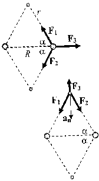
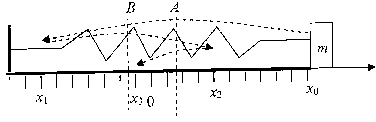

**Задача 1.** а) На протона действат три сили:

(1) $F_1 = F_2 = \frac{ke^2}{r^2}$  \[0,25 т\]

и

(2) $F_3 = \frac{ke^2}{R^2}$  \[0,25 т\]

От условието за равновесие на трите сили имаме:

(3) $F_1 \cos \alpha + F_2 \cos \alpha = F_3$  \[0,5 т\]

От друга страна:

(4) $\cos \alpha = \frac{R}{2r}$

От уравненията (1)–(4) намираме

(5) $r/R = 1$ или $r = R$  \[1,0 т\]

б) Прилагаме втория принцип на Нютон за един от електроните:

(6) $\frac{mv^2}{\rho} = F_1 \sin \alpha + F_2 \sin \alpha - F_3$,  \[1,0 т\]

където:

(7) $F_1 = F_2 = \frac{ke^2}{r^2} = \frac{ke^2}{R^2}$  \[0,5 т\]

и

(8) $F_3 = \frac{ke^2}{(2\rho)^2}$  \[0,5 т\]

От уравнения (5) и (4) намираме:

(9) $\cos \alpha = \frac{1}{2} \Rightarrow \sin \alpha = \frac{\sqrt{3}}{2}$

Също така:

(10) $\rho = r \sin \alpha = \frac{R\sqrt{3}}{2}$

Така получаваме:

(11) $mv^2 = \frac{(9 - \sqrt{3})ke^2}{6R}$

или

(12) $v = \sqrt{\frac{(9 - \sqrt{3})ke^2}{6mR}}$  \[1,0 т\]

в) Кинетичната енергия на електроните е:

(13) $K = 2 \left( \frac{mv^2}{2} \right) = \frac{(9 - \sqrt{3})ke^2}{6R}$  \[0,25 т\]

Потенциалната енергия на системата е сума от потенциалните енергии на взаимодействие на всички двойки частици:

(14) $U = U_{pp} + 4U_{ep} + U_{ee}$  \[0,25 т\]

където:

(15) $U_{pp} = \frac{ke^2}{R}$  \[0,25 т\]

(16) $U_{ep} = -\frac{ke^2}{r} = -\frac{ke^2}{R}$  \[0,25 т\]

(17) $U_{ee} = \frac{ke^2}{(2\rho)} = \frac{\sqrt{3}ke^2}{3R}$  \[0,25 т\]

Следователно:

(18) $U = -\frac{(9 - \sqrt{3})ke^2}{3R}$  \[0,25 т\]

Окончателно намираме:

(19) $E = K + U = -\frac{(9 - \sqrt{3})ke^2}{6R}$

Следователно:

(20) $C = \frac{(9 - \sqrt{3})}{6}$  \[0,5 т\]

г) От условието за квантуване имаме:

(21) $2\pi\rho = n \frac{h}{mv}$ или $mv\rho = n\hbar$  \[0,5 т\]

Използваме изразите за радиуса (10) и за скоростта (12), за да получим уравнение за $R$:

(20) $m \sqrt{\frac{(9 - \sqrt{3})ke^2}{6mR}} \times \frac{\sqrt{3}}{2} mR = n\hbar$

Следователно, в състояние на равновесие разстоянията между протоните могат да приемат следните стойности:

(21) $R = \frac{8n^2\hbar^2}{(9 - \sqrt{3})mke^2}$  \[0,5 т\]

Минималното разстояние между протоните съответства на $n = 1$:

(22) $R_{min} = \frac{8\hbar^2}{(9 - \sqrt{3})mke^2} \approx 5,78 \times 10^{-11} \text{ m} = 0,578 \text{ \AA}$.  \[0,25 т + 0,25 т\]

Съответната минимална енергия се получава като заместим израза за $R_{min}$ в (19):

(23) $E_{min} = -\frac{(9 - \sqrt{3})ke^2}{6 R_{min}} = -\frac{(9 - \sqrt{3})^2 m k^2 e^4}{48 \hbar^2}$

След опростяване на израза получаваме:

(24) $E_{min} = -\frac{(14 - 3\sqrt{3}) m k^2 e^4}{8 \hbar^2} = -4,827 \times 10^{-18} \text{ J} = -30,2 \text{ eV}$ \[0,25 т + 0,25 т\]

д) Понеже водородната молекула се разпада на два атома водород, енергията на връзката е:

(25) $E_B = 2E_H - E_{min} = -27,2 \text{ eV} - (-30,2 \text{ eV}) = 3,0 \text{ eV}$ \[0,5 т + 0,5 т\]

*Коментар.* Експериментално измереното разстояние между протоните във водородната молекула е $R_{min} = 0,74 \text{ \AA}$, а експерименталната стойност на енергията на връзката: $E_B = 4,37 \text{ eV}$

**Задача 2.** а) Релативистката маса на електрона е:

(1) $m' = \frac{m}{\sqrt{1 - (v/c)^2}}$ \[1 т\]

Магнитната сила, действаща на електрона има големина:

(2) $F = evB$ \[1 т\]

и е насочена перпендикулярно на посоката на скоростта. Следователно електронът има нормално ускорение:

(3) $a = \frac{F}{m'} = \frac{evB \sqrt{1 - (v/c)^2}}{m}$ \[1 т\]

Мощността на излъчване на електрона е:

(4) $P = \frac{e^2 a^2}{6 \pi \epsilon_0 c^3} = \frac{e^4 v^2 B^2 (1 - (v/c)^2)}{6 \pi \epsilon_0 c^3 m^2} \approx 3,64 \times 10^{-19} \text{ W}$ \[1 т\]

б) От кинематичното съотношение:

(5) $a = \frac{v^2}{R}$ \[1 т\]

намираме радиуса на орбитата:

(6) $R = \frac{mv}{eB \sqrt{1 - (v/c)^2}}$ \[1 т\]

Вътре в областта с магнитно поле орбитата представлява дъга, на която съответства централен ъгъл:

(7) $\alpha = \arcsin(d/R) = \arcsin\left( \frac{deB \sqrt{1 - (v/c)^2}}{mv} \right)$ \[1 т\]

Дължината на дъгата е съответно:

(8) $L = R \alpha = \frac{mv}{eB \sqrt{1 - (v/c)^2}} \arcsin\left( \frac{deB \sqrt{1 - (v/c)^2}}{mv} \right)$ \[1 т\]

а времето, за което частицата преминава областта с магнитно поле:

(9) $t = \frac{L}{v} = \frac{m}{eB \sqrt{1 - (v/c)^2}} \arcsin\left( \frac{deB \sqrt{1 - (v/c)^2}}{mv} \right)$ \[1 т\]

Пълното количество излъчена енергия е:

(10) $E_{rad} = Pt = \frac{e^3 B v^2 \sqrt{1 - (v/c)^2}}{6 \pi \epsilon_0 c^3 m} \arcsin\left( \frac{deB \sqrt{1 - (v/c)^2}}{mv} \right) \approx 1,57 \times 10^{-28} \text{ J}$ \[1 т\]

**Задача 3. А)** Налягането на газа в бутилката е:

(1) $p = \frac{mRT}{\mu V} = \frac{3mRT}{4\pi r^3 \mu}$ \[0,5 т\]

където:

(2) $\mu = \mu_c + 4\mu_H = 0,016 \text{ kg/mol}$

Мислено разделяме сферата на две половини. Върху всяка от тях газът упражнява сила:

(3) $F = p \pi r^2 = \frac{3mRT}{4r\mu}$ \[0,5 т\]

Тази сила води до възникване на сила на еластичност със същата големина в пръстеновидното напречно сечение на бутилката. Площта на това напречно сечение е:

(4) $S \approx 2\pi r d$, \[0,5 т\]

защото $d \ll r$. Следователно механичното напрежение в напречното сечение е:

(5) $\sigma = \frac{F}{S} = \frac{3mRT}{8\pi r^2 d \mu}$ \[0,5 т\]

Обемът на материала, от който е изработена бутилката е:

(6) $V_m = 4\pi r^2 d$ \[0,5 т\]

Следователно:

(7) $\sigma = \frac{3mRT}{2V_m \mu}$ \[0,5 т\]

Понеже $\sigma \le \sigma_{max}$, намираме, че за изработката на бутилката е нужен материал с минимален обем:

(8) $V_{m,min} = \frac{3mRT}{2\sigma_{max} \mu}$ \[0,5 т\]

и минималната маса на бутилката е:

(9) $M_{min} = \rho V_{m,min} = \frac{3\rho mRT}{2\sigma_{max} \mu}$ \[1 т\]

Като заместим с числените данни, намираме:

(10) $M_{min} \approx 73 \text{ kg}$ \[0,5 т\]

Б) Трупчето ще спре окончателно в точка с координата $x$ такава, че:

(1) $k|x| \le \mu mg$ \[0,5 т\]

т.е. между точките $A$ и $B$ с координати:

(2) $x_A = +\frac{\mu mg}{k} = 0,015 \text{ m} = 1,5 \text{ cm}$ \[0,5 т\]

и

(3) $x_B = -\frac{\mu mg}{k} = -0,015 \text{ m} = -1,5 \text{ cm}$ \[0,5 т\]

След като трупчето бъде освободено, то започва да се движи наляво, като извършва половин период от хармонично трептене около т. $A$. Следователно, първата точка на спиране има координата $x_1$ такава, че:

(4) $x_0 - x_A = x_A - x_1$

или

(5) $x_1 = 2x_A - x_0 = -7 \text{ cm}$ \[0,5 т\]

Тъй като условието (1) не е изпълнено, трупчето започва да се движи надясно, като извършва половин период хармонично трептене около т. $B$. Аналогично намираме, че втората точка на спиране е:

(6) $x_2 = 2x_B - x_1 = 4 \text{ cm}$ \[0,5 т\]

Понеже и за втората точка не е изпълнено условието (1), движението продължава наляво и трупчето достига точката:

(7) $x_3 = 2x_A - x_2 = -1 \text{ cm}$ \[0,5 т\]

Понеже за $x_3$ е изпълнено (1), правим извод, че трупчето спира окончателно в точка с координата:

(8) $x = -1 \text{ cm}$ \[1 т\]

До своето окончателно спиране трупчето извършва три полупериода на хармонично трептене, т.е. времето за движение е:

(9) $t = \frac{3T}{2} = 3\pi \sqrt{\frac{m}{k}}$ \[0,5 т\]

(10) $t \approx 0,94 \text{ s}$ \[0,5 т\]

