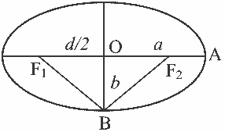
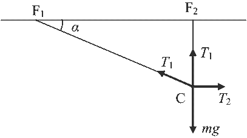
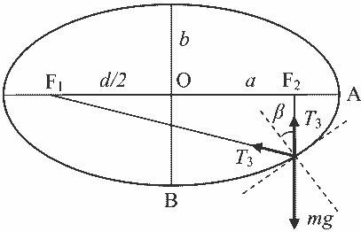

**Задача 1. Алпийски тролей.**

**а)** Нека $a$ е хоризонталната полуос на елипсата, а $b$ – вертикалната. От чертежа се вижда, че $F_2A + AF_1 = l = 2a$, следователно $a = l/2$. (1.1)
\[0.5 т.\] От триъгълника $OBF_2$ следва, че $\left(\frac{d}{2}\right)^2 + b^2 = \left(\frac{l}{2}\right)^2$, откъдето $b = \frac{\sqrt{l^2 - d^2}}{2}$ (1.2).
\[0.5 т.\]

**б)** Тъй като тялото е в покой, сумата от действащите му сили е нула. Следователно $mg = T_1(1 + \sin\alpha)$ \[0.25 т.\] и $T_2 = T_1 \cos\alpha$. \[0.25 т.\] Нека бележим дължината на $CF_2$ с $l_2$. Тогава $\sin\alpha = l_2 / (l - l_2)$ \[0.25 т.\] (1.3). От уравнението на елипсата следва $\left(\frac{d/2}{a}\right)^2 + \left(\frac{l_2}{b}\right)^2 = 1$ (1.4). \[0.25 т.\] След заместването на $a$ и $b$ с изразите им от (1.1) и (1.2), (1.4) се преобразува до $l_2 = \frac{l^2 - d^2}{2l}$ (1.5). Замествайки (1.5) в (1.3), $\sin\alpha = \frac{l^2 - d^2}{l^2 + d^2}$. Така $T_1 = \frac{mg}{2} \left[ 1 + \left(\frac{d}{l}\right)^2 \right]$ \[0.5 т.\], а $T_2 = mg \frac{d}{l}$. \[0.5 т.\]

**в)** След отвързването на спомагателното въже, скоростта на тялото все още е нула. Следователно тялото започва да се движи с тангенциално към траекторията ускорение. Следователно сумата от проекциите на действащите сили върху нормалата е нула. Използвайки „оптичното“ свойство на елипсата следва, че и двете сили на опън $T_3$ сключват един и същи ъгъл $\beta$ с нормалата.
Следователно $2T_3 \cos\beta = mg \cos\beta$, или $T_3 = mg/2$. \[1 т.\]

**г)** Прилагайки закона за запазване на механичната енергия за началната точка и за най-ниската точка от траекторията, получаваме $mg(b - l_2) = mv^2/2$. (1.6) \[0.5 т.\]
Замествайки (1.2) и (1.5) в (1.6), $v = \sqrt{2g(b - l_2)} = \sqrt{gl \left[ \sqrt{1 - \left(\frac{d}{l}\right)^2} + \left(\frac{d}{l}\right)^2 - 1 \right]}$. \[1.5 т.\]

**д)** Замествайки отношението $(d/l)^2$ със $z$, търсим максимум на функцията $f(z) = \sqrt{1 - z} + z - 1$. \[0.5 т.\] Нейната първа производна се нулира за $z = 3/4$. \[0.5 т.\] Следователно търсеното отношение е $d/l = \sqrt{3}/2$ \[0.5 т.\]. За максималната скорост се получава $v = 10 \text{ m/s}$. \[0.5 т.\]

**е)** Нека представим потенциалната енергия на тялото около най-ниската точка от траекторията: $E_p = mgy = mg \left[ -b + \frac{1}{2} \frac{d^2y}{dx^2}\big|_{x=0} x^2 \right] = mg \left( -b + \frac{1}{2} \frac{b}{a^2} x^2 \right)$. \[0.5 т.\] Тъй като кинетичната енергия е $E_k = \frac{1}{2}mv^2$, то периодът на трептене е $T_0 = 2\pi \sqrt{\frac{m}{mgb/a^2}} = 2\pi \sqrt{\frac{a^2}{bg}}$. Използвайки (1.1) и (1.2), $T_0 = 2\pi \frac{l}{\sqrt{2g \sqrt{l^2 - d^2}}} = \pi \sqrt{\frac{2l}{g}} \frac{1}{\sqrt[4]{1 - (d/l)^2}}$. \[1 т.\] При условията от подточка д), $T_0 = 4\pi \approx 12.6 \text{ s}$ \[0.5 т.\].

**Задача 2. Електростатичен (кондензаторен) микрофон.**

**а)** Когато разстоянието между плочите на кондензатора се мени по закона $d(t) = d_0 [1 + \alpha \sin(\omega t)]$, (2.1) капацитетът на кондензатора се мени с времето така: $C(t) = \frac{\varepsilon_0 S}{d_0 [1 + \alpha \sin(\omega t)]}$. (2.2) От закона на Ом за цялата верига следва $E = RI(t) + \frac{q(t)}{C(t)}$. \[0.5 т.\] (2.3) Нека допуснем, че зарядът върху плочите на кондензатора зависи от времето така: $q(t) = q_0 [1 + \beta \sin(\omega t + \delta)]$. (2.4) Тогава токът е $I(t) = \dot{q}(t) = q_0 \beta \omega \cos(\omega t + \delta)$. (2.5) Замествайки (2.2), (2.4) и (2.5) в (2.3), се получава
$E = R q_0 \beta \omega \cos(\omega t + \delta) + \frac{q_0 [1 + \beta \sin(\omega t + \delta)]}{\frac{\varepsilon_0 S}{d_0 [1 + \alpha \sin(\omega t)]}} =$
$= R q_0 \beta \omega \cos(\omega t + \delta) + \frac{q_0}{C_0} [1 + \beta \sin(\omega t + \delta)] [1 + \alpha \sin(\omega t)]$. (2.6) След опростяване, (2.6) изглежда така: $RC_0 \beta \omega \cos(\omega t + \delta) + \alpha \sin(\omega t) + \beta \sin(\omega t + \delta) = 0$. \[0.5 т.\] (2.7) Последното уравнение може да се преобразува до:
$\beta (RC_0 \omega \cos \delta + \sin \delta) \cos(\omega t) + (-RC_0 \omega \beta \sin \delta + \alpha + \beta \cos \delta) \sin(\omega t) = 0$. (2.8)
(2.8) е изпълнено за всеки момент от времето, само ако множителите пред тригонометричните функции са нули. Следователно, $RC_0 \omega \cos \delta + \sin \delta = 0$, откъдето $\tan \delta = -RC_0 \omega$ \[0.5 т.\] (2.9), и $-RC_0 \omega \beta \sin \delta + \alpha + \beta \cos \delta = 0$, откъдето $\beta = -\alpha \cos \delta = -\frac{\alpha}{\sqrt{(RC_0 \omega)^2 + 1}}$. \[0.5 т.\] (2.10) Тогава $U_R(t) = RI(t) = R q_0 \beta \omega \cos(\omega t + \delta) =$
$= RC_0 E \beta \omega \cos(\omega t + \delta) = \frac{\alpha E}{\sqrt{1 + \frac{1}{(RC_0 \omega)^2}}} \sin\left(\omega t + \delta - \frac{\pi}{2}\right)$. Следователно $U_{R0} = \frac{\alpha E}{\sqrt{1 + \frac{1}{(RC_0 \omega)^2}}}$ \[0.5 т.\], и $\phi = \delta - \frac{\pi}{2}$. \[0.5 т.\]

**б)** В областта (50 Hz ÷ 20 kHz), $(RC_0 \omega)^2 \gg 1$, следователно $U_R(t) \approx \alpha E \sin(\omega t + \pi) = -\alpha E \sin(\omega t)$ (2.11) \[1 т.\]

**в)** Нека разгледаме тънък слой въздух с площ $S$ и дебелина $dx$. Резултантната сила, която му действа, е $dF(x,t) = S dp = S \frac{dp}{dx} dx = S k p_1 \cos(kx - \omega t + \psi) dx$. \[0.5 т.\] Ускорението му е $a(x,t) = -\omega^2 u_0 \sin(kx - \omega t)$. \[0.5 т.\] От втория принцип на динамиката $dF = dm a$, или $S k p_1 dx = \rho S dx \omega^2 u_0$, откъдето $p_1 = \frac{\rho \omega^2 u_0}{k} = \rho \omega c u_0$. (2.12) \[1 т.\]

**г)** От (2.11) амплитудата на напрежението върху резистора ще бъде $U_0 = \alpha E$. Подвижната пластина на кондензатора трепти така: $x(t) = \alpha d_0 \sin(\omega t)$. Ускорението $a(t)$, с което трепти, е $a(t) = -\omega^2 \alpha d_0 \sin(\omega t)$. \[0.5 т.\] Това ускорение е предизвикано от резултантна сила $F(t) = -p_1 S \sin(\omega t)$. \[0.5 т.\] Следователно $p_1 S = m \omega^2 \alpha d_0$. Използвайки (2.12), $\alpha = \frac{p_1 S}{m \omega^2 d_0} = \frac{\rho \omega c u_0 S}{m \omega^2 d_0} = \frac{\sqrt{2 I \rho c C_0}}{\varepsilon_0 m \omega^2}$. Следователно $U_0 = \frac{\sqrt{2 I \rho c} C_0 E}{\varepsilon_0 m \omega^2} \approx$ \[1 т.\] $47\ \mathrm{\mu V}$. \[1 т.\]

**д)** Разстоянието $d_0$ между плочите на кондензатора е $d_0 = \frac{\varepsilon_0 S}{C_0} \approx 0.89 \text{ mm}$. \[0.5 т.\]

**е)** Дебелината $h$ на подвижната плоча на кондензатора е $h = \frac{m}{\rho S} = 0.10 \text{ mm}$. \[0.5 т.\]

**Задача 3. Вълнички в басейн.**

**а)** Наклонът на водната повърхност в произволна точка е равен на производната $\frac{dz}{dx} = A_1 \frac{2\pi}{\lambda} \cos \left( \frac{2\pi x}{\lambda} - \frac{2\pi t}{T} \right)$. \[0.5 т.\] Следователно „плоската“ част на вълната сключва ъгъл $\alpha$ с хоризонталата, равен на $\alpha \approx \tan \alpha = \frac{dz}{dx} = \frac{2\pi A_1}{\lambda}$. \[0.5 т.\] Това е и ъгълът, който сключва падащият вертикален лъч с нормалата на „плоската“ част на вълната. \[0.5 т.\] От закона на Снелиус следва: $\frac{\sin \alpha}{\sin \beta} = \frac{n}{1} \Rightarrow n \approx \frac{\alpha}{\beta}$. \[0.5 т.\] От чертежа може да се намери, че $\frac{\lambda/4}{h} = \tan(\alpha - \beta) \approx \alpha - \beta = \frac{n-1}{n} \alpha = \frac{(n-1) 2\pi A_1}{n \lambda}$. \[0.5 т.\] Следователно $A_1 = \frac{1}{8\pi} \frac{n}{n-1} \frac{\lambda^2}{h}$ \[1 т.\]. След заместване с дадените стойности, $A_1 \approx 3.21 \text{ mm}$. \[0.5 т.\]

**б)** Нека изберем координатната система така, че в някакъв момент от време вълничката да се описва с уравнението $z(x) = A \cos \left( \frac{2\pi}{\lambda} x \right)$. Първата и втората производни в точката $x = 0$ са съответно $\frac{dz}{dx}(0) = 0$ \[0.5 т.\] и $\frac{d^2z}{dx^2}(0) = -\frac{4\pi^2}{\lambda^2} A$. \[0.5 т.\] Съгласно дадената формула, радиусът на кривината на водната повърхност в тази точка е $R = \frac{\lambda^2}{4\pi^2 A}$. \[1 т.\]

**в)** Използвайки формулата за фокусното разстояние на пречупваща сферична повърхност (или след нейния извод) $\frac{n}{h} = \frac{n-1}{R} = \frac{(n-1) 4\pi^2 A_2}{\lambda^2}$ \[2 т.\], се получава $A_2 = \frac{1}{4\pi^2} \frac{n}{n-1} \frac{\lambda^2}{h} = \frac{2}{\pi} A_1$ \[1 т.\] $= 2.04 \text{ mm}$. \[1 т.\]