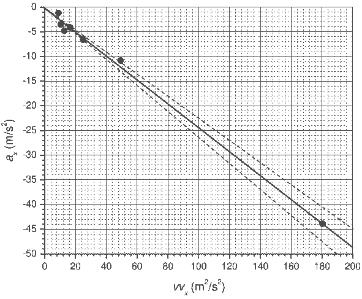
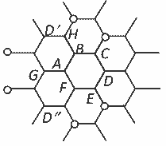

**Задача 1. Механика на бадминтона**

А) Помощни съотношения.
Разглеждаме момента 1 като начален и записваме уравненията за скоростта и преместването при равноускорително движение в моментите 2 и 3.
$$\vec{v}_2 = \vec{v}_1 + \vec{a}\Delta t$$
$$\vec{v}_3 = \vec{v}_1 + \vec{a}(2\Delta t)$$
$$\vec{r}_2 = \vec{r}_1 + \vec{v}_1\Delta t + \frac{1}{2}\vec{a}\Delta t^2$$
$$\vec{r}_3 = \vec{r}_1 + \vec{v}_1(2\Delta t) + \frac{1}{2}\vec{a}(2\Delta t)^2$$
От четирите уравнения намираме:
$$\vec{v}_1 = \frac{4\vec{r}_2 - 3\vec{r}_1 - \vec{r}_3}{2\Delta t}; \vec{v}_2 = \frac{\vec{r}_3 - \vec{r}_1}{2\Delta t}; \vec{v}_3 = \frac{\vec{r}_1 + 3\vec{r}_3 - 4\vec{r}_2}{2\Delta t}$$
$$\vec{a} = \frac{\vec{r}_1 - 2\vec{r}_2 + \vec{r}_3}{\Delta t^2}$$
Б) Получените формули дават най-точна оценка за скоростта и за ускорението в средния (втория) момент.
В) За определяне на ускорението и скоростта в даден момент $i$, използваме координатите на перото в същия момент, както и в предходния ($i–1$), и в следващия ($i+1$) момент. За компонентите на скоростта имаме:
$$v_{xi} = \frac{x_{i+1} - x_{i-1}}{2\Delta t}; v_{yi} = \frac{y_{i+1} - y_{i-1}}{2\Delta t}$$
а за компонентите на ускорението съответно:
$$a_{xi} = \frac{x_{i+1} - 2x_i + x_{i-1}}{\Delta t^2}; a_{yi} = \frac{y_{i+1} - 2y_i + y_{i-1}}{\Delta t^2}$$
Така пресметнатите стойности са дадени в таблицата.

Г) От II принцип на Нютон имаме:
$$m\vec{a} = m\vec{g} - \frac{1}{2}C_D\rho S v^2 \vec{n}$$
където $v = \sqrt{v_x^2 + v_y^2}$ е големината на скоростта, а $\vec{n}$ е единичен вектор в посока на скоростта. Ако проектираме векторното равенство по двете координатни оси, получаваме:
$$a_x = -\frac{C_D\rho S}{2m}vv_x$$
$$a_y = -g -\frac{C_D\rho S}{2m}vv_y$$
Следователно, ако изберем като нови променливи $vv_x$ и $a_x$, ще получим права пропорционалност с наклон $k = -\frac{C_D\rho S}{2m}$, от който можем да определим коефициента $C_D$. Пресметнатите стойности на големината на скоростта $v$ и на новата променлива $vv_x$ са дадени в таблицата.

На графиката са нанесени точките, съответстващи на променливите $vv_x$ и $a_x$, както е построена и апроксимиращата права, минаваща през тях. За наклона на правата намираме:
$$k = \frac{\Delta a_x}{\Delta (vv_x)} = \frac{-49 \text{ m/s}^2}{200 \text{ m}^2/\text{s}^2} = -0.25(\pm 0.02) \text{ m}^{-1}$$
Плътността на въздуха определяме от уравнението на Клапейрон-Менделеев:
$$\rho = \frac{p\mu}{RT} = 1.17 \text{ kg/m}^3$$
Площта на сечението, перпендикулярно на скоростта, е:
$$S = \frac{\pi D^2}{4} = 26.4 \text{ cm}^2 = 2.64 \times 10^{-3} \text{ m}^2$$
Следователно за коефициента на челно съпротивление намираме:
$$C_D = -\frac{2mk}{\rho S} \approx 0.78$$
Относителната грешка на резултата е $\frac{\Delta C_D}{C_D} = \frac{\Delta k}{k} = 0.08$. Окончателно получаваме:
$$C_D = 0.78 \pm 0.06$$

**Задача 2. Гравитационна вълна**

А) Приемаме, че $f$ е степенна функция, т.е.
$$I \propto \omega^x \gamma^y c^z h^2$$
където $x$, $y$ и $z$ са неизвестни степенни показатели. Размерностите на величините в двете страни на уравнението са:
$[I] = \text{J} \cdot \text{s}^{-1} \cdot \text{m}^{-2} = \text{kg} \cdot \text{s}^{-3}; [\omega] = \text{s}^{-1}; [\gamma] = \text{kg}^{-1} \cdot \text{s}^{-2} \cdot \text{m}^3; [c] = \text{s}^{-1} \cdot \text{m}$
От равенството на размерностите в двете страни на уравнението получаваме:
$$\text{kg} \cdot \text{s}^{-3} = \text{kg}^{-y} \cdot \text{s}^{-x-2y-z} \cdot \text{m}^{3y+z}$$
откъдето намираме $x = 2; y = -1; z = 3$. Следователно:
$$I = \text{const} \cdot \frac{c^3 \omega^2 h^2}{\gamma}$$
Б) Приемаме, че $K$ е степенна функция, т.е.
$$h \propto \gamma^x c^y \frac{E_k}{R}$$
Лявата страна на уравнението е безразмерна, а размерностите на величините в дясната част са:
$[\gamma] = \text{kg}^{-1} \cdot \text{s}^{-2} \cdot \text{m}^3; [c] = \text{s}^{-1} \cdot \text{m}; \left[\frac{E_k}{R}\right] = \text{J} \cdot \text{m}^{-1} = \text{N} = \text{kg} \cdot \text{s}^{-2} \cdot \text{m}$
От равенството на размерностите в двете страни на уравнението получаваме:
$$\text{kg}^0 \cdot \text{s}^0 \cdot \text{m}^0 = \text{kg}^{1-x} \cdot \text{s}^{-2x-y-2} \cdot \text{m}^{3x+y+1}$$
откъдето намираме $x = 1; y = -4$. Следователно:
$$h = \text{const} \cdot \frac{\gamma E_k}{R c^4}$$
В) Ако обградим източника на вълна с мислена сфера с радиус $R$ ($R \gg r$), то мощността на източника е:
$$P \propto IR^2 \propto \frac{c^3 \omega^2}{\gamma} \left( \frac{\gamma E_k}{R c^4} \right)^2 R^2 = \frac{\gamma}{c^5} \omega^2 E_k^2$$
Нека означим с $r_1$ и $r_2$ разстоянията от звездите до центъра на масата на системата:
$$M_1 r_1 = M_2 r_2$$
$$r_1 + r_2 = r$$
$$\Rightarrow r_1 = \frac{M_2 r}{M_1 + M_2}; r_2 = \frac{M_1 r}{M_1 + M_2}$$
От II принцип на Нютон:
$$M_1 \omega^2 r_1 = M_2 \omega^2 r_2 = \frac{\gamma M_1 M_2}{r^2}$$
$$\Rightarrow \omega^2 = \frac{\gamma (M_1 + M_2)}{r^3}$$
За кинетичната енергия намираме:
$$E_k = \frac{1}{2} (M_1 r_1^2 + M_2 r_2^2) \omega^2 = \frac{\gamma M_1 M_2}{2r}$$
Следователно, с точност до безразмерен множител, получаваме следния израз за излъчваната мощност:
$$P = \text{const} \cdot \frac{\gamma^4 (M_1 M_2)^2 (M_1 + M_2)}{c^5 r^5}$$
Г) Пълната енергия на системата е:
$$E = E_k + E_p = \frac{\gamma M_1 M_2}{2r} - \frac{\gamma M_1 M_2}{r} = -\frac{\gamma M_1 M_2}{2r}$$
Излъчваната мощност е равна на скоростта, с която намалява пълната енергия на системата:
$$P = -\frac{dE}{dt} = -\frac{\gamma M_1 M_2}{2r^2} \frac{dr}{dt}$$
Като използваме израза за мощността, намираме:
$$-\frac{\gamma M_1 M_2}{2r^2} \frac{dr}{dt} \propto \frac{\gamma^4 (M_1 M_2)^2 (M_1 + M_2)}{c^5 r^5}$$
откъдето, с отчитане на дадения безразмерен множител, получаваме:
$$\frac{dr}{dt} = -\frac{64 \gamma^3 M_1 M_2 (M_1 + M_2)}{5 c^5 r^3}$$
Д) След интегриране на полученото в т. Г уравнение, намираме:
$$r_0^4 - r_t^4 = \frac{512 \gamma^3 M^3}{5 c^5} t$$
Откъдето
$$t = \frac{5 c^5 (r_0^4 - r_t^4)}{512 \gamma^3 M^3}$$
Е) Периодът на гравитационната вълна е два пъти по-малък от периода на обикаляне на звездите, защото след половин обиколка, звездите заемат неразличими от гледна точка на гравитационното поле положения. Следователно ъгловата скорост $\omega$ на обикаляне на черните дупки е свързана с линейната честота $\nu$ на вълната като: $\omega = \pi \nu$. От получените в точка В съотношения, намираме ($M_1 = M_2 = M$):
$$r_0 = \frac{(2\gamma M)^{1/3}}{(\pi \nu_0)^{2/3}} \text{ и } r_c = \frac{(2\gamma M)^{1/3}}{(\pi \nu_c)^{2/3}}$$
Също така от т. Д имаме:
$$r_0^4 - r_c^4 = \frac{512 \gamma^3 M^3}{5 c^5} t$$
Численото решаване на трите уравнения дава:
$r_0 \approx 7.0 \times 10^5 \text{ m}; r_c \approx 1.8 \times 10^5 \text{ m}; M \approx 5.2 \times 10^{31} \text{ kg}$.

**Задача 3. Хексагонални структури**

А) Нека $m_c = \mu / N_A$ е масата на въглеродния атом. Всеки въглероден атом принадлежи на три шестоъгълни клетки и дава принос $\frac{1}{3} m_c$ към масата на една клетка. Следователно масата на една клетка е:
$$m = 6 \times \frac{1}{3} m_c = 2 m_c = \frac{2\mu}{N_A}$$
Площта на шестоъгълната клетка е:
$$S = 3\sqrt{3} a^2 / 2$$
Следователно повърхнинната плътност на графена е:
$$\lambda = \frac{m}{S} = \frac{4\mu}{3\sqrt{3} N_A a^2} = 7.6 \times 10^{-7} \text{ kg/m}^2$$

Б) Да приемем, че в т. А се „инжектира” ток $I$, който се разпределя по цялата мрежа и „изтича” към безкрайно отдалечените точки. От съображения за симетрия е ясно, че токовете, които текат по резисторите $AB$ и $BC$ са съответно:
$$I'_{AB} = \frac{1}{3} I \text{ и } I'_{BC} = \frac{1}{2} I'_{AB} = \frac{1}{6} I$$
Ако от т. $B$ се „отнема” ток $I$, тогава от същите съображения следва, че:
$$I''_{AB} = \frac{1}{3} I$$
Ако точките $A$ и $B$ са включени едновременно към източник на ток, тогава през резистора $AB$ тече ток:
$$I_{AB} = I'_{AB} + I''_{AB} = \frac{2}{3} I$$
а напрежението върху резистора е $U_{AB} = \frac{2}{3} IR$. Следователно еквивалентното съпротивление между точките $A$ и $B$ е:
$$R_{AB} = \frac{U_{AB}}{I} = \frac{2}{3} R$$
В) Електронът може да се върне в т. $A$ или да попадне в точките $C$ и $E$ само след четен брой подскоци. Следователно $P(A) = P(C) = P(E) = 0$.
Вероятността електронът да избере конкретна последователност от три отсечки е $(\frac{1}{3})^3 = \frac{1}{27}$. За три стъпки електронът може да попадне в т. $D$ само по два начина – като следва пътя $ABCD$ или пътя $AFED$. Следователно
$$P(D) = 2 \times \frac{1}{27} = \frac{2}{27}$$

Електронът може да попадне в т. $B$ по пет различни пътя: $ABCB$, $ABHB$, $ABAB$, $AFAB$, $AGAB$. Следователно:
$$P(B) = 5 \times \frac{1}{27} = \frac{5}{27}$$
От съображения за симетрия:
$$P(F) = P(B) = \frac{5}{27}$$