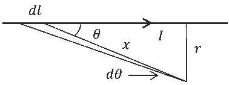
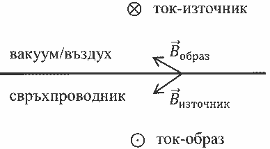
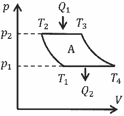
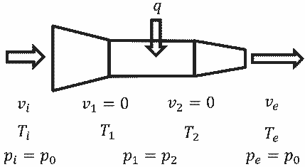

[[Състезания/proletno/st/2019|◂ 2019]] | [[Състезания/proletno/st/2021|условия]] | [[Състезания/proletno/st/2022| 2022 ▸]]

**Задача 1. Хелмхолцови бобини.**

а) Индукцията $\Delta B$ на магнитното поле, създадено от част от проводника с дължина $\Delta l$, по който тече ток $I$, в точка на разстояние $z$ от равнината, в която лежи проводника, е $\Delta B = \frac{\mu_0 I \Delta l}{4\pi y^2}$, където $y = \sqrt{R^2 + z^2}$. \[0.5 т.\] Нейната проекция по оста на симетрия е $\Delta B_z = \Delta B \sin \alpha = \Delta B \frac{R}{y}$. \[0.5 т.\] Тъй като от съображения за симетрия индукцията на магнитното поле е насочена по оста на симетрия на кръговия проводник, то индукцията, създадена от целия проводник, е $B_1(z) = \sum \Delta B_z = \frac{\mu_0 I R}{4\pi y^3} \sum \Delta l = \frac{\mu_0 I R}{4\pi y^3} 2\pi R = \frac{\mu_0 I R^2}{(R^2 + z^2)^2} = \frac{\mu_0 I R^2}{(R^2 + z^2) \frac{3}{2}} = \frac{\mu_0 I R^2}{(R^2 + z^2)^2} \cdot \frac{1}{2R}$. \[1 т.\]

б) Нека разгледаме магнитното поле в околност на средата между двата проводника. Нека точка е на разстояние $x$ от средата. Тогава индукцията на магнитното поле в тази точка е
$$B_2(z) = B_1\left(\frac{l}{2} + x\right) + B_1\left(\frac{l}{2} - x\right) = \frac{\mu_0 I}{2R} \left(1 + \left(\frac{l}{2} + x\right)^2\right)^{\frac{3}{2}} + \left(1 + \left(\frac{l}{2} - x\right)^2\right)^{\frac{3}{2}} \cdot \left[0.5 \text{ т.}\right]$$. Тъй като функцията $B_2(x)$ е четна, то първата ѝ производна $\frac{dB_2(x)}{dx}(x=0)$ е нула, т.е. в средата стойността на индукцията на магнитното поле е екстремум (минимум или максимум). Функцията ще е "най-плоска", когато и втората ѝ производна е нула. \[0.5 т.\]

Първата производна е
$$\frac{dB_2(x)}{dx} = \frac{\mu_0 I}{2R} \left(-\frac{3}{2}\right)^{\frac{1}{R^2}} \left(\frac{l}{2} + x\right)^{\frac{3}{2}} + \left(-\frac{3}{2}\right)^{\frac{1}{R^2}} 2\left(\frac{l}{2} - x\right)(-1) =$$
$$\left(1 + \left(\frac{l}{2} + x\right)^2\right)^{\frac{5}{2}} \left(1 + \left(\frac{l}{2} - x\right)^2\right)^{\frac{5}{2}} \cdot \left[0.5 \text{ т.}\right].$$

Нейната стойност за $x=0$ е $\frac{d^2 B_2(x)}{dx^2}(x=0) = -\frac{3\mu_0 I}{2R^3} \left(2\left(\frac{l}{2}\right)^{\frac{5}{2}} \left(\frac{l}{2} - x\right)^{\frac{7}{2}} + \left(\frac{l}{2} + x\right)^{\frac{7}{2}}\right) = \left(1 + \left(\frac{l}{2} + x\right)^2\right)^{\frac{7}{2}} \left(1 + \left(\frac{l}{2} - x\right)^2\right)^{\frac{7}{2}}$.

$- \frac{3\mu_0 l}{R^3} \frac{1}{1 + \left(\frac{L}{2R}\right)^2} \left[ 1 - \frac{5\left(\frac{L}{2R}\right)^2}{1 + \left(\frac{L}{2R}\right)^2} \right].$   \[1 т.\]  Тя е равна на нула, когато } $1 - \frac{5\left(\frac{L}{2R}\right)^2}{1 + \left(\frac{L}{2R}\right)^2} = 0$, откъдето

$L = R$ или $k = \frac{L}{R} = 1$. \[1 т.\]

в) 3а $k = \frac{L}{R} = 1$, B$_2\left(\frac{L}{2}\right) = \frac{\mu_0 l}{R} \frac{1}{\left(1 + \left(\frac{1}{2}\right)^2\right)^2} = \frac{\mu_0 l}{2R} 2 \sqrt{\frac{64}{125}}$. \[0.5  т.}\]

г) $B_2(0) = \frac{\mu_0 l}{2R} \left( \frac{1}{1 + \left(\frac{L}{2R}\right)^2} + \frac{1}{1 + \left(\frac{L}{2R}\right)^2}\right)^2 = \frac{\mu_0 l}{2R} \left[ 1 + \frac{1}{2^2} \right].$

$B_2\left(\frac{L}{4}\right) = \frac{\mu_0 l}{2R} \left( \frac{1}{1 + \left(\frac{L}{2R}\right)^2} + \frac{1}{1 + \left(\frac{L}{2R}\right)^2}\right)^2 = \frac{\mu_0 l}{2R} \left[ \frac{1}{17^2} + \frac{1}{25^2} \right]$ Следователно $b_1 = \frac{1 + \frac{1}{3}}{2\sqrt{\frac{64}{125}}} \approx 0,9458$ , \[0.5 т.\] и $b_2 = \frac{\frac{17}{16}\frac{2}{3}}{\frac{64}{125}} \approx 0,9958$. \[0.5 т.\]

д) Скоростта $v$, която придобиват електроните след ускоряването им от електричното
поле, се определя от закона за запазване на енергията, $\frac{mv^2}{2} = eU$, откъдето $v = \sqrt{\frac{2eU}{m}}$.
\[0.5 т.\] За да се движат по окръжност, скоростта на електроните трябва да е
перпендикулярна на магнитните силови линии. Тогава центростремителната сила е
силата на Лоренц, $\frac{mv^2}{r} = evB_2\left(\frac{L}{2}\right)$, откъдето $B_2\left(\frac{L}{2}\right) = \frac{1}{r}\sqrt{\frac{2mU}{e}}$. \[0.5 т.\] Използвайки
израза за $B_2\left(\frac{L}{2}\right)$ и отчитайки факта, че вместо един, има $N$ проводника, то тогава
$\frac{1}{r}\sqrt{\frac{2mU}{e}} = \frac{\mu_0 NI}{R}\sqrt{\frac{64}{125}}$, откъдето $N = \frac{R}{\mu_0 Ir}\sqrt{\frac{125mU}{32e}}$. \[0.5 т.\] След заместване, $N \approx 154$. \[1 т.\]

**Задача 2. Ефект на Майснер.**

а) Индукцията $dB$ на магнитното поле, създадено от проводник с дължина $dl$, по който тече ток $I$, в точка на разстояние $x$ от него, е $dl = \frac{\mu_0 l dl \sin \theta}{4\pi x^2}$   От чертежа се вижда, че $x = \frac{r}{\sin \theta}$. Също така от синусовата теорема, приложена за триъгълника със страни $dl$  и $x$, следва $\frac{x}{\sin \theta} \approx \frac{x}{\sin(\theta - d\theta)} = \frac{dl}{\sin(d\theta)} \approx \frac{dl}{d\theta},$  откъдето $dl = \frac{x}{\sin \theta} d\theta = \frac{r}{(\sin \theta)^2} d\theta.$  Замествайки в първото равенство, $dB = \frac{\mu_0 l}{4\pi} \frac{r}{(\sin \theta)^2} d\theta \left( \frac{\sin \theta}{r^2} \right)^2 = \frac{\mu_0 l}{4\pi r} \sin \theta d\theta.$  \[1 т.\] Тъй като когато $\theta$  се мени от 0 до $\pi$,  описва всички части на безкрайния проводник, то индукцията, създадена от безкрайния проводник, е $B = \int_0^\pi \frac{\mu_0 l}{4\pi r} \sin \theta d\theta = \frac{\mu_0 l}{4\pi r} \int_0^\pi \sin \theta d\theta = -\frac{\mu_0 l}{4\pi r} (-1 - 1) = \frac{\mu_0 l}{2\pi r}.$  \[1 т.\]

равенство, $dB = \frac{\mu_0 l}{4\pi} \frac{r}{(\sin \theta)^2} d\theta \left( \frac{\sin \theta}{r^2} \right)^2 = \frac{\mu_0 l}{4\pi r} \sin \theta d\theta$. \[1 т.\] Тъй като когато $\theta$ се мени от 0 до $\pi$, описва всички части на безкрайния проводник, то индукцията, създадена от безкрайния проводник, е $B = \int_0^\pi \frac{\mu_0 l}{4\pi r} \sin \theta d\theta = \frac{\mu_0 l}{4\pi r} \int_0^\pi \sin \theta d\theta = -\frac{\mu_0 l}{4\pi r} (-1 - 1) = \frac{\mu_0 l}{2\pi r}$.

б) При доближаване на магнит до свръхпроводник, по повърхността му се индуцират свръхпроводящи токове (аналогично на ситуацията, когато до проводник се доближи електричен заряд и на повърхността му се индуцират електрични заряди). Разпределението на тези токове е такова, че магнитното поле, създадено от тях, напълно компенсира вътре в свръхпроводника магнитното поле, създадено от външния магнит. За да няма магнитно поле вътре в свръхпроводника, в него не трябва да влиза нито една магнитна силова линия. Тъй като магнитните силови линии са затворени криви, то силовата линия, минаваща безкрайно близо над повърхността на свръхпроводника, трябва да е права линия. Това означава, че индукцията създадена от правия проводник, по който тече ток, събрана с индукцията, създадена от индуцираните свръхпроводящи токове, трябва да е винаги вектор, успореден на повърхността. \[1 т.\] Това е възможно само ако магнитното поле, създадено от свръхпроводящите токове, е еквивалентно на магнитното поле, създадено от втори проводник, образ на реалния проводник (виж фигурата). \[1 т.\] Следователно, магнитното поле около проводника е еквивалентно на сумата от магнитните полета на тока-източник и тока-образ (забележете, че токът-образ тече в противоположна посока). Разстоянието между двата проводника е $2d$. Магнитното поле, създадено от тока-образ в точка от тока-източник, е $B(2d) = \frac{\mu_0 l}{2\pi 2d}$. Следователно, силата на отблъскване, действаща на проводника на единица дължина от него, от страна на свръхпроводника, е $\frac{F}{l} = B \cdot I = \frac{\mu_0 l^2}{4\pi d}$. \[1 т.\]

в) Проводникът ще се намира в равновесие, когато силата на тежестта, действаща на единица дължина, е равна на силата на отблъскване, действаща на единица дължина, $\frac{F}{l} = \frac{\mu_0 l^2}{4\pi d_0} = \frac{\Delta mg}{\Delta l} = kg$, следователно $d_0 = \frac{\mu_0 l^2}{4\pi kg}$. \[2 т.\]

г) При отклонение на проводника на разстояние $x$ нагоре, резултантната сила $F$, действаща на единица дължина от него, е $\frac{\mu_0 l^2}{4\pi(d_0 + x)} - kg \approx \frac{\mu_0 l^2}{4\pi d_0} \left(1 - \frac{x}{d_0}\right) - kg = -\frac{\mu_0 l^2}{4\pi d_0^2} x$. \[1 т.\] Тъй като силата е пропорционална на отклонението от равновесното положение, трептенето е хармонично, $F = -\frac{\mu_0 l^2}{4\pi d_0^2} x = k\ddot{x}$, \[1 т.\] следователно периодът $T$ на тези трептения е $T = 2\pi \sqrt{\frac{k}{\frac{\mu_0 l^2}{4\pi d_0^2}}} = 2\pi \sqrt{\frac{k}{\frac{d_0 kg}{d_0^2}}} = 2\pi \sqrt{\frac{d_0}{g}}$. \[1 т.\]

**Задача 3. Турбореактивен двигател.**

а) Реактивната сила е $F_r = \frac{\Delta p}{\Delta t} = \frac{\Delta m}{\Delta t} (v_e - v_i) = \rho Sv_i (v_e - v_i)$. \[1 т.\]

б) Коефициентът на полезно действие на двигателя е $\eta = \frac{A_{\text{полезна}}}{Q_{\text{получена}}} = \frac{F_r v_i}{q} = \frac{\rho Sv_i^2 (v_e - v_i)}{q}$. \[1 т.\]

в) Коефициентът на полезно действие $\eta_B$ на такъв цикъл е $\eta_B = \frac{A}{Q_1} = \frac{Q_1 - Q_2}{Q_1} = 1 - \frac{Q_2}{Q_1}$. Тъй като 2-3 и 4-1 са изобарни процеси, $Q_1 = C_p (T_3 - T_2)$, $Q_2 = C_p (T_4 - T_1)$, следователно $\eta_B = 1 - \frac{T_4 - T_1}{T_3 - T_2}$. \[0.5 т.\] От уравнението за адиабатния процес $p.V^\gamma = const$. и уравнението на състоянието за идеален газ $\frac{pV}{T} = const$. получаваме $p \cdot T =$ const. Съответно за адиабатните процеси 1-2 и 3-4, $p_1 \cdot T_1 = p_2 \cdot T_2$ и $p_1 \cdot T_4 = p_2 \cdot T_3$.

г) Нека разгледаме частта въздух между състояния "i" (влизащия) и "1" (преди поглъщането на топлина). Тази част въздух е отворена стационарна система (отляво влиза постоянно въздух с температура $T_i$ и налягане $p_i = p_0$, а отдясно излиза същата маса въздух при температура $T_1$ и налягане $p_1$). Нека разгледаме преминаването на един мол въздух през тази система. Тъй като системата не се променя и процесът е адиабатен, ако навлизащият въздух нямаше кинетична енергия, тогава $U_i - U_1 = p_1V_1 - p_iV_i$, откъдето следва че величината, която се запазва в този случай, е $U_i + p_iV_i = U_1 + p_1V_1$ (нарича се енталпия). Обаче тъй като навлизащия въздух вкарва допълнително количество кинетична енергия, то $\frac{1}{2}\mu v_i^2 = U_1 + p_1V_1 - (U_i + p_iV_i) = C_V T_1 + RT_1 - (C_V T_i + RT_i) = C_p (T_1 - T_i)$. Следователно $T_1 - T_i = \frac{1}{2}\mu v_i^2 = \frac{v_i^2}{2c_p}$ \[0.5 т.\]

За да получим формулата за скоростта $v_e$ на изтичане на въздуха от двигателя, написаме връзките между състоянията "i", "1", "2" и "e": $T_1 - T_i = \frac{v_i^2}{2c_p} \quad (2)$
(между ,"i" и "1"), $T_2 - T_e = \frac{v_e^2}{2c_p}$ (3) \[0.5 т.\] (между "e" и "2"), $q = \frac{\Delta m}{\Delta t} c_p (T_2 - T_1)$ \[0.5 т.\] (4) (между "1" и "2"). Допълнително от адиабатните процеси "i"-"1" и "2"-"e" следва, че $T_i p_0^{\gamma} = T_1 p_1^{\gamma}$ и $T_2 p_2^{\gamma} = T_e p_0^{\gamma}$. \[0.5 т.\] Като отчетем факта, че $p_1 = p_2$ и разделим последните две равенства едно на друго, се получава $\frac{T_2}{T_1}$. \[0.5 т.\] (5) Така, използвайки (2), (3), (4) и (5), $\frac{v_e^2}{2c_p} = T_2 - T_e$ = $T_2 \left(1 - \frac{T_i}{T_1}\right)$ = $\left(T_1 + \frac{q}{\Delta t c_p}\right) \left(1 - \frac{T_i}{T_1}\right)$ = $\left(T_i + \frac{v_i^2}{2c_p} + \frac{q}{\Delta t c_p}\right) \left(1 - \frac{T_i}{T_i + \frac{v_i^2}{2c_p}}\right)$ = $\left(T_i + \frac{v_i^2}{2c_p} + \frac{q}{\Delta t c_p}\right) \left(1 - \frac{T_i}{T_i + \frac{v_i^2}{2c_p}}\right)$ \[0.5 т.\]

д) Аналогично на предното подусловие за да получим формулата за скоростта $v_e$ на изтичане на въздуха от двигателя, написавме връзките между състоянията "i", "1", "3", "4", "2" и "e": $T_1 - T_i = \frac{v_i^2}{2c_p}$ (7) (между "i" и "1"), $T_2 - T_e = \frac{v_e^2}{2c_p}$ (8) (между "e" и "2"),

Разделяйки двете уравнения, получаваме $\frac{T_4}{T_1} = \frac{T_3}{T_2}$. \[0.5 т.\] Представяйки формулата за $\eta_B$ във вида $\eta_B = 1 - \frac{T_1(T_4-1)}{T_2(T_3-1)}$, получаваме $\eta_B = 1 - \frac{T_1}{T_2}$, $\eta_B = 1 - \left(\frac{p_1}{p_2}\right)^\gamma$. \[1 т.\]

$q = \frac{\Delta m}{\Delta t} c_p (T_4 - T_3)$ (9) (между "3" и "4"). Допълнително от адиабатните процеси "i"-"1", "1"-"3", "4"-"2" и "2"-"e" следва, че $T_i p_0^{\frac{1-\gamma}{\gamma}} = T_1 p_1^{\frac{1-\gamma}{\gamma}}$ (10), $T_1 p_1^{\frac{1-\gamma}{\gamma}} = T_3 p_3^{\frac{1-\gamma}{\gamma}}$ (11), $T_4 p_4^{\frac{1-\gamma}{\gamma}} = T_2 p_2^{\frac{1-\gamma}{\gamma}}$ (12) и $T_2 p_2^{\frac{1-\gamma}{\gamma}} = T_e p_0^{\frac{1-\gamma}{\gamma}}$ (13). С разсъждения, аналогични на тези в началото на подусловие г), може да се докаже, че $\frac{A}{\Delta m} = c_p (T_3 - T_1) = c_p (T_4 - T_2)$, откъдето $T_3 - T_1 = T_4 - T_2$ (14). \[0.5 т.\] Така, използвайки връзки (8) и (14), $\frac{v_e^2}{2c_p} = T_2 - T_e = T_1 + T_4 - T_3 - T_e$ (15). От (10), (11), (12) и (13) следва, че $\frac{T_i}{T_3} = \frac{T_e}{T_4}$ (16). \[0.5 т.\] Замествайки (16) в (15), $\frac{v_e^2}{2c_p} = T_1 + T_4 - T_3 - \frac{T_4}{T_3} T_i$. \[0.5 т.\] Използвайки (9), $\frac{v_e^2}{2c_p} = T_1 + \frac{q}{\Delta m c_p} (1 + \frac{q}{\Delta t c_p T_3}) T_i$. Използвайки (11), $\frac{v_e^2}{2c_p} = T_1 + \frac{q}{\Delta t c_p} - (1 + \frac{q}{\Delta t c_p T_1 b} \frac{q}{\gamma-1}) T_i$. \[0.5 т.\] Използвайки (7), $\frac{v_e^2}{2c_p} = T_i + \frac{v_i^2}{2c_p} + \frac{q}{\Delta t c_p} - (1 + \frac{q}{\Delta t c_p (T_i + \frac{v_i^2}{2c_p} b) \frac{\gamma-1}{\gamma}}) T_i$. След преобразования, $\nu_e = \sqrt{\nu_i^2 + \frac{2q}{\rho S \nu_i} \left( 1 - \frac{1}{\left( 1 + \frac{v_i^2}{2c_p T_i} \right) b} \frac{\gamma-1}{\gamma} \right)}$. (17) \[0.5 т.\] Вижда се, че при $b = 1$, (17) се опростява до (6).
