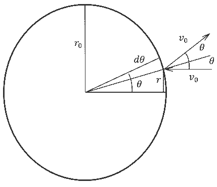
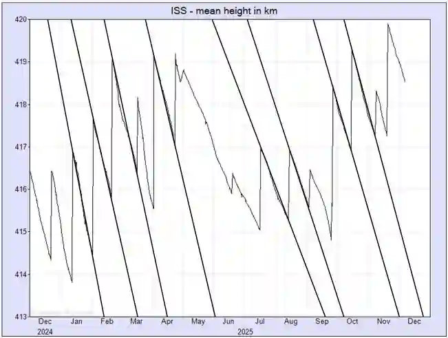
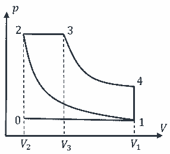
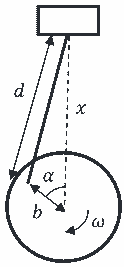
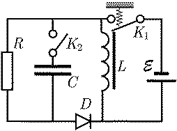
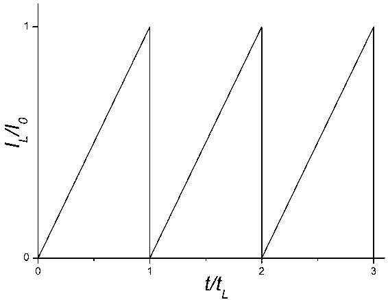

**Задача 1. Международна космическа станция (ISS)**

**а)** При движение по кръгова орбита пълната механична енергия на спътника е $E = E_{kin} + E_{pot} = \frac{mv^2}{2} - \frac{\gamma Mm}{r}$. \[0,2 т.\] Тъй като при движение по окръжност $\frac{mv^2}{r} = \frac{\gamma Mm}{r^2}$, \[0,2 т.\] (1) то $E = \frac{mv^2}{2} - \frac{\gamma Mm}{r} = -\frac{\gamma Mm}{2r}$. \[0,2 т.\] Производната ѝ по времето е $\frac{dE}{dt} = \frac{\gamma Mm}{2r^2} \frac{dr}{dt} = \frac{\gamma Mm \dot{r}}{2r^2}$. \[0,2 т.\] (2) Тъй като $\frac{dE}{dt} = P = -F_{\tau} \cdot v$ \[0,2 т.\] и използвайки, че $|F_{\tau}| = \alpha v^n$, то $\frac{dE}{dt} = \frac{\gamma Mm \dot{r}}{2r^2} = -\alpha v^{n+1}$. \[0,2 т.\] (3) Тъй като от (1) $v = \sqrt{\frac{\gamma M}{r}}$, замествайки в (3), за получава $\frac{\gamma Mm \dot{r}}{2(\frac{\gamma M}{v^2})^2} = \frac{v^4 \dot{r} m}{2\gamma M} = -\alpha v^{n+1}$. \[0,2 т.\] За да е изпълнено за всяко $v$ (и съответно $r$) следва, че $n = 3$ \[0,3 т.\] и $\alpha = -\frac{m \dot{r}}{2 \gamma M v^2}$ (тук вероятно има техническа грешка в оригиналния текст на решението, виж крайния резултат: $\alpha = \frac{m \dot{r}}{2 \gamma M}$). В решението е посочено: $n = 3$ и $\alpha = -\frac{m \dot{r}}{2 \gamma M}$. \[0,3 т.\]

**б)** Тъй като $v_0 \gg v_м$, то в система, свързана с топката, всички молекули се движат упоредно със скорост $v_0$ спрямо топката. \[0,1 т.\] Нека една молекула удари топката в точка, намираща се на разстояние $r$ от диаметъра, успореден на скоростта на молекулата. Скоростта на молекулата ще сключва ъгъл $\theta$ с нормалата в тази точка, като $r = r_0 \sin \theta$. \[0,1 т.\] (4) Тъй като ударът е идеално еластичен, молекулата ще отскочи под ъгъл $2\theta$ спрямо същия диаметър. \[0,1 т.\] Тази молекула ще предаде импулс на топката с проекция по същия диаметър $\Delta p = m_м v_0 - m_м v_0 \cos 2\theta = m_м v_0 2(\sin \theta)^2$. \[0,2 т.\] Нека отчетем предадения на топката импулс $\Delta P$ с проекция по този диаметър от молекулите, ударили се в точки, намиращи се в кръгова ивица между ъгли $\theta$ и $\theta + \Delta \theta$ спрямо диаметъра за интервал от време $\Delta t$:
$\Delta P = N \cdot \Delta p = n \Delta V \cdot \Delta p = \frac{\rho \Delta V \cdot \Delta p}{m_м} = \frac{\rho \Delta S v_0 \Delta t \cdot \Delta p}{m_м} = \frac{\rho 2\pi r \Delta r v_0 \Delta t \cdot \Delta p}{m_м} =$
$= \frac{\rho 2\pi r \Delta r v_0 \Delta t \cdot m_м v_0 2(\sin \theta)^2}{m_м} = \rho 2\pi r \Delta r v_0 \Delta t \cdot v_0 2(\sin \theta)^2 = \rho 2\pi r_0 \sin \theta \Delta r v_0 \Delta t \cdot v_0 2(\sin \theta)^2$. \[0,5 т.\] (5)
От (3) следва, че $\Delta r = r_0 \cos \theta \Delta \theta$. Замествайки в (5),
$\Delta P = \rho 2\pi r_0 \sin \theta \cdot r_0 \cos \theta \Delta \theta v_0 \Delta t \cdot v_0 2(\sin \theta)^2 = 4\pi \rho v_0^2 r_0^2 \Delta t (\sin \theta)^3 \cos \theta \Delta \theta$. \[0,3 т.\]
Интегрирайки по $\theta$ от $0$ до $\frac{\pi}{2}$, получаваме че сумарният импулс ще бъде $P = 4\pi \rho v_0^2 r_0^2 \Delta t \int_0^{\pi/2} (\sin \theta)^3 \cos \theta d\theta$. \[0,2 т.\] Интегралът $\int_0^{\pi/2} (\sin \theta)^3 \cos \theta d\theta = \int_0^{\pi/2} (\sin \theta)^3 d(\sin \theta) = \left. \frac{(\sin \theta)^4}{4} \right|_0^{\pi/2} = \frac{1}{4}$. \[0,1 т.\] Следователно $F_{\tau} = \frac{P}{\Delta t} = \pi \rho v_0^2 r_0^2 = \rho S v_0^2$ (6) ($S = \pi r_0^2$ е напречното сечение на топката). \[0,4 т.\]

**в)** От (1) следва, че $v(r_1) = \sqrt{\frac{\gamma M}{r_1}}$ (7) и $v(r_2) = \sqrt{\frac{\gamma M}{r_2}}$ (8). При движението по елиптичната орбита за точките на апогея и перигея от ЗЗМИ следва, че $v_1 r_1 = v_2 r_2$, \[0,2 т.\] откъдето $v_2 = v_1 \frac{r_1}{r_2}$. (9) От ЗЗМЕ следва, че $\frac{m v_1^2}{2} - \frac{\gamma Mm}{r_1} = \frac{m v_2^2}{2} - \frac{\gamma Mm}{r_2}$. \[0,2 т.\] След преобразования се достига до $v_1^2 - v_2^2 = 2\gamma M (\frac{1}{r_1} - \frac{1}{r_2})$. \[0,2 т.\] (10) Използвайки (9), (10) се преобразува до $v_1^2 - v_1^2 (\frac{r_1}{r_2})^2 = 2\gamma M (\frac{1}{r_1} - \frac{1}{r_2})$ и след рационализиране $v_1 = \sqrt{\frac{2 \gamma M r_2}{r_1(r_1+r_2)}}$. \[0,2 т.\] (11) Използвайки (9) и (11), $v_2 = \sqrt{\frac{2 \gamma M r_1}{r_2(r_1+r_2)}}$. (12) Тъй като $r_2 - r_1 = h \ll r_1, r_2$,
$v_1 = \sqrt{\frac{2 \gamma M r_2}{r_1(r_1+r_2)}} = \sqrt{\frac{2 \gamma M (r_1+h)}{r_1(r_1+r_1+h)}} = \sqrt{\frac{\gamma M (1+\frac{h}{r_1})}{r_1(1+\frac{h}{2r_1})}} \approx \sqrt{\frac{\gamma M}{r_1}} (1 + \frac{h}{2r_1})(1 - \frac{h}{4r_1}) \approx v(r_1)(1 + \frac{h}{4r_1})$. \[0,3 т.\] Следователно $\Delta v_1 = v_1 - v(r_1) = v(r_1)\frac{h}{4r_1} = \sqrt{\frac{\gamma M}{r_1}} \frac{h}{4r_1}$. \[0,3 т.\] (13)
Аналогично $v_2 = \sqrt{\frac{2 \gamma M r_1}{r_2(r_1+r_2)}} = \sqrt{\frac{2 \gamma M (r_2-h)}{r_2(r_2-h+r_2)}} = \sqrt{\frac{\gamma M (1-\frac{h}{r_2})}{r_2(1-\frac{h}{2r_2})}} \approx \sqrt{\frac{\gamma M}{r_2}} (1 - \frac{h}{2r_2})(1 + \frac{h}{4r_2}) \approx v(r_2)(1 - \frac{h}{4r_2})$. \[0,3 т.\] Следователно $\Delta v_2 = v(r_2) - v_2 = v(r_2)\frac{h}{4r_2} = \sqrt{\frac{\gamma M}{r_2}} \frac{h}{4r_2}$. \[0,3 т.\] (15)

**г)** Апроксимирайки $H(t)$ между две включвания на двигателите с прави линии, определяме наклона на тези прави (виж фигурата). За $\Delta H = 7 \text{ km}$, \[0,2 т.\] получаваме интервали време (в месеци) съответно (отляво надясно) 1.7, 2.2, 2.1, 2.3, 3.6, 3.1, 2.8, 2.7 месеца. \[0,3 т.\] Средното е 2.56 месеца. \[0,1 т.\] Съответно $\frac{dH}{dt} \approx 2.7 \text{ км/месец} \approx 1,0 \cdot 10^{-3} \text{ m/s}$. \[0,4 т.\]

**д)** Скоростта на промяната на механичната енергия е равна на мощността на силата на триене, $\frac{dE}{dt} = P_{\tau} = F_{\tau} v$. Използвайки (2) и (6), $\frac{\gamma Mm}{2r^2} \frac{dr}{dt} = -\rho S v^2 v = -\rho S v^3$. \[0,2 т.\] Така $S = -\frac{\gamma Mm}{2r^2 \rho v^3} \frac{dr}{dt}$. \[0,2 т.\] След заместване на скоростта с (7), $S = -\frac{\gamma Mm}{2r^2 \rho (\frac{\gamma M}{r})^{3/2}} \frac{dr}{dt} = -\frac{m}{2\rho (\gamma M)^{1/2} r^{1/2}} \frac{dr}{dt}$. \[0,4 т.\] (16) От силата на тежестта следва $mg = \frac{\gamma Mm}{R_З^2}$, откъдето $\gamma M = g R_З^2$. \[0,2 т.\] Замествайки в (16), $S = -\frac{m}{2\rho R_З \sqrt{g r}} \frac{dr}{dt}$ \[0,5 т.\] След заместване с дадените и получените стойности, $S = \frac{450 \cdot 10^3}{2 \cdot 3 \cdot 10^{-12} \cdot 6,4 \cdot 10^6 \sqrt{9,81 \cdot 6,8 \cdot 10^6}} \cdot 1,0 \cdot 10^{-3} \approx 1400 \text{ m}^2$. \[0,5 т.\]

**е)** Тъй като $r_1 \approx r_2$, то и $\Delta v_1 \approx \Delta v_2 = \sqrt{\frac{\gamma M}{r_1}} \frac{h}{4r_1} = \sqrt{\frac{g R_З^2 h^2}{16 r_1^3}} = \frac{R_З h}{4 r_1} \sqrt{\frac{g}{r_1}}$. Замествайки, $\Delta v_1 \approx \Delta v_2 \approx \sqrt{\frac{9,81}{6,8 \cdot 10^6}} \frac{6,4 \cdot 10^6 \cdot 3 \cdot 10^3}{4 \cdot 6,8 \cdot 10^6} \approx 0,85 \text{ m/s}$. \[0,5 т.\]

**ж)** Тъй като $\Delta p = m \Delta v = F_p t_d$, то $t_d = \frac{m \Delta v}{F_p} \approx 128 \text{ s}$. \[0,5 т.\]

**Задача 2. Дизелов двигател**

**а) Вариант 1:**
Нека разглеждаме 1 mol идеален газ. Нека при процеса 2-3 газът получава топлина $Q_{23}$. Коефициентът на полезно действие ще бъде $\eta = \frac{A_{12}+A_{23}+A_{34}}{Q_{23}}$. \[0,2 т.\] (1) От първия принцип на ТД следва, че топлината $Q_{23} = U_3 - U_2 + p_2(V_3 - V_2)$. \[0,2 т.\] От уравнението за идеалния газ $p_2(V_3 - V_2) = R(T_3 - T_2)$. \[0,2 т.\] За идеален газ $U_3 = C_V T_3$ \[0,2 т.\] и $U_2 = C_V T_2$. \[0,2 т.\] От уравнението на Майер $C_p = C_V + R$. \[0,2 т.\] Следователно $Q_{23} = C_p(T_3 - T_2)$. \[0,2 т.\] (2) От първия принцип на ТД следва, че работата $A_{12} = U_1 - U_2 = C_V(T_1 - T_2)$, (3) \[0,3 т.\] $A_{23} = p_2(V_3 - V_2) = R(T_3 - T_2)$ \[0,3 т.\] (4) и $A_{34} = U_3 - U_4 = C_V(T_3 - T_4)$. \[0,3 т.\] (5) Замествайки (2), (3), (4) и (5) в (1),
$\eta = \frac{C_V(T_1-T_2)+R(T_3-T_2)+C_V(T_3-T_4)}{C_p(T_3-T_2)} = \frac{(C_V+R)(T_3-T_2)+C_V(T_1-T_4)}{C_p(T_3-T_2)} = 1 - \frac{C_V}{C_p} \frac{(T_4-T_1)}{(T_3-T_2)}$. \[0,5 т.\] (6)
Изразът (6) може да се представи така: $\eta = 1 - \frac{1}{\gamma} \frac{T_1 (\frac{T_4}{T_1}-1)}{T_2 (\frac{T_3}{T_2}-1)}$. \[0,3 т.\] (7) От изобарния процес 2-3 следва, че $\frac{T_3}{T_2} = \frac{V_3}{V_2} = \alpha$. \[0,3 т.\] (8) От друга страна $\frac{T_4}{T_1} = \frac{T_4}{T_3} \frac{T_3}{T_2} \frac{T_2}{T_1}$. \[0,3 т.\] (9) От уравнението за адиабатния процес $TV^{\gamma-1} = const.$ \[0,3 т.\] (10) прилагайки го за процеса 3-4 $\frac{T_4}{T_3} = (\frac{V_3}{V_4})^{\gamma-1} = (\frac{V_3}{V_2} \frac{V_2}{V_4})^{\gamma-1} = (\frac{V_3}{V_2})^{\gamma-1} (\frac{V_2}{V_4})^{\gamma-1} = \frac{\alpha^{\gamma-1}}{r^{\gamma-1}}$. \[0,3 т.\] (11) Отново прилагайки (10) за процеса 1-2, $\frac{T_2}{T_1} = (\frac{V_1}{V_2})^{\gamma-1} = r^{\gamma-1}$. \[0,2 т.\] (12) Замествайки (11), (8) и (12) в (9) и после (9) и (8) в (7) се получава $\eta = 1 - \frac{1}{\gamma} \frac{1}{r^{\gamma-1}} \frac{(\frac{\alpha^{\gamma-1}}{r^{\gamma-1}} \alpha r^{\gamma-1} - 1)}{(\alpha-1)}$, $\eta = 1 - \frac{1}{\gamma r^{\gamma-1}} \frac{(\alpha^\gamma-1)}{(\alpha-1)}$. (13) \[0,5 т.\]

**Вариант 2:**
Коефициентът на полезно действие е $\eta = 1 - \frac{Q_-}{Q_+} = 1 + \frac{Q_{41}}{Q_{23}}$. Процес 2-3 е изобарен и следователно $Q_{23} = n C_p (T_3 - T_2) = \frac{C_p}{R} (p_3 V_3 - p_2 V_2) = \frac{C_p}{R} (\alpha - 1) pV$, където $p_2 = p_3 = p$ и $V_2 = V, V_3 = \alpha V$. Процес 4-1 е изохорен, откъдето $Q_{41} = n C_V (T_1 - T_4) = \frac{C_V}{R} (p_1 - p_4) V_1 = \frac{C_V}{R} r(p_1 - p_4) V$. Оттук следва
$\eta = 1 + \frac{Q_{41}}{Q_{23}} = 1 - \frac{r(p_4 - p_1) C_V}{(\alpha - 1) p C_p} = 1 - \frac{r}{\gamma (\alpha - 1)} (\frac{p_4}{p} - \frac{p_1}{p})$
където $\frac{C_p}{C_V} = \gamma$. Понеже 1-2 и 3-4 за адиабатни, то $p_1 V_1^\gamma = p_1 (rV)^\gamma = p_2 V_2^\gamma = p V^\gamma \Rightarrow \frac{p_1}{p} = \frac{1}{r^\gamma}$ и $p_3 V_3^\gamma = p (\alpha V)^\gamma = p_4 V_4^\gamma = p_4 (rV)^\gamma \Rightarrow \frac{p_4}{p} = \frac{\alpha^\gamma}{r^\gamma}$. Така финално $\eta = 1 - \frac{1}{\gamma r^{\gamma-1}} \frac{\alpha^\gamma - 1}{\alpha - 1}$

**б)** Замествайки в (13) с дадените стойности $\gamma = 1.4, r = 20$ и $\alpha = 2.0$, $\eta = 1 - \frac{1}{1,4 \cdot 20^{1,4-1}} \frac{(2^{1,4}-1)}{(2-1)} \approx 65\%$. \[0.4 т.\]

**в)** Химическата реакция е $k_1 C_{16}H_{34} + k_2 O_2 \to k_3 CO_2 + k_4 H_2O$. След изравняване се получава $2 C_{16}H_{34} + 49 O_2 \to 32 CO_2 + 34 H_2O$. Следователно за изгарянето на 1 mol $C_{16}H_{34}$ са необходими 24,5 mol О2. \[0.4 т.\]

**г)** Ъгловата скорост е $\omega = 3000 \text{ rpm} = 50 \text{ об/s}$. Всеки цилиндър се пълни веднъж на всеки два оборота, затова имаме общо 100 пълнения на цилиндри за 1 s. \[0.3 т.\] При всяко пълнене в един цилиндър влиза въздух с обем $V_1 - V_2 = V_1 - \frac{V_1}{r} = 0,475 \text{ L}$. \[0.3 т.\] Общо за всички цилиндри ще е необходим 47,5 l въздух. Парциалното налягане на кислорода ще бъде $p_{O2} = \frac{p_0}{5} = 2,0 \cdot 10^4 \text{ Pa}$. \[0.3 т.\] Използвайки уравнението на идеалния газ броят молове кислород за 1 s ще бъде $n = \frac{p_{O2} V}{RT} = \frac{2,0 \cdot 10^4 \text{Pa} \cdot 47,5 \cdot 10^{-3} \text{m}^3}{8,314 \frac{\text{J}}{\text{mol.K}} \cdot 300\text{K}} \approx 0,381 \text{ mol}$. \[0.3 т.\] Броят необходими молове хексадекан ще бъдат $0,381 \text{ mol}/24,5 = 1,56 \cdot 10^{-2} \text{ mol}$. \[0.3 т.\] Съответно масата ще бъде $m = \mu n = 226,4 \text{ g/mol} \cdot 1,56 \cdot 10^{-2} \text{ mol} = 3,53 \text{ g}$, \[0.3 т.\] а обемът $V = \frac{m}{\rho} = \frac{3,53 \text{ g}}{0,773 \text{ g/cm}^3} = 4,55 \text{ mL}$. \[0.3 т.\] Максималната консумация ще бъде $q = 4,55 \text{ mL/s} = 4,55 \cdot 10^{-6} \text{ m}^3\text{/s} = 16,4 \text{ L/h}$. \[0.3 т.\]

**д)** $P_{max} = \frac{A}{t} = \frac{\eta Q}{t} = \frac{\eta \lambda m}{t}$. \[0.1 т.\] Замествайки $P_{max} = 0,65 \cdot 45 \text{ MJ/kg} \cdot 3,53 \text{ g/s} \approx 103 \text{ kW} \approx 140 \text{ к.с.} $ \[0.3 т.\]

**е)** Разходът на гориво е $\frac{\Delta V}{\Delta x} = \frac{\Delta V / \Delta t}{\Delta x / \Delta t} = \frac{\Delta V}{v \Delta t} = \frac{q}{2v}$ \[0.2 т.\] $= \frac{16,4 \text{ L/h}}{2 \cdot 120 \text{ km/h}} \approx 6,83 \text{ L/100 km}$. \[0.2 т.\]

**ж) Вариант 1:**
Нека разстоянието от буталото до оста на вала е $x$, а ъгълът между вертикалата и радиуса към точката на окачване на мотовилката е $\alpha$. От косинусовата теорема следва $d^2 = b^2 + x^2 - 2bx \cos \alpha$. \[0.1 т.\] Решавайки спрямо $x$, $x = b \cos \alpha + \sqrt{b^2 \cos^2 \alpha + d^2 - b^2}$. \[0.2 т.\] За околност около ”горната мъртва точка“ $\alpha \ll 1$ може да се използват приближените формули $\cos \alpha \approx 1 - \frac{\alpha^2}{2}$ и $\cos^2 \alpha \approx 1 - \alpha^2$. Тогава $x \approx b(1 - \frac{\alpha^2}{2}) + \sqrt{b^2(1 - \alpha^2) + d^2 - b^2}$. След преобразуване $x \approx b(1 - \frac{\alpha^2}{2}) + d \sqrt{1 - \frac{b^2}{d^2} \alpha^2} \approx b(1 - \frac{\alpha^2}{2}) + d - \frac{b^2}{2d} \alpha^2 = b + d - \frac{b}{2}(1 + \frac{b}{d})\alpha^2$. \[0.3 т.\] Тогава скоростта на буталото ще бъде $v = \frac{dx}{dt} = -\frac{b}{2}(1 + \frac{b}{d}) 2\alpha \frac{d\alpha}{dt} = -b(1 + \frac{b}{d})\alpha \omega$, \[0.2 т.\] а ускорението $a = \frac{dv}{dt} = -b(1 + \frac{b}{d})\omega \frac{d\alpha}{dt} = -b(1 + \frac{b}{d})\omega^2$. \[0.2 т.\]

**Вариант 2:**
В позиция на горна мъртва точка, точката на окачване $M$ лежи между буталото $P$ и оста на вала $O$. Точка $M$ се върти около неподвижната $O$ и се движи с ускорение $a_M = -\omega^2 b$. В същия момент т. $P$ също е неподвижна и следователно мотовилката се върти около нея с ъглова скорост $\omega'$, за която $\omega' b = \omega d$, т.е. $\omega' = \frac{b}{d} \omega$. Тогава относителното ускорение на т. $M$ спрямо т. $P$ е $a_M' = \omega'^2 d = \frac{\omega^2 b^2}{d} = a_M - a_P$, откъдето $a_P = -(1 + \frac{b}{d})\omega^2 b$.

**Задача 3. Преобразувател на постоянно напрежение**

**а)** При първоначално ключ $K_2$ отворен и $I_L = 0$, диодът е запушен и схемата съдържа ефективно само източник на напрежение и намотка. \[0.2 т.\] Тогава $\mathcal{E} = L \frac{dI_L}{dt}$. \[0.3 т.\] Следователно $I_L = \frac{\mathcal{E}}{L} t + C$ ($C = 0$). Така $I_0 = \frac{\mathcal{E}}{L} \tau_L$ и $\tau_L = \frac{L I_0}{\mathcal{E}}$. \[0.5 т.\]

**б)** Когато токът през намотката $I_L = I_0$, ключът $K_1$ се отваря, диодът се отпушва (защото $R \cdot I_0 \gg U_0$) и схемата съдържа ефективно само намотка и резистор. \[0.5 т.\] Тогава $RI = -L \frac{dI}{dt}$, (1) откъдето $I(t) = I_0 e^{-\frac{R}{L}t}$. (2) \[0.5 т.\] При даденото неравенство $\frac{L}{R} \ll \tau_L$ токът успява да стане нула преди ключът $K_1$ да се затвори отново. И тъй като $\tau_K \ll \tau_L$ графиката изглежда така. \[0.5 т.\]

*

**в)** Максималното напрежение $U_{max}$ върху резистора е $U_{max} = R \cdot I_0$ (тъй като $R \cdot I_0 \gg U_0$) \[0.5 т.\]

**г)** Тъй като $R \cdot I_0 \gg U_0$, падът на напрежението върху диода може да се пренебрегне при определяне на зависимостта на тока от времето, виж (1). (1) може да се преобразува така, $R \frac{dq}{dt} = -L \frac{dI}{dt}$, \[0.2 т.\] (3) където $dq$ е протеклият заряд през резистора за време $dt$. Интегрирайки (3), с точност до знак пълният заряд, протекъл през резистора до пълното спиране на тока, е $q = \frac{L I_0}{R}$. \[0.3 т.\] (Същият резултат може да се получи от (2) и така: $q = \int_0^\infty I(t) dt = \frac{L I_0}{R}$). Тъй като този заряд преминава и през диода, върху който има пад на напрежение $U_0$, електричните сили извършват работа $A = q U_0$, \[0.5 т.\] която се превръща във топлина. Тъй като този процес се повтаря с период $\tau_L$, средната топлинна мощност $P$, отделяна на диода, e $P = \frac{A}{\tau_L} = \frac{q U_0}{\tau_L} = \frac{L I_0 U_0}{R \cdot \frac{L I_0}{\mathcal{E}}} = \frac{\mathcal{E} U_0}{R}$. \[0.5 т.\]

**д)** Когато диодът е запушен, се образува $RC$ верига, отделена от останалата част на схемата. В нея $U_C = \frac{q}{C} = -RI = -R \frac{dq}{dt}$, (4) от (4) следва, че при зареден кондензатор до някакъв начален заряд $q_m, q(t) = q_m e^{-\frac{t}{RC}}$, а напрежението върху кондензатора, $U(t) = U_m e^{-\frac{t}{RC}}$. (5) Тъй като $RC \gg \tau_L$, кондензаторът почти няма да се разрежда за характерното време $\tau_L$ на повторението на процесите в схемата. \[0.2 т.\] Нека разгледаме ситуацията, когато ключът $K_1$ се отвори. Заради посоката на тока в намотката, диодът се отпушва. Тогава се образува трептящ кръг, съдържащ упоредно свързани намотка, кондензатор и резистор. Тъй като $RC \gg \tau_L \gg \tau_K > \pi \sqrt{LC}$, токът през резистора е пренебрежим в сравнение с токовете през намотката и кондензатора. \[0.2 т.\] Затова трептящия кръг ще има период $T = 2\pi\sqrt{LC}$. \[0.3 т.\] Тъй като $\tau_K > \pi\sqrt{LC}$, т.е. $\tau_K > \frac{T}{2}$, енергията от намотката ще успее да се прехвърли в кондензатора преди ключът $K_1$ отново да се затвори. \[0.2 т.\] Обаче, ще се осъществи само един полупериод, защото след един полупериод диодът ще се запуши отново. \[0.3 т.\] Така за един полупериод енергията от намотката се прехвърля в кондензатора, която в стационарно състояние след запушване на диода, се отделя на резистора. \[0.3 т.\] Следователно $\frac{1}{2} L I_0^2 = \frac{U_{av}^2 \tau_L}{R}$, \[0.5 т.\] откъдето $U_{av} = \sqrt{\frac{L I_0^2 R}{2 \tau_L}} = \sqrt{\frac{L I_0^2 R}{2 \frac{L I_0}{\mathcal{E}}}} = \sqrt{\frac{I_0 R \mathcal{E}}{2}}$. \[0.5 т.\]

**е)** Тъй като през по-голямата част от времето диодът е запушен, топлината се отделя върху резистора основно през този интервал от време. \[0.2 т.\] От (5) следва, $U(t) = U_m e^{-\frac{t}{RC}}$. За интервал от време $\tau_L$, $U(\tau_L) = U_m e^{-\frac{\tau_L}{RC}} \approx U_m (1 - \frac{\tau_L}{RC})$. \[0.3 т.\] Тогава промяната на напрежението върху кондензатора $2u = U_m - U(\tau_L) = U_m \frac{\tau_L}{RC}$, откъдето $u = \frac{U_m \tau_L}{2RC} \approx \frac{U_{av} \tau_L}{2RC}$. \[0.5 т.\] След заместване, $u = \frac{\sqrt{\frac{I_0 R \mathcal{E}}{2}} \cdot \frac{L I_0}{\mathcal{E}}}{2RC} = \frac{L I_0}{2C} \sqrt{\frac{I_0}{2 R \mathcal{E}}}$. \[0.5 т.\]

**ж)** Използвайки дадените стойности, $\tau_L = 40 \text{ ms}, U_{max} = 5 \text{ kV}, P = 50 \text{ μW}, U_{av} \approx 112 \text{ V}, u \approx 4,5 \text{ V}$. \[1.5 т.\]