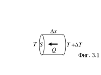

**Задача 1. Разхлабена струна** 

Единият край на струна е закрепен неподвижно, а другият - за шайба с маса M, която може да се хлъзга без триене по спица, (фиг. 1). В изправено състояние струната е перпендикулярна на спицата, дължината й е L, линейната плътност на масата й (маса на единица дължина) е $\mu$, а силата на опъване - T. Струната трепти с толкова малка амплитуда (A << L), че можете да приемете силата на опъване за постоянна по големина. 

При тези условия собствените трептения на струната са стоящи вълни, при които отклонението на точка, разположена на разстояние x от неподвижния край, се дава с израза: 

$$ (1) \quad y(x,t) = A \sin(kx) \sin(\omega t), $$

където $k = 2\pi/\lambda$ е вълновият вектор на стоящата вълна, а $\omega$ - кръговата честота на трептене. 

а) Получете израз за ускорението $a$, с което се движи шайбата, като функция на времето $t$ и на параметрите $A, k, L, T$. \[2 т\] 

б) Докажете, че за да съществува стояща вълна в струната, вълновият й вектор $k$ трябва да приема стойности, които се определят от уравнението: 

(2)
$$\quad \cotg(kL) = \frac{Mk}{\mu}.$$ \[4 т\]

в) Пресметнете числено най-ниската (основна) честота v на собствено трептене на струната при $T = 100$ N, $\mu = 2,0 \cdot 10^{-2}$ kg/m, $M = 0,01$ kg, $L = 0,5$ m. \[4 т\] 

Упътване:

- Силата на опъване е толкова голяма, че можете да пренебрегнете силата на тежестта във всички подусловия на задачата. 

- Скоростта $c$ на разпространение на напречни вълни по опъната струна се дава с израза: 

$$ (3) \quad c = \sqrt{\frac{T}{\mu}}. $$

- Ако решението изисква, можете да използвате предоставената ви милиметрова хартия. В този случай задължително предайте милиметровата хартия заедно с останалите листа от решението!

**Задача 2. Ако имаше магнитни заряди** 

Според установените схващания магнитното поле се поражда от движещи се електрични заряди. Въпреки това, няма фундаментални закон на физиката, който изключва съществуването на свободни магнитни заряди. Един точков магнитен заряд $g$ би създавал в точка с радиус-вектор $\vec{r}$ магнитно поле с индукция $\vec{B}$, която се задава с израза: 

$$ (1) \quad \vec{B} = \frac{\mu_0 g}{4\pi r^3} \vec{r}, $$

където $\mu_0 = 4\pi \times 10^{-7}$ Н/м е магнитната константа. За полето на система от магнитни заряди би била изпълнена теоремата на Гаус: 

$$ (2) \quad \Phi_B = \mu_0 g_0, $$

където $\Phi_B$ е потокът на магнитното поле през дадена затворена повърхност, а $g_t$ е пълният магнитен заряд, заграден от тази повърхност. 

а) Изразете единицата за магнитен заряд в системата SI чрез единиците за електричен заряд, дължина и време. \[2 т\]

б) Електрон се движи перпендикулярно на еднородното магнитно поле в “магнитен кондензатор” - две успоредни пластини, върху които са разпределени равномерно магнитни заряди с еднакви големини и противоположни знаци (фиг. 2.1). 

- Като използвате правилото за квантуване на Бор, докажете, че общият магнитен заряд, който се съдържа в участък от пластината с площ $S$, равна на площта на електронната орбита, е целочислено кратен на определен “елементарен” магнитен заряд $g_e$. Изразете $g_e$ чрез фундаменталните константи, дадени в края на задачата и пресметнете неговата числена стойност. \[4 т\]

в) Частица с елементарен магнитен заряд $g_e$ се движи с постоянна скорост $v$ по оста $z$ на проводящ пръстен с радиус $a$ и съпротивление $R$ (фиг. 2.2). Частицата започва движение на много голямо разстояние от пръстена ($z = -\infty$), преминава през центъра му ($z = 0$) и се отдалечава на много голямо разстояние от него ($z = +\infty$). 

- Получете израз за индуцираното ЕДН в пръстена, като функция на координатата $z$ на частицата и параметрите $g_e$, $v$, $a$, $\mu_0$. \[2 т\]

- Получете израз за пълното количество топлина $Q$, което се отделя в пръстена при преминаване на частицата чрез параметрите $v$, $a$, $R$, константата на Планк $h$ и елементарния електричен заряд $e$. \[2 т\]

Приемете, че индуктивността на пръстена е пренебрежимо малка.

**Фундаментални константи:** 

- елементарен електричен заряд, $e = 1,60 \cdot 10^{-19}$ С; 

- константа на Планк, $h = 6,64 \cdot 10^{-34}$ J.s; 

- магнитна константа, $\mu_0 = 4\pi \times 10^{-7}$ Н/м. 

 Упътване: Ако е нужно, можете да използвате, че:

- Пространственият ъгъл $\Omega$, който загражда конус с ъгъл $\alpha$ между оста му и образуващата, се дава с израза: $\Omega = 2\pi (1 - \cos \alpha)$. 
- $\int_{-\infty}^{\infty} \frac{dz}{(a^2 + z^2)^3} = \frac{3\pi}{8a^5}.$

Задача 3. Икономично отопление 

Нека разгледаме слой от определен материал с дебелина $\Delta x$ и с площ на напречното сечение S (фиг. 3.1). Ако температурите върху двете основи на слоя са различни, $T$ и $T + \Delta T$, през слоя започва пренос на топлина. Пренесеното за време t количество топлина $Q$, се дава с израза: 

$$(1) \quad Q = kS \frac{\Delta T}{\Delta x} t,$$

където k се нарича топлопроводност на
дадения материал. Топлопроводността се
измерва с единицата $\mathrm{W.m^{-1}.K^{-1}}$. 

а) Стая има една външна стена от бетон с дебелина $d_1 = 0,2$ m, широчина $a = 4$ m и височина $b = 3$ m (фиг. 3.2). На стената има квадратен прозорец от единично стъкло с дебелина $d_2 = 2$ mm и с дължина на страната $c = 1,5$ m. Намерете мощността P на електрически нагревател, нужна за да се поддържа в стаята постоянна температура $T_1 = 20$ °C при температура на външния въздух $T_2 = 0$ °C. \[2 т\] 

б) За икономия на енергия, единичният прозорец е заменен с двоен, който се състои от два листа стъкло с еднакви дебелини $d_2 = 2$ mm, между които има въздушен слой с дебелина $d_3 = 1$ cm (фиг. 3.3). Пресметнете мощността $P_1$ на нагревателя, която е необходима в този случай за поддържане на температура $T_1 = 20$ °C в стаята при температура на външния въздух $T_2 = 0$ °C. \[4 т\] 

в) Един съвременен уред за отопление е т. нар. **термопомпа**. Тя представлява устройство, което има същия работен цикъл като този на хладилник. Охладеното работно вещество приема топлина от външния въздух, свива се адиабатно, при което се загрява и тогава отдава топлина на въздуха в стаята. 

- Ако приемете, че термопомпата работи по цикъла на Карно, пресметнете мощността $P_2$ на електричния ток, който тя консумира, за да поддържа същата постоянна температура $T_1 = 20$ °C в стаята при температура на външния въздух $T_2 = 0$ °C. \[3 т\] 

 - Колко пъти ще намалее консумираната мощност в случай на отопление с
 електрически нагревател и в случай на отопление с термопомпа, ако
 външната температура се повиши до 10 $^\circ$C при постоянна температура на
 въздуха в стаята? \[1 т\]

Използвайте от таблицата

| Материал | $k$ ($\mathrm{W.m^{-1}.K^{-1}}$) |
| -------- | -------------------------------- |
| Бетон    | 0,84                             |
| Стъкло   | 0,84                             |
| Въздух   | 0,023                            |

