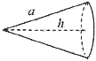
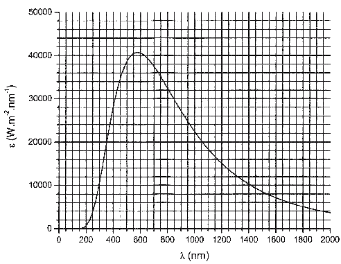

[[Състезания/proletno/st/2006|◂ 2006]] | [[Състезания/proletno/st-r/2007|решения]] | [[Състезания/proletno/st/2008| 2008 ▸]]

**Задача 1. $\alpha$-разпадане**

Естественият радиоактивен фон се дължи до голяма степен на $\alpha$-разпадане на радиоактивния газ радон (Rn). Радонът е продукт от разпадане на метала радий (Ra), който се съдържа в скалите, почвата, включително и в строителните материали. След разпадане на радия образуваният радон се освобождава във въздуха. В тази задача ще разгледате разпадането на изотопа на радона $\frac{220}{86} \text{Rn}$ :

$$\frac{220}{86} \text{Rn} \rightarrow \alpha + \frac{216}{84} \text{Po}.$$

а) Масите на участващите в реакцията частици в атомни единици за маса (амп) са дадени в таблицата:

| Частица                    | Маса (амп) |
| -------------------------- | ---------- |
| $\frac{220}{86} \text{Rn}$ | 220,011396 |
| $\frac{216}{84} \text{Po}$ | 216,001917 |
| $\alpha$                   | 4,002603   |

- Пресметнете скоростите на $\alpha$-частицата и на ядрото на полония след разпадането.

- Пресметнете кинетичната енергия на $\alpha$-частицата в мегаелектронволити (MeV).

Приемете, че ядрото на радона е неподвижно преди разпадането.

**Общо по т. а):** \[5 т.\]

Пробегът l на $\alpha$-частиците във въздуха зависи от тяхната начална кинетична енергия E по закона:

$l = 0,285E^\frac{3}{2},$

където пробегът е изразен в сантиметри, а енергията - в МеV. За измерване на концентрацията на радиоактивен радон във въздуха се използва тънка фотоплака с площ $S = 10 \text{ cm}^2$, оставена във въздуха (в тъмно помещение) за време $t = 1 \text{ h}$. След проявяване на фотоплаката, върху нея са изброени $N = 180$ тъмни точки, получени от преминаване на $\alpha$-частици.

б) Намерете обемната активност A на въздуха, т.е. броя радиоактивни разпадания за единица време в единица обем. Изразете отговора чрез $l, S, N$ и $t$, и го пресметнете числено. \[3 т.\]

в) Пресметнете концентрацията n на атомите на радона във въздуха (брой атоми в единица обем), ако периодът на полуразпадане на $\frac{220}{86} \text{Rn}$ е $T = 50 \text{ s}$. Изразете

отговора чрез A и T, и го пресметнете числено. \[2 т.\]

Данни:
атомна единица за маса,
скорост на светлината във вакуум, $c = 3,00 \cdot 10^8 \text{ m/s}$;
елементарен електричен заряд, $e = 1,60 \cdot 10^{19} \text{ C}$;

Упътване: Пространственият ъгъл, заграден от конус с височина h и дължина на образуващата $\alpha$, се дава с формулата:
$$\Omega = 2\pi \left( 1 - \frac{h}{a} \right)$$

**Задача 2. Двоен удар**

Тънка еднородна пръчка с дължина $l = 0,1 \, \text{м}$ се движи постъпателно със скорост $v_0 = 5 \, \text{м/с}$, насочена перпендикулярно на плоска стена. Оста на пръчката сключва ъгъл $\alpha$ с равнината на стената (фиг.2).

Пръчката се удря в стената. Триенето между пръчката и стената по време на удара се пренебрегва. Продължителността на удара е толкова малка, че завъртането и преместването на пръчката по време на удара са несъществени.

Фиг. 2

а) Нека $v_x$ е $x$-компонентата на скоростта на центъра на пръчката след удара, а $\omega$ - ъгловата й скорост. Докажете, че:

$$v_x + v_0 = k\omega$$

и изразете константата $k$ чрез $l$ и $\alpha$.

\[4,5 т.\]

б) Ако приемете, че ударът е идеално еластичен, изразете $v_x$ и $\omega$ чрез $v_0$, $l$ и $\alpha$. \[3 т.\] в) Намерете ъгъла $\alpha_0$, при който след идеално еластичен удар, центърът на пръчката ще бъде неподвижен. \[0,5 т.\]

г) При $\alpha = \alpha_0$ пресметнете времето $t$, за което след първия удар, пръчката ще се удари втори път в стената. \[2 т.\]

Упътване. Инерчният момент на пръчка спрямо ос, минаваща през нейния център, е $l = \frac{1}{12} ml^2$

**Задача 3. Вега от съзвездието Лира**

Спектърът на топлинно излъчване на дадено тяло се характеризира с излъчвателна способност $\varepsilon(\lambda)$, която се дефинира като:

$$\varepsilon(\lambda) = \frac{dP}{Sd\lambda},$$

където $dP$ е излъчената мощност от площ $S$ в интервала от дължини на вълната $[\lambda, \lambda+d\lambda]$. На фиг. 3 е дадена графика на излъчвателната способност на абсолютно черно тяло при неизвестна температура.

а) Пресметнете температурата на тялото. Оценете грешката на числения резултат. \[2 т.\]

б) Оценете каква относителна част $\eta$ от мощността на излъчване на тялото се отделя във видимия диапазон: $\lambda = 400 - 750 \, \text{nm}$. Оценете грешката на числения резултат. \[5,5 т.\]

в) Звездата Вега от съзвездието Лира има температура на повърхността 10 000 K. Ако приемете, че звездата излъчва като абсолютно черно тяло, оценете каква относителна част от отделяната енергия се излъчва във видимия диапазон. \[2,5 т.\] (В тази точка не е необходим анализ на грешката)

Данни:
- константа на Вин, $b = 2,90 \cdot 10^{-3} \, \text{m.K}$.
- константа на Стефан-Болцман: $\sigma = 5,67 \cdot 10^{-8} \, \text{W.m}^{-2}.\text{K}^{-4}$.

Предайте този лист заедно с решенията!

Фиг. 3 Изпъчетална способност на абсолютно черно тяло като функция на дължината на вълната