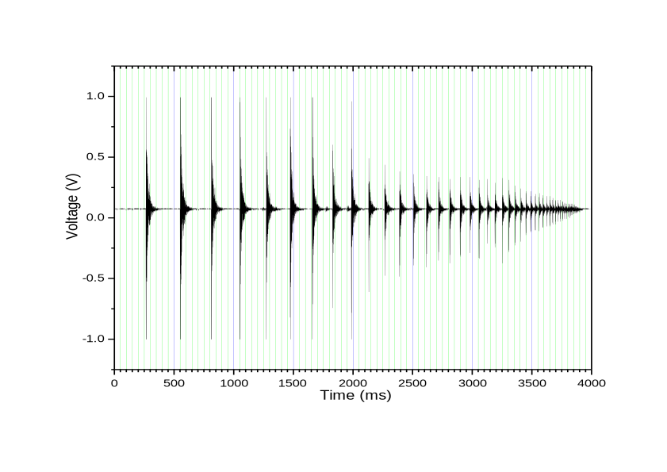
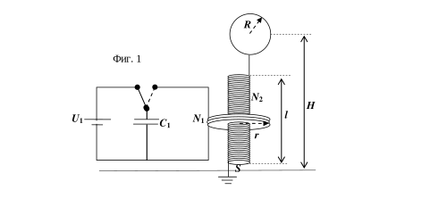

[[Състезания/proletno/st/2009|◂ 2009]] | [[Състезания/proletno/st-r/2010|решения]] | [[Състезания/proletno/st/2011| 2011 ▸]]

**Задача 1. Подскачане на топче за тенис на маса.**

Топче започва да подскача вертикално върху хоризонтална повърхност. Ударите на топчето с
повърхността не са идеално еластични, а се характеризират с т. нар. коефициент на възстановяване
 vслед
k= , където двете скорости vпреди и vслед са съответно непосредствено преди и след удара.
 vпреди

а) Ако t1 и t$\infty$ са съответно моментите време на първия удар и на спиране на топчето върху
повърхността, намерете формула за интервала време T1 _ $\infty$ = t$\infty$ - t1 \[2 т\]. Земното ускорение е g =
9,81 m/s2, а скоростта на топчето непосредствено преди първия удар е v0.

б) Този модел на подскачане на топчето се проверява експериментално. С микрофон и
компютър е записан звукът от подскачането на топче за тенис на маса върху хоризонтална твърда
повърност. Напрежението на микрофона като функция на времето е дадено на приложената
фигура. Целта е от тази фигура да се извлече информация, за да се получи експериментално
стойността на коефициента на възстановяване k. Намерете такива променливи, че информацията
от фигурата, представена графично, да е права линия, от чиито параметри може да изчислите k.
Запишете зависимостта, която ще чертаете графично \[0,5 т\]. Посочете кои и колко данни ще
използвате \[0,5 т\]. Запишете измерените данни от фигурата в приложената таблица, като в нея
нанесете и допълнителни колони с данни, които ще изчислите (ако се нуждаете от такива) \[0,5 т\].
Начертайте графиката на предложената от вас зависимост \[3,5 т\]. Определете от графиката k \[1 т\].

в) Определете грешката, с която сте намерили k . \[0,5 т\]

г) Определете от фигурата интервала време T1 _ $\infty$ . \[0,5 т\]

д) Изчислете от каква височина h е пуснато топчето в направения експеримент. \[0,5 т\]

е) Изчислете грешката $\Delta$h на височината h. \[0,5 т\]
(таблицата и фигурата се предават заедно с решението на задачата!)

**Задача 2. Трансформатор на Тесла**

Трансформаторът на Тесла (вж. илюстрацията) е
прост уред, с който може да се генерира променливо електрично
напрежение с висока честота (103 - 106 Hz) и голяма амплитуда ( 105
- 106 V). Първоначално трансформаторът на Тесла е имал
многобройни приложения - за излъчване на радиовълни, запалване
на газоразрядни лампи и електротерапия в медицината. Днес уредът
има повече историческа стойност и се използва за демонстриране на
коронен газов разряд.

Устройството на трансформатора е показано на фиг. 1. Състои се от два трептящи кръга, чиито собствени честоти съвпадат. Първичният трептящ кръг е съставен от кондензатор с капацитет C1 и намотка, която се състои от малък брой N1 кръгови навивки. Първичната намотка обхваща вторична намотка, която представлява дълъг соленоид с голям брой N2 (N2 >> N1) r навивки. Единият край на  вторичната намотка е заземен, а другият й край е свързан към метална сфера с радиус R, чийто център се намира на височина H над земната повърхност. Металната сфера и земната повърхност могат да се разглеждат като плочи на кондензатор, включен във вторичния трептящ кръг.
А. Параметри на първичния кръг
Известно е, че индуктивността на единична кръгова намотка се дава с израза:
 L = $\mu$0r(ln( r /a) - 0.230)
където r e радиусът на средното сечение на намотката, а a e радиусът на кръговото напречно
сечение на проводника, от който е изработена намотката. Формулата е валидна, когато r >> a.
А1. Получете израз за индуктивността L1 на намотка от N1 кръгови навивки, разположени плътно
една до друга. Приемете, че дебелината на намотката е много по-малка от нейния радиус:
 N 1 a << r . \[1.5 т\]
А2. Пресметнете числено индуктивността L 1 на първичната намотка, ако тя е съставена от N1 = 5
навивки с радиус r = 50 cm, изработени от проводник с радиус на напречното сечение a = 2 mm.
 \[0.5 т\]
A3. Колко трябва да бъде капацитетът C1 на кондензатора от първичния трептящ кръг така, че
собствената честота на кръга да бъде $\nu$ = 10 kHz? \[1.0 т\]

Б. Параметри на вторичния кръг
Вторичната намотка има дължина l = 1,5 m и e съставена от кръгови навивки с площ S = 0.2 m2.
Приемете, че магнитното поле, създадено от тока във вторичната намотка, е еднородно.

Б1) Получете израз за индуктивността L2 на вторичната намотка чрез l, S, $\mu$ 0 и броя на навивките
N2. \[2.0 т\]

Б2) Ако приемете, че при електромагнитните трептения във вторичния кръг електрическите заряди
се разпределят равномерно по повърхността на металната сфера, получете израз за капацитета C2
на системата сфера-Земя чрез R, H и електричната константа $\varepsilon$ 0. Пресметнете числената стойност
на C2 при R = 30 cm и H = 2.0 m. \[1.5 т\]

Б3) Колко навивки N2 (с точност до цяло число) трябва да има вторичната намотка така, че
собствената й честота на трептене да съвпада със собствената честота $\nu$ на първичната намотка?
 \[0.5 т\]
 
В) Преобразуване на напрежението
 Кондензаторът в първичната намотка е зареден от източник на високо постоянно
напрежение с ЕДН U1 = 1000 V, след което е изключен от източника и е включен към първичната
намотка. В първичния кръг възникват електромагнитни трептения, чиято амплитуда постепенно
намалява. Във вторичния кръг също възникват трептения, но тяхната амплитуда постепенно
нараства във времето. Получете израз за максималната амплитуда U2 на напрежението между
сферата и Земята. Изразете отговора чрез U1 и параметрите N1, N2, r, a, l и S на вторичната и на
първичната намотки. Пресметнете числено U2. \[3.0 т\]

Константи: $\varepsilon_0 = 8.85 \times10^{-12}$ F/m
 $\mu_0 = 4\pi \times 10^{-7}$ H/m

**Задача 3. Интерференция от клин**

 а) Два кохерентни монохроматични успоредни снопа светлина с дължина на вълната
$\lambda$ = 500 nm сключват ъгъл $\alpha = 0,01^\circ$ . Екран е поставен перпендикулярно на тях. Намерете
разстоянието $\Delta x_1$ между максимумите на наблюдаваната интерференчна картина. \[3 т\]

б) Широк успореден монохроматичен сноп лазерна светлина с дължина на вълната
$\lambda$ = 500 nm пада под ъгъл $\theta = 60^\circ$ на повърхността на стъклена пластинка с дебелина d = 1 mm.
Двете плоски повърхности на стъклената пластинка не са идеално успоредни, а сключват малък ъгъл $\alpha = 0,001^\circ$ . Правата, образувана от пресичането на равнините на двете повърхности, е перпендикулярна на равнината на падане на снопа. Екран е поставен перпендикулярно на отразения от пластинката сноп светлина на разстояние L = 1 m от клина. Върху него се вижда интерференчна картина. Намерете разстоянието $\Delta$x2 между максимумите на наблюдаваната интерференчна картина. Показателят на пречупване на стъклото е n = 1,5. \[7 т\]