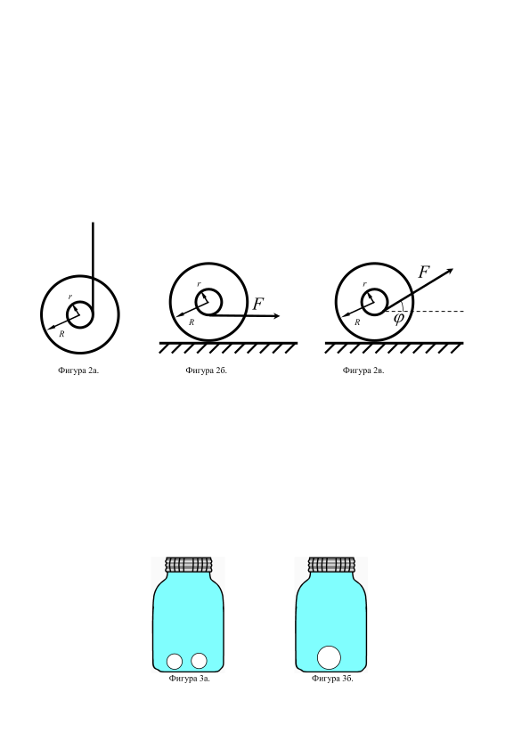

[[Състезания/proletno/st/2010|◂ 2010]] | [[Състезания/proletno/st-r/2011|решения]] | [[Състезания/proletno/st/2012| 2012 ▸]]

Задача 1. Индуциран заряд върху сфери

 Част 1. Две еднакви метални и незаредени сфери с радиус R са свързани посредством прав,
много тънък и дълъг проводник с дължина L ( L R ). Системата от двете сфери с проводника се
поставя в хомогенно електрично поле с големина E така, че посоката на полето да е успоредна на
правия проводник, както е показано на Фигура 1а. Намерете:
а) Заряда, който се индуцира върху лявата сфера. \[1,5т\]
б) Заряда, който се индуцира върху дясната сфера. \[1,5т\]
в) Ако външното поле стане мигновено нула, то намерете времето, за което зарядът на сферите ще
намалее e - пъти ( e = 2,7182818 е Неперовото число). Съпротивлението на проводника е r . \[2т\]

 Фигура 1а. Фигура 1б.

 Част 2. Нека сега, вместо две, да имаме три последователно свързани сфери, центровете на
които лежат на една права, която е успоредна на външното електрично поле E , както е показано на
Фигура 1б. Намерете:
г) Заряда, който се индуцира върху лявата сфера. \[1т\]
д) Заряда, който се индуцира върху дясната сфера. \[1т\]
е) Заряда, който се индуцира върху средната сфера. \[1т\]

 Част 3. Нека сега имаме N последователно свързани сфери, центровете на които лежат на
една права, която е успоредна на външното електрично поле E . Намерете:
ж) Заряда, който се индуцира върху крайните две сфери. \[2т\]

 Упътване: при решаването на задачата пренебрегнете заряда, който се натрупва върху
проводниците, свързващи сферите и считайте, че всяка една от сферите се зарежда хомогенно.

Задача 2. Йо-йо

 Йо-йо е играчка, направена от два еднакви малки диска от пластмаса (метал, дървесина или
други материали), свързани с ос, около която е навита еластична нишка (конец), завършваща с
примка за пръста. Така получената макаричка се пуска надолу и сама се връща в ръката на
играещия.

 Част 1. На Фигура 2а. е показано Йо-йо с външен радиус R и вътрешен (на който се навива
конеца) r . Ако инерчният момент на Йо-йото спрямо оста му на симетрия е I , а масата на Йо-йото
е M , то намерете:
а) Линейното ускорение a , с което Йо-йото ще се движи, ако го пуснем свободно, но държим края
на конеца така, че конецът да се развива. \[3т\]
б) Ако конецът е с дължина L и е изцяло намотан на Йо-йото, то каква ще е крайната линейна
скорост V на центъра на масата на Йо-йото точно в момента, в който конецът изцяло се е развил от
Йо-йото. \[2т\]
в) Каква ще е ъгловата скорост $\Omega$ на Йо-йото за предишната подточка (подточка б). \[1т\]

 Част 2. Същото Йо-йо от предишната част на задачата е поставено на маса и конецът
започва да се придърпва с хоризонтална сила F надясно, както е показано на Фигура 2б,
вследствие на която Йо-йото започва да се търкаля без хлъзгане. Намерете:
г) В каква посока ще се движи Йо-йото (наляво или надясно на чертежа) и посоката, в която ще се
върти то (по часовниковата стрелка или обратно на часовниковата стрелка). Обосновете отговора
си. \[1т\]
д) Ако силата F не е хоризонтална, а сключва ъгъл $\varphi$ с хоризонта (Фигура 2в), то при какъв
критичен ъгъл $\varphi$ Йо-йото ще обърне посоката си на движение и на въртене? Обосновете отговора
си. \[3т\]

 r r
 F
 r
 F
 R R $\varphi$
 R

 Фигура 2а. Фигура 2б. Фигура 2в.

Задача 3. Повърхностно напрежение

Част 1. Херметически затворен буркан е напълнен изцяло с вода. Освен водата, на дъното на
буркана се намират и два малки въздушни мехура, както е показано на Фигура 3а. Двата мехура
бавно се сливат и образуват един по-голям мехур, както е показано на Фигура 3б. Налягането на
гърлото на буркана е P0 , първоначалният радиус на двата мехура е R0 , а коефициентът на
повърхностно напрежение на водата е $\sigma$ . Считайки, че процесът на сливането на мехурите е
изотермен, намерете:
а) Радиуса R на новообразувалият се мехур. \[1т\]
б) Изменението на налягането при гърлото на буркана $\Delta$P . \[3т\]
Упътване: Считайте, че размерите на мехурите са пренебрежимо малки в сравнение с размерите на
буркана. Също така приемете, че водата е несвиваема, а въздухът в мехурите е идеален газ.

 Фигура 3а. Фигура 3б.
 Част 2. Два сапунени мехура, които се намират във въздух, имат радиуси R1 и R2 . Двата
мехура се сливат бавно в един мехур с радиус R0 . Считайки, че процесът на сливането на мехурите
е изотермен, намерете коефициента на повърхностно напрежение $\sigma$ за сапунения разтвор, ако
атмосферното налягане е Pat . . \[3т\]
Упътване: Приемете, че въздухът в мехурите и извън него е идеален газ.

 Част 3. Две еднакви капки живак с радиус R0 се намират при една и съща температура T0 .
Ако повърхностното напрежение на живака е $\sigma$ , топлинният му капацитет е c , а плътността му е
$\rho$ , то намерете температурата на капката живак, която се е образувала от сливането на двете
капки. Пренебрегнете разширението на живака и топлообмена с околната среда. \[3т\]
