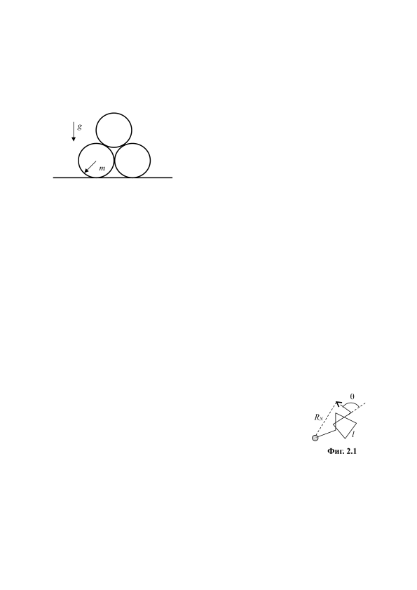
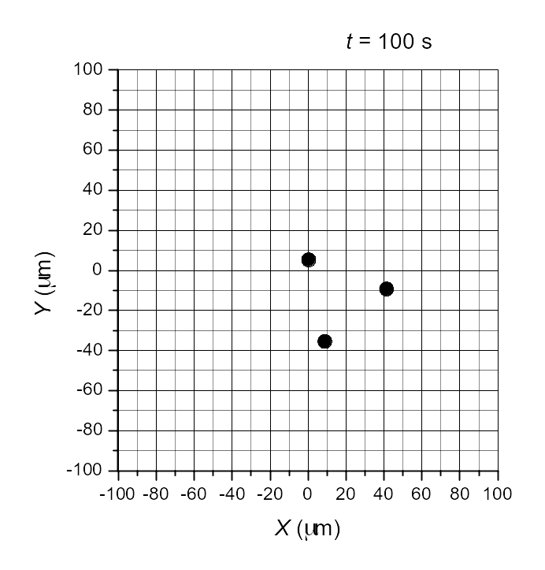
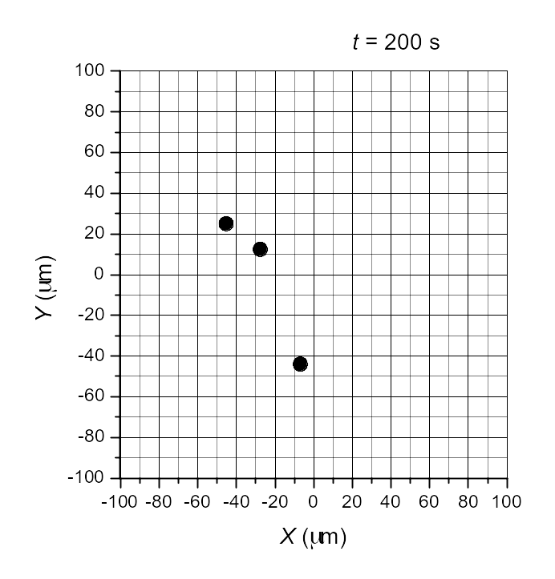
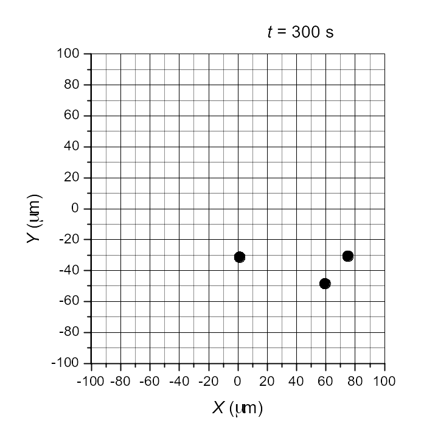

Задача 1. Пирамида от цилиндри.

 Три еднакви еднородни цилиндри, всеки с радиус r
 g и маса m, са поставени върху хоризонтална
 повърхност и се допират един до друг, както е
 показано на фигурата. Земното ускорение е g.
 а) Нека няма триене на цилиндрите с повърхността
 r
 m и помежду им. Първоначално цилиндрите са в
 покой. Намерете ускоренията a1 на горния и a2 на
 страничните цилиндри в началния момент на
 тяхното движение. \[2 т.\]
б) Нека коефициентът k на триене на цилиндрите с повърхността и помежду им е един и
същ и е толкова голям, че цилиндрите остават в покой. Намерете интервалът от
стойности на k, когато това е възможно. \[2 т.\]
в) Нека коефициентът k на триене на цилиндрите с повърхността и помежду им е един и
същ и е такъв, че цилиндрите започват да се движат, като се хлъзгат помежду си и в
повърхността. Намерете ускоренията a3 на горния и a4 на страничните цилиндри в
началния момент на тяхното движение. \[3 т.\]
г) Намерете интервалът от стойности на k, когато ситуацията от подусловие в) е
възможна. \[3 т.\]

Задача 2. Брауново движение
 Брауновото движение е хаотично топлинно движение на фини частици (т. нар.
Браунови частици) поради случайните им удари с молекулите на обкръжаващата ги
среда. Всъщност, Брауновата частица може да се разглежда като една гигантска
молекула, за чието движение са в сила основните закони на молекулно-кинетичната
теория.
А) Сферична неразтворима Браунова частица с диаметър d = 1.0 $\mu$m и плътност $\rho$ = 1000
kg/m3 извършва Брауново движение във вода при температура T = 300 K. Оценете
средната скорост на топлинно движение на частицата*. \[3 т\]
Б) Поради случайния характер на ударите на молекулите в
Брауновата частица, нейната траектория е сложна начупена линия. $\theta$
Приемете, че между два поредни удара частицата се движи
праволинейно, като изминава едно и също разстояние - т. нар. RN
свободен пробег l, а посоката й на движение след даден удар сключва
с посоката й на движение преди удара случаен ъгъл $\theta$ между 0$^\circ$ и 180$^\circ$ l
(вж. Фиг. 2.1). На какво средно разстояние ще се отдалечи Фиг. 2.1
частицата от началното си положение след голям брой удари N с
молекулите на водата. Изразете отговора чрез l и N. \[3 т\]
В) В началния момент (t = 0) три еднакви Браунови частици, подобни на частицата,
описана в т. А, се намират в центъра на координатната система (Х = 0, Y = 0).
Движението им се наблюдава под микроскоп, като се фотографират през интервали
време $\Delta$t = 100 s, както е показано на четирите кадъра от Фиг. 2.2. Като използвате
данните от снимките, оценете свободния пробег l на Брауновите частици, както и
средното време $\tau$ между последователните им удари с молекулите на водата. \[4 т\]

 1
При решаването на тази подточка можете (но не е задължително) да използвате
празната координатна мрежа, дадена на Фиг. 2.3. В този случай предайте листа с
построените от Вас графики заедно с останалите листа от решението!.

*Упътване към задачата. За една величина X, която приема случайни положителни
стойности, можете да приемете, че , т.е. средната стойност на нейния квадрат е
приблизително равна на квадрата от нейната средна стойност. В конкретната задача
това приближение води до грешка от порядъка на 10% за търсените средни стойности.
Физични константи. Константа на Болцман: kB = 1.38$\times$10-23 J/K.

Задача 3. Затихващи електромагнитни трептения.
Кондензатор с капацитет C = 0,100 $\mu$F и соленоид (бобина) с индуктивност L = 100 mH и
собствено съпротивление R = 10,0 $\Omega$ са свързани успоредно към идеален източник на
напрежение с електродвижещо напрежение E = 10,0 V. Така свързани те са стояли дълго
време.
а) начертайте схемата и изчислете установените постоянни напрежение U0 на
кондензатора и ток I0 през бобината. \[1 т.\]
б) в момента време t = 0 източникът на напрежение се разкачва от останалата част на
схемата. Пренебрегвайки съпротивлението на бобината, намерете периодът T0 на
възникналите електромагнитни трептения и максималните напрежение Umax, до което се
зарежда кондензатора и ток Imax , който протича през бобината. \[2 т.\]
в) ако решението на уравнението е от тип
изразете неизвестните параметри $\kappa$ и в решението чрез дадените параметри $\beta$ и $\omega_0$ в
уравнението. \[2 т.\]
г) използвайки решението от подусловие в), намерете точната (отчитайки
съпротивлението R) зависимост на заряда на плочите на кондензатора от времето.
Изчислете точния период T на електромагнитните трептения и началната фаза $\varphi$. \[3 т.\]
д) изчислете времето (в секунди и брой периоди), за което енергията в трептящия кръг
намалява 2 пъти. \[1 т.\]
е) начертайте графиката на зависимостта на напрежението на кондензатора от
времето. \[1 т.\]
Загубите на енергия чрез излъчване се пренебрегват.

Полезна математика:
 ,

 ,

 Фиг. 2.2

Фиг. 2.3 (Използвайте, ако решението налага)

 3
