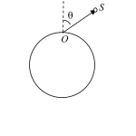

[[Състезания/proletno/st/2013|◂ 2013]] | [[Състезания/proletno/st-r/2014|решения]] | [[Състезания/proletno/st/2015| 2015 ▸]]

**Задача 1. Космическа станция**

Космическа станция обикаля Земята по кръгова орбита на височина h над
земната повърхност. На земята, в равнината на орбитата на станцията, се намира наблюдател, който вижда станцията като малка светла движеща се точка в небето. Поради голямата отдалеченост на станцията в сравнение със собствения й размер, наблюдателят няма зрителна представа за разстоянието до станцията.

В тази задача можете да пренебрегнете околоосното въртене на Земята.
Приемете Земята за еднородно кълбо с гладка повърхност. Оптичните аберации на атмосферата се пренебрегват.

Основни данни

Радиус на Земята, $6.37\times10^6$ m

Гравитационно ускорение върху земната повърхност, $g_0 = 9.81\ \mathrm{m/s^2}$

А) Получете израз за периода $T$ на обикаляне на станцията като функция на h и основните данни. Пресметнете $T$ за Международната космическа станция, която обикаля на височина 423 km над земята. \[2.5 т\]

Б) За колко време t наблюдателят ще вижда станцията на небето? Получете израз за t и го пресметнете за Международната космическа станция. \[1.5 т\]

В) Станцията се намира над хоризонта в точка S, чийто радиус-вектор $\vec{OS}$ спрямо наблюдателя O сключва ъгъл $\theta$ с вертикалата (вж. фигурата). Видимата за наблюдателя скорост, с която станцията се движи на фона на звездното небе е равна на ъгловата скорост , с която се завърта зрителният лъч $\vec{OS}$. Получете израз за чрез T , R, h и моментната стойност на $\theta$. \[3.5 т\]

Г) Получете израз за отношението $\beta_z/\beta_h$ на видимата скорост на станцията, когато минава през зенита (вертикално над наблюдателя) към видимата й скорост $\beta_h$ в момента, когато се намира на хоризонта. \[1.5 т\]

Д) В момента, когато станцията минава през зенита, вертикално над наблюдателя на височина $h_1$ = 10 km прелита и самолет със скорост $v_1$ = 300 m/s. Подобно на станцията, самолетът изглежда като малка движеща се точка. Кой от двата летателни апарата, станцията или самолетът, изглежда че се движи по-бързо? \[1.0 т\]

**Задача 2. Лазер на свободни електрони**

 На фигурата е показано принципното устройство на лазер, който работи със
свободни електрони. Сноп електрони, ускорени до висока енергия, попада между две успоредни редици магнити с алтернативно ориентирани полюси - т.нар. ондулатор. Разстоянието между центровете на съседните магнити е d = 1.0 cm. Поради магнитните сили, електроните се движат по вълнообразна траектория, излъчвайки електромагнитни вълни. При релативистки скорости на електроните, лъчението е насочено почти изцяло в посоката на оста X.

А) Траекторията на електроните в ондулатора е синусоида, която лежи в равнината $XY$:
$$\tag{1} y(x) =A\sin(kx+\phi)$$
където $A$, $k$ и $\phi$ са съответно амплитудата, вълновият вектор и началната й фаза. Получете израз за вълновия вектор k и пресметнете числената му стойност. \[1.0 т\]

Б) Електроните навлизат в ондулатора със скорост $v$. Определете компонентите на ускорението на електроните като функция на $A$, $d$ и $v$ в точки от траекторията с координати $y = 0$ и $y=+A$. \[2.5 т\]

В) Електроните в ондулатора извършват трептене в направление на оста $Y$. При амплитуди $A$, малки в сравнение с разстоянието $d$ между магнитите, периодът на трептенето може да бъде записан приблизително във вида:

$$\tag{2} T = T_0 \left(1+\alpha\left(\frac{A}{d}\right)^2\right)$$
където $T_0$ и $\alpha$ са параметри, които зависят само от $d$ и $v$. Определете $T_0$ и $\alpha$. \[1.0 т\]

Г) Намерете дължината $\lambda$ на електромагнитната вълна, излъчена в посока на оста X.  \[1.5 т\]

Д) Можете да приемете, че магнитната индукция в равнината на траекторията е насочена вертикално (по оста Z) и зависи от координатата X по закона:
$$\tag{3} B_z = B_0 \sin(kx)$$
където $B_0$ е амплитудата на магнитната индукция в ондулатора
 На колко е равна фазата в уравнението (1) на траекторията? Посочете верния
според вас отговор: $\phi = 0$; $\pi/2$; ; $3\pi/2$ като го обосновете кратко. \[0.5 т\]

Е) Получете израз за амплитудата А на траекторията.

Пресметнете А числено за електрони с кинетична енергия $E_k = 50$ MeV и при
амплитуда на магнитната индукция в ондулатора $B_0 = 0.15$ T. \[2.5 т\]

Ж) Пресметнете дължината на вълната, излъчена в посока на оста X при тази енергия на електроните. В кой диапазон на електромагнитния спектър се намира лъчението? \[1.0 т\]

Фундаментални константи

Скорост на светлината, $c = 3.0\times10^8$ m/s;

Елементарен заряд, $e = 1.6\times10^{-19}$ C

Маса в покой на електрона, $m = 9.1\times10^{-31}$ kg.

Полезна формула: $(1+\delta)^n\approx1+n\delta$ при $|\delta|\ll1$

**Задача 3. Радиоактивна планета**

Кълбовидна планета с радиус 6.4 10 m е съставена от вещество с
плътност 5.5 10 kg/m , еднаква в твърдо и в течно състояние. Веществото
съдържа малки количества изотопи $^{238}_{92}U$ и $^{232}_{90}Th$, които търпят -разпадане.\* Периодите $T_{1/2}$ на полуразпадане и относителните масови концентрации на двата изотопа са дадени в таблицата. След първото $\alpha$-разпадане следва поредица значително по-бързи ядрени разпадания, докато се образуват стабилни изотопи на оловото. Сумарната енергия , отделена в цялата поредица разпадания на дадено ядро, също е дадена в таблицата

| Изотоп          | $T_{1/2}$ ($10^9$ години) | MeV  | c (kg изотоп/kg вещество) |
| --------------- | ------------------------- | ---- | ------------------------- |
| $^{238}_{92}U$  | 4.5                       | 47.5 | $3.1\times10^{-8}$        |
| $^{232}_{90}Th$ | 14.0                      | 41.8 | $1.2\times10^{-7}$        |

Отделената при разпаданията енергия води до загряване на веществото, поради което вътрешността на планетата е разтопена, а само тънка външна обвивка (кора) се намира в твърдо състояние. Топлопроводността на твърдата кора е 2.9 W m K , a на разтопената вътрешна част 38.0 W m K .\*\*

А) Изчислете обемната плътност $q$ (в единици $\mathrm{W/m^3}$) на топлинната мощност,
отделяща се във веществото поради радиоактивните разпадания. \[2.0 т\]

Б) Планетата няма атмосфера и е разположена далече от всякакви други източници на топлина. Можете да приемете, че повърхността й излъчва като абсолютно черно тяло и температурата на Космоса е 0 K. Пресметнете температурата на повърхността на планетата. \[1.5 т\]

В) На малка дълбочина $h$ ($h\ll R$) под повърхността на планетата температурата на твърдата кора се променя приблизително по линеен закон: $T(h)\approx T_S + Ah$. Получете израз за константата $A$ посредством $q$ и другите известни параметри, и пресметнете числената й стойност. \[2.5 т\]

Г) Определете дебелината $d$ на твърдата кора на планетата. Приемете, че температурата на топене на веществото, изграждащо планетата, е 1500 K. \[1.0 т\]

Д) Температурата $T(r)$ в разтопената вътрешна част зависи от разстоянието $r$ до центъра на планетата по закона: $T(r) = T_C - B(r/R)^2$ . Определете константата $B$ и пресметнете температурата $T_C$ в центъра на планетата. \[3.0 т\]

Основни константи:

Число на Авогадро, $N_A = 6.02\times10^{23}\ \mathrm{mol^{-1}}$

Елементарен заряд, $e = 1.60\times10^{-19}\ \mathrm{C}$

Константа на Стефан-Болцман, $\sigma = 5.67\times10^{-8}\ \mathrm{W\cdot m^{-2}\cdot K^{-4}}$

\*Приемете, че относителните атомни маси на двата изотопа са равни на масовите им числа.

\*\*Топлопроводността $k$ на дадено вещество се дефинира посредством закона на Фурие за преноса на топлина: $\displaystyle Q = -k\frac{dT}{dx}St$, където $Q$ e количеството топлина, преминало за време $t$ през площ $S$, перпендикулярна на посоката x, в която се променя температурата $T$. Знакът минус показва, че топлината се пренася в посока от по-висока към по-ниска температура.