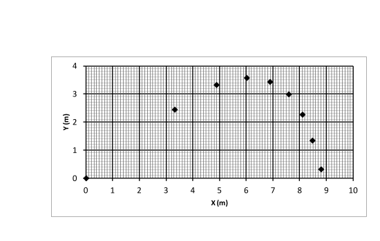

**Физични константи**

Скорост на светлината във вакуум $c = 3.00 \times 10^8 \mathrm{\ m/s}$

Гравитационна константа $\gamma = 6.67 \times 10^{-11} \mathrm{\ N.m^2/kg^2}$

Универсална газова константа $R = 8.314 \mathrm{\ J/(mol.K)}$

Число на Авогадро $N_A = 6.02 \times 10^23 \mathrm{\ mol^{-1}}$

Земно ускорение $g = 9.81 \mathrm{\ m/s}^2$

**Задача 1. Механика на бадминтона**

Перото за игра на бадминтон (вж. фиг. 1.1) е пример за тяло, при чието движение съществена роля играе силата на съпротивление на въздуха. Означените на фигурата размери на перото са $D = 5.8 \mathrm{\ cm}$ и $L = 7.0 \mathrm{\ cm}$, а масата му, съсредоточена основно в сферичната глава, е $m = 4.80 \mathrm{\ g}$. Експерименталните данни в задачата се отнасят за движение на перото във въздух при налягане $p = 99.8 \mathrm{\ kPa}$ и температура $T = 297 \mathrm{\ K}$. Приемете, че средната моларна маса на въздуха е $\mu = 0.029 \mathrm{\ kg/m^3}$.

	

При движение на тяло във флуид с пренебрежим вискозитет, върху тялото действа сила на съпротивление, която се дава с израза:
$$ f = \frac{1}{2} C_D \rho S v^2$$
където е плътността на флуида, - скоростта на тялото, $S$ - площта на проекцията на тялото в равнина, перпендикулярна на скоростта му (вж. фиг. 1.2). Безразмерният коефициент $C_D$ се нарича коефициент на челно съпротивление и зависи от формата на тялото. Целта на задачата е да определите коефициента на челно съпротивление на перото за бадминтон въз основа на реални експериментални данни.

А) Помощни съотношения. От стробоскопична снимка на движещо се тяло са установени радиус-векторите $\vec{r_1}$, $\vec{r_2}$ и $\vec{r_3}$ на три негови последователни положения през еднакви интервали от време $\Delta t$. Ако приемете, че движението на тялото е равноускорително, получете изрази за ускорението на тялото $\vec{a}$ и за скоростите му $\vec{v_1}$, $\vec{v_2}$ и $\vec{v_3}$ в съответните три момента, изразени само чрез радиус-векторите и интервала време. **\[2.5 т]**

Б) В случай, че движението на тялото не е равноускорително, получените в точка А формули дават само приблизителни стойности за скоростта и ускорението в трите момента. За кой от трите момента, според вас, получените формули дават най-точна оценка на скоростта и на ускорението? Не е нужно да се аргументирате. \[0.5 т\]

В) Графиката на фиг. 1.3 изобразява последователните положения на главата на летящо перо за бадминтон, получени от стробоскопична снимка с интервал между кадрите $\Delta t = 200 \mathrm{\ ms}$. Оста X е хоризонтална, а Y - вертикална. Можете да приемете, че: 1) през целия полет оста на перото е успоредна на вектора на скоростта на главата; 2) промяната на ускорението за времето между два кадъра е пренебрежимо малка. 

Последователни положения на главата на перо за бадминтон, получени от стробоскопична снимка с интервал между кадрите $\Delta t = 200 \mathrm{\ ms}$.

В празните полета на таблицата от работния лист нанесете:
- координатите $x$ и $у$ на перото в моментите на дадените кадри (в момента $t = 0$ перото се намира в центъра на координатната система);
- пресметнатите компоненти $v_x$ и $v_y$, $a_x$ и $a_y$ съответно на скоростта и ускорението на перото. 
Запишете формулите, които използвате, за да получите оценка на скоростта и ускорението в $i $-тия момент от време (можете да не разглеждате началния и крайния момент). **\[3 т]**

Г) Въз основа на дадените и на пресметнатите данни, предложете графичен метод, чрез който да определите коефициента $C_D$ на челно съпротивление на перото. Направете нужните изчисления и оценете грешката на получения резултат. За построяване на графики можете да използвате разграфената координатна система в работния ви лист. **\[4 т]**

**Внимание! Предайте работния лист заедно с останалите листа от решението.**

**Задача 2. Гравитационна вълна**

Гравитационната вълна представлява смущение в геометрията на пространството, което се разпространява с крайна скорост $c$. От практическа гледна точка гравитационната вълна се проявява като деформация на телата, през които преминава. Гравитационните вълни се излъчват от масивни обекти, които се движат с ускорение, например: въртящо се несиметрично тяло, двойка звезди, обикалящи около общия им център на масата, неизотропен взрив на свръхнова, сблъсък между космически обекти и др.

А) Гравитационната вълна предизвиква деформация на телата в равнина, перпендикулярна на посоката на разпространение на вълната. Деформацията се изразява в еднородно разтягане (свиване) на тялото $k$ пъти в дадено направление $X$ и едновременно свиване (разтягане) $1/k$ пъти в перпендикулярното направление $Y$, както е показано на фиг. 2.1. В случай на слаби гравитационни вълни, породени от далечни космически обекти, коефициентът на разтягане $k$ се мени по хармоничен закон:
$$ k(t) = 1 + h \sin(\omega t)$$
където $h \ll 1$ е безразмерната амплитуда на вълната. Тя има смисъл на максимална относителна деформация, предизвикана от вълната. 

Нека означим с $I$ интензитета на вълната, т.е. количеството енергия, което вълната пренася за единица време през единица площ, ориентирана перпендикулярно на посоката на разпространение. Както при механичните вълни, интензитетът на гравитационната вълна е пропорционален на квадрата на нейната амплитуда:
$$ I = f(\omega,\gamma,c) h^2$$
където коефициентът на пропорционалност $f$ зависи от кръговата честота на вълната $\omega$ и фундаменталните константи $\gamma$ и $c$. Определете вида на функцията $f$ с точност до безразмерен множител. **\[1.5 т]**

Б) Гравитационна вълна е породена от двойка звезди с маси $M_1$ и $M_2$, обикалящи около общия си център на масата на разстояние r една от друга, както е показано на фиг. 2.2. Съгласно с Общата теория на относителността, амплитудата на вълната на разстояние R от звездите ($R \gg r$) се дава с израза:
$$ h = K(\gamma,c) \frac{E_k}{R}$$
където $E_k$ е кинетичната енергия на звездите, а $K$ е коефициент на пропорционалност, зависещ само от фундаменталните константи $\gamma$ и $c$. Получете израз за $K$ с точност до безразмерен множител. **\[1.5 т]**

В) За двойната система от фиг. 2.2 получете, с точност до безразмерен множител, израз за пълната мощност $P$, излъчвана под формата на гравитационни вълни, като функция на масите на звездите, разстоянието между тях и фундаменталните константи $\gamma$ и $c$. **\[1 т]**

Г) Загубата на енергия под форма на гравитационни вълни води до бавно намаляване на разстоянието между двойката звезди. Получете израз за скоростта $dr/dt$, с която се променя разстоянието между звездите, ако приемете, че относителното изменение на разстоянието за една обиколка е много малко. Релативистките ефекти не се отчитат. Всички безразмерни коефициенти от предишните подточки, водят до множител 64/5, който можете да използвате наготово в окончателния израз. **\[3 т]**

Д) За колко време $t$ разстоянието между звездите в системата ще се промени от определена начална стойност $r_0$ до крайна стойност $r_1$ ($r_1 < r_0$). **\[1.5 т]**

Е) В проведения наскоро експеримент за детектиране на гравитационна вълна е регистрирана вълна от двойка черни дупки, въртящи се около общия си център на масата. Честотата на регистрирания сигнал се изменя от 45 Hz до 360 Hz за време $t = 0.15 s$, след което се предполага, че двете черни дупки са се сблъскали и сляли.

Ако приемете, че масите на двете черни дупки са еднакви, определете числено тяхната маса $M$, началното разстояние $r_0$ между тях и разстоянието rc, при което е настъпил сблъсъкът. Не е нужно да получавате аналитични изрази за търсените величини. Релативистките ефекти не се отчитат. **\[1.5 т]**

**Задача 3. Хексагонална решетка**

Много често в природата и в техниката се срещат хексагонални структури, т.е. структури съставени от правилни шестоъгълни елементи, запълващи плътно двумерна равнина (виж например фиг. 3.1). Тук, в три независими подусловия, ще изследвате някои физични свойства на различни такива структури.

А) Повърхнинна плътност на графена **\[2 т]**

Графенът (фиг. 3.2) е двумерна форма на въглерода. Състои се от въглеродни атоми, заемащи върховете на правилни шестоъгълници, които запълват плътно равнината. Разстоянието между два съседни въглеродни атома е $a = 1.42 \text{\ \r{A}}$. Колко е повърхнинната плътност $\lambda$ на графена, т.е. колко е масата на единица площ от слой графен. Моларната маса на въглерода е $\mu = 0.012 \mathrm{\ kg/mol}$. 

Б) Хексагонална мрежа от резистори **\[3 т]**

За безкрайната хексагонална мрежа от еднакви резистори със съпротивление $R$ всеки (фиг. 3.3), определете еквивалентното съпротивление $R_{AB}$ между точките $A$ и $B$.

В) Дифузия в хексагонален кристал **\[5 т]**

 

В някои кристали пренасянето на електричен ток се дължи на т.нар. "скокова" проводимост. В отсъствие на електрично поле, токовите носители "блуждаят" по кристала, като извършват случайни скокове от атом на атом. В хексагоналния кристал, показан на фиг. 3.4, в даден момент електрон се намира в т. $A$. Електронът може да прескочи с еднаква вероятност 1/3 на всеки от трите съседни атома, после със същата вероятност на някой от следващата тройка съседни атоми и т.н.

Пресметнете вероятностите $P(A), P(B), P(C), P(D), P(E)$ и $P(F)$ след три случайни скока електронът да се окаже съответно в точките от $A$ до $F$.

