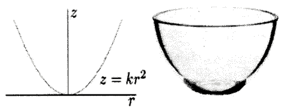
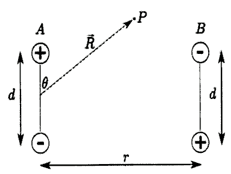
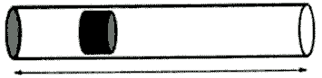

**Задача 1. Механика**

Фиг. 1

Тяло се движи по вътрешната повърхност на гладка параболична купа, чието сечение се задава с уравнението $z = kr^2$. Тялото е поставено на височина $z_0$ от дъното на ккупата и има хоризонтална скорост $v_0$ успоредно на повърхността на купата. Земното ускорение е $g$.

а) За определена стойност на скоростта $v_0$, която ще отбележим с $v_h$, тялото се движи по хоризонтална окръжност. Намерете $v_h$. **\[2 т.]**

б) Нека началната скорост е $v_0 > v_h$. Намерете максималната височина, до която достига тялото. **\[3 т.]**

в) Приемете, че $z_0$ е достатъчно малко, така че движението може да се апроксимира с хармонично трептене. Намерете периода $T_0$ на движението. **\[3 т.]**

г) Приемете, че $z_0$ не е малко. Сравнете периода $T$ на трептене с периода $T_0$ на хармоничното трептене от горното подусловие - ще бъде ли по-малък, по-голям или равен? Няма нужда да пресмятате експлицитната стойност за $T$. Достатъчно е да аргументирате отговора си. **\[2 т.]**

**Задача 2. Електричество**

 
Фиг. 2

**Част 1**

Електричният дипол се състои от два заряда с равна големина $q$ и противоположен знак, разделени на разстояние $d$ един от друг. Векторът на диполния момент има големина $p = qd$ и сочи по оста, свързваща $-q$ с $+q$. Разгледайте два идентични дипола, ориентирани както е показано на фигурата. Разстоянието между тях е $r$.

а) Намерете точен израз за потенциалната енергия на системата от два дипола, изразена чрез $q, d, r$ и фундаментални константи. За удобство приемете, че потенциалната енергия е нула, когато диполите са на безкрайно разстояние един от друг; **\[1 т.]**

Във всички следващи подусловия приемете, че $d \ll r$.

б) Направете приближение на израза за потенциалната енергия като запазите само най-ниската степен на $d/r$. Напишете приближението чрез $p, r$ и фундаментални константи. **\[2 т.]**

в) Намерете големината и посоката на силата, с която единият дипол действа на другия. Изразете силата чрез $p, r$ и фундаментални константи. **\[2 т.]**

г) Намерете потенциала, създаден от дипола $A$ в точка $P$, изразен чрез векторите $\vec p$ и $\vec R$ и фундаментални константи. **\[2 т.]**

**Част 2**

д) Сферична обвивка с вътрешен радиус $a$ и външен радиус $b$ е направена от материал със специфично съпротивление $\rho$. Точков заряд с големина $q_0$ е поставен в центъра на обвивката. В момента $t = 0$ обвивката е електрически неутрална, включително вътрешната и външната ѝ повърхност. Намерете заряда, разпределен върху външната повърхност на обвивката като функция на времето за $t \geq 0$. Игнорирайте всякакви магнитни ефекти. **\[3 т.]**

**Задача 3. Топлина**

**Част 1**

Планета с радиус $R$ е съставена от равномерно разпределен материал, който чрез радиоактивен разпад отделя енергия с мощност $P$. Това води до зависимост на температурата от положението в планетата, тъй като има пренос на топлина отвътре-навън.

Коефициентът на топлопроводимост е мярка за скоростта на преноса на топлина в резултат от температурна разлика. Да разгледаме тънка пластина с площ $S$ и дебелина $\Delta x$, едната повърхност на която е с температура $\Delta T$ по-висока от другата. Нека през пластината да преминава топлина $\Delta Q$ за време $\Delta t$. Коефициентът на топлопроводимост се дефинира като
$$ k = \frac{\Delta Q}{\Delta t} \frac{1}{S} \frac{\Delta x}{\Delta T}$$
Намерете:

а) Температурата $T_s$ на повърхността на планетата; **\[1 т.]**

б) температурната разлика $\Delta T$ между температурите в центъра и на повърхността на планетата. **\[4 т.]**

Приемете, че
\begin{itemize}
- $k$ не зависи от положението в планетата, т.е. $k$ е еднаква за цялата планета;
- температурата зависи само от координатите, но не и от времето;
- планетата излъчва като абсолютно черно тяло;
- върху планетата не попада енергия от друг източник.
\end{itemize}

**Част 2**

Фиг. 3

Оръдие с форма на цилиндър с площ на напречното сечение $S$ изстрелва снаряд. Непосредствено след взрива снарядът е в покой, обемът между затворения край на тръбата и снаряда е $V_0$, а налягането на газа в този обем е $P_0$. Атмосферното налягане е $P_{atm}$, като $P_0 > P_{atm}$. Газът в цилиндъра е двуатомен, т.е. $C_V = 5R/2$, а $C_P = 7R/2$. Дължината на оръдието може да се изменя.

Намерете:

в) максималната възможна кинетична енергия $E_{\max}$, с която снарядът може да напусне оръдието; **\[4 т.]**

г) дължината на оръдието $L$ в този случай. **\[1 т.]**

Приемете, че

- снарядът се движи в цилиндъра достатъчно бързо, така че газът не получава топлина;
- триенето между снаряда и цилиндъра е пренебрежимо;
- около снаряда не преминава газ;
- върху вдясно от снаряда налягането е винаги $P_{atm}$.
