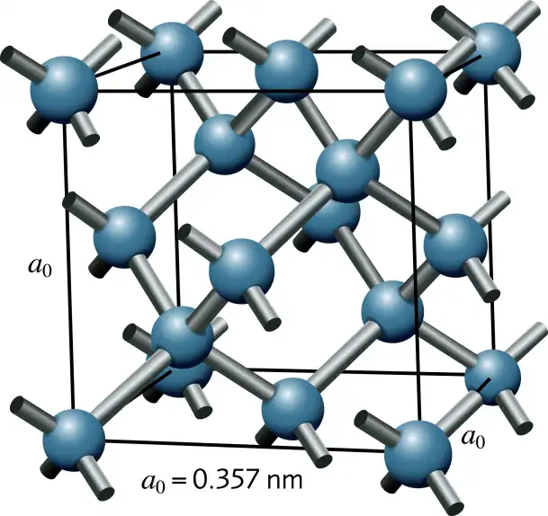

**Задача 1.** Пирамида от топки.

Четири еднакви еднородни топки са поставени така, че всяка да се допира до останалите три. Три от тях лежат на хоризонтална маса, а четвъртата е върху тях. Всяка от топките има маса $m$ и радиус $r$. Земното ускорение е $g$.

*Двете подусловия са независими:*

а) Коефициентът на триене между топките е $k_1$, а между топките и масата е $k_2$. Намерете възможните стойности за тези два коефициента на триене, при които пирамидата ще бъде в равновесие. **\[5 т.]**

б) В това подусловие приемете, че между топките и между топките и масата няма триене (т.е. $k_1 = k_2 = 0$). Така сформираната пирамида се пуска и се разпада. Намерете максималната скорост $v_{\infty}$, с която ще се разлети всяка от трите долни топки. **\[5 т.]**

*Полезна математика:* Уравнението $\displaystyle x^3 + \frac{3}{2} x - \sqrt{\frac{2}{3}} = 0$ има единствено решение $x \approx 0.47354$. 

**Задача 2.** Диамант.

а) При облъчване на диамант с монохроматична светлина с дължина на вълната $\lambda_0$ в спектъра на разсеяната светлина се наблюдава тясна линия, съответстваща на монохроматична светлина с по-голяма дължина на вълната $\lambda_p$. Измерено е, че $\displaystyle \frac{1}{\lambda_0} - \frac{1}{\lambda_p} = 1333 \frac{1}{\mathrm{cm}}$. Oбяснението на това явление е, че един фотон от облъчващата светлина взаимодейства с диаманта, като придава част от енергията си $E_0$ и продължава като разсеял се фотон с по-малка енергия $E_p$. Отдадената част от енергията $\Delta E = E_0 - E_p$ на първия фотон е точно равна на квант $h\nu$ от енергията на трептене на атомите в кристала с честота $\nu$. Изчислете честотата $\nu$. Скоростта на светлината е $c = 3,00.10^8 \mathrm{m/s}$. **\[1 т.]**

 

б) Кристалната структура на диаманта е дадена на фигурата. Тя е кубична, т.е. съществуват 3 транслации с големина $a_0$ в три взaимно перпендикулярни направления, при които структурата съвпада със себе си. Най-малкият обем от структурата, носещ цялата информация за нея, се нарича елементарна клетка. В случая тя е куб с ръб $a_0$. Въглеродните атоми в структурата са разположени така, че всеки един от тях създава четири еднакви химични връзки с четирите си най-близки съседи, които са разположени във върховете на правилен тетраедър. Изчислете ъгъла $\phi$ между две такива химични връзки (нарисувани като пръчки на фигурата). **\[1 т.]**

в) Атомната маса на въглеродния атом е $m_C = 12,01 m_u$. Единицата за атомна маса е $m_u = 1,6605.10^{-27} \mathrm{kg}$. Трептенето с честота $\nu$ (от подусловие а)) може да се представи (илюстрира) по различни начини. Един от тях е следният: един въглероден атом трепти (се е отклонил) в посока на един от най-близките си съседи, а 4-те негови съседи трептят със същата амплитуда и в същото направление, но в противофаза (в обратна посока). Ако моделираме химичната връзка между два въглеродни атома с пружина с коефициент на еластичност $k$, изчислете нейната стойност. **\[3 т.]**

г) Изчислете плътността $\rho$ на диаманта. $a_0 = 3,567.10^{-10} m$. **\[1 т.]**

д) Еластичните свойства на един кристал могат да се опишат с модула на всестранно свиване (наричан още модул на свиваемост) $B$. Предполага се, че относителната промяна $\Delta V /V_0$ на обема $V_0$ на кристала е пропорционална на приложеното (хидростатично) налягане $p$. Тогава този модул се дефинира с формулата $\displaystyle \frac{\Delta V}{V_0} = - \frac{p}{B}$. Изчислете модула на всестранно свиване $B$ за диаманта. **\[3 т.]** 

е) Докато еластичните свойства на изотропните среди напълно се описват с два независими емпирични параметъра (например модула на Юнг $E$ и модула на всестранно свиване $B$, като всички останали могат да се получат от тях), то за анизотропните среди тези независими параметри са повече. Кубичните кристали са изотропни среди за светлината (електромагнитните вълни), но за механичните вълни те не са изотропни среди. В различни направления в кристала механичните вълни могат да имат различни скорости. В кубични кристали еластичните им свойства се описват с 3 еластични константи - $C_{11}$, $C_{12}$ и $C_{44}$. Тук не е нужно да се изяснява техния смисъл. Експериментално са измерени техните стойности: $C_{11} = 1079 \mathrm{\ GPa}$, $C_{12} = 124 \mathrm{\ GPa}$,$ C_{44} = 578 \mathrm{\ GPa}$. Теоретично може да се получи, че $\displaystyle B =\frac{C_{11}+2C_{12}}{N}$, където $N$ е цяло число. Изчислете $N$. **\[0.5 т.\]** 

ж) За кубични кристали може да се получи, че скоростта $v_L^{[100]}$ на разпространение на механични надлъжни вълни с голяма дължина на вълната ($\lambda \gg a_0$, т.е. звук) в посока, успоредна на един от векторите на транслация, е $v_L^{[100]} = \sqrt{\frac{C_11}{\rho}}$. Изчислете скоростта $v_L^{[100]}$ на звука в това направление на диаманта. **\[0.5 т.\]**

*Полезна математика:* Пресечната точка на височините в един правилен тетраедър ги дели в отношение 3:1. 

**Задача 3.** Тънка сферична леща.

Леща има две сферични повърхности с радиуси съответно $R_1$ и $R_2$. Тя е тънка (т.е. дебелината ѝ $d \ll R_1, R_2$). Направена е от вещество с показател на пречупване $n$. Нейното измерено фокусно разстояние във въздух е $f = 0,390 \mathrm{\ m}$. Ако обаче лещата се потопи наполовина в дълбок аквариум, пълен с течност с показател на пречупване $n_0$ ($n_0 < n$), така че повърхността с радиус $R_1$ да е във въздуха, а повърхността с радиус $R_2$ да е в течността и се изследва нейното фокусно разстояние в течността (т.е. пусне се вертикален успореден сноп светлина от въздуха и се изследва къде той се събира в течността), то се оказва $f_{n_0} = 0,792 \mathrm{\ m}$. Ако се изследва нейното фокусно разстояние във въздуха (т.е. пусне се вертикален успореден сноп светлина през течността и се изследва къде той се събира във въздуха), то се оказва $f_1 = 0,566 \mathrm{\ m}$. И при последен експеримент, ако лещата се обърне обратно (т.е. повърхността с радиус $R_2$ да е във въздуха, а повърхността с радиус $R_1$ да е във водата), измереното фокусно разстояние във въздуха е $f_2 = 0,526 \mathrm{\ m}$. Получете формули, от които от измерените 4 фокусни разстояния да може да изчислите показателя на пречупване $n_0$ на течността **\[2.5 т.\]**, радиусите $R_1$ **\[2.5 т.\]** и $R_2$ **\[2.5 т.\]** на повърхностите на лещата, нейния показател на пречупване $n$ **\[2.5 т.\]** и изчислете техните стойности. 

*Полезна математика:* Използвайте така нареченото "параксиално приближение", т.е. ъглите в задачата са малки и за тях $\sin \alpha \approx \tan \alpha \approx \alpha$ (ако се измерват в радиани).

